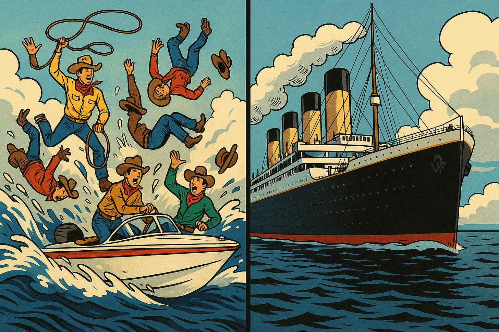

*(Aside, I'd love to show you how my current product can support the product operating model. Tools aren't going to solve all of your problems, but they can help. Especially at enterprise-scale. I'll personally **[give you a demo](https://www.dotwork.com/demo)**. I also wrote this starter pack document. It is **[a rough Google Doc for now,](https://docs.google.com/document/d/1T_WI6jUwwd-LSoaRBVbF1CMyd45DJIykFKYN0dUVvyY/edit?usp=sharing)** but hopefully it is helpful.)*

---

Hot-take Friday.

I see two broad categories of company attempting to “transform” to a product operating model:

### **Rapid Scale-Ups**

 ###

Rapid scale-ups that found initial success running feature factories but have now hit some sort of scaling limit, market headwinds, or other business reality. The challenge in these settings is wrangling all the speedboats and chaos, and trying to adopt something “new” while the train is barreling down the tracks. The reality is that feature factories can be highly effective in certain domains—until they aren’t, and all that non-value-add complexity (both organizationally, architecturally, and product-experience wise) comes crashing down.

### **Large Enterprises**

 ###

Large enterprises riding the sequential waves of transformation: early Agile, “scaled agile”, design thinking, product 1.0 (even having product managers), “digital”, DevOps, more platform thinking, and now a sort of “product 2.0” resurgence. Here, the problem is very different. It is more akin to turning the Titanic. For a long time, the only group adopting any sort of product ways of working was a “digital” group (typically consumer facing, e-comm, etc.), and now with product 2.0 there’s an effort to scale that out. Best intentions meet architectural and organizational reality.

*You could probably slot another category in there: large tech companies founded pre 2010 or 2012 that aren’t growing as fast as the scale-ups, have reasonably strong technical foundations, are pure tech plays, but ultimately are falling into a native tech company version of the large enterprises. But for today’s post let’s keep it simple with those two categories.*

**Speedboat Chaos vs. Titanic**

----------

The first, most obvious point here is that these two categories of company couldn’t be more different.

The rapid scale-up is riding a lot of momentum. They are growing rapidly. They have had *just enough* time to develop fiefdoms and internal politics, but not enough time for it to become the tired status quo. Many of their teams can still work independently. They aren’t saddled with (too many) legacy systems. Through heroics and pockets of success, they can still stumble along.

The enterprise is navigating decades of organizational baggage and detritus. There is still a legacy of centralized IT, whether people like it or not. They’ve taken a lot of the “new” words like products, outcomes, discovery, etc., and on some level jammed them into a legacy framework of programs, projects, program budgets, etc. The directors and below are trying to work like it is 2025, the CEO wants to work like it is 2025, but there is a whole layer of upper middle management needing to deal with all that legacy baggage. It is almost like they are running two “books”: the new product ways, and then all of that legacy portfolio-program-Finance infrastructure.

When I frame it this way, the former example (the scale-up) might seem on better footing, but from my vantage point you often see much more pathological behavior in the scale-up. You are much more likely to find a maniacal founder expecting that the company can still operate like it is 15 people in a room. These enterprise transformations are frequently staffed with great, passionate change agents and leaders. They would kill for the flexibility of the scale-up, but despite the org inertia they manage to make progress. So it isn’t an easier vs. harder situation, and more like a question of context and unique challenges.

**The scale-up:**

* Their success

* The rate of growth

* The personalities and egos on the line

* The difficulty of unpacking systemic problems from your run-of-the-mill scale problems

* The push and pull between doing what worked, and adapting to what is next

* Anti-process

* Catching up on platforms, tech debt, etc. (where they can still make progress)

**The enterprise:**

* Their architecture

* Their funding models

* Institutionalized incoherence: layers of people whose job relies on “translating”

* Red tape

* Tension between “customer facing” digital, and the less sexy tech teams

* Tension between The Product, and “products” as parts of the value chain

* The big “break up the monolith” modes, and areas of debt that are completely intractable

You can get a sense here of how different these motions are. But it also suggests a bit of a signal. It gives a sense of how we might adapt tactics depending on the situation.

**Two (Related) Paths**

----------

### **Scale-up**

 ###

For the scale-up, the highest leverage thing you can do is to figure out a model for linking these new product-forward ways of working to your current business challenge, and essentially a new “model” for investment. For years, you have just built and built and things have been OK. You aren’t saddled with a project-oriented funding model—you just don’t have any. Output = good until very recently. So your opportunity is to align the strategy with the structure of your company (re-orgs are fairly easy, still), and consider a model of actionable inputs, drivers, a North Star, etc., that reshapes what progress looks like.

### **Enterprise**

 ###

For the enterprise, your highest leverage thing to do is to:

1. Accelerate any refactoring/architecture efforts that will enable more team autonomy.

2. Once and for all remove that “translation layer” in the business where corporate finance still expects the project-centric accounting view of the world, senior leaders want all the tech goodness, and the front-line teams are kind of caught in limbo trying to do all the good things and uplevel their career, yet ultimately their work doesn’t connect through that legacy layer.

3. I see a lot of work to “up-level” teams in terms of product practices, and install product leaders with some sort of tech product pedigree, but ultimately the company can’t let go of the centralized IT funding infrastructure.

This is hot-take Friday so I have left a lot out, but the important point here is that these are different motions, and you need to address them as such.