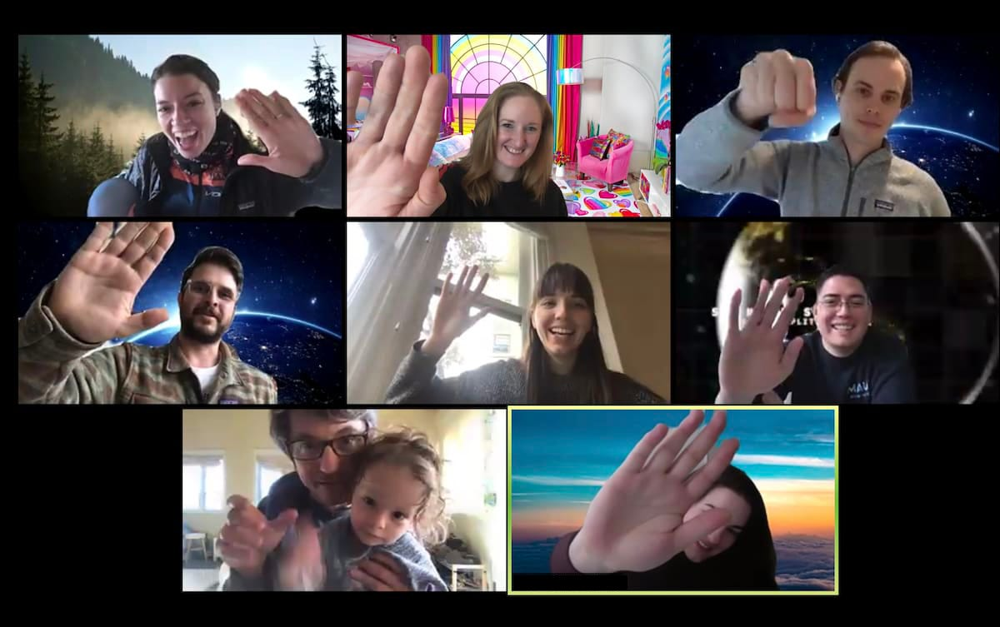

In these hectic times, I am very hesitant to overload people with more content. We're all grappling with lots of difficult news.

So a brief post today.

Our work community can be a source of strength and support. Or it can be an added layer of anxiety on top of what we are all experiencing today. This is not business as usual. This is not "going remote". We are launching into uncharted waters. We are WFHDP (working from home during a pandemic).

Companies trying to figure out how to make people productive at home are missing the point. They are actually creating more process overhead, and more tension.

More than ever, it is important to limit promises in progress, change in progress, and work in progress. Work smaller. Leave a *ton* of slack in the system. Do way less, and slow way down. Limit your planning inventory. Work in smaller batches. Be more deliberate. More supportive. Sustainability and routine -- with minimal cognitive dissonance, and tension -- are key. Leave tons of bandwidth for care and community.

We had a wonderful celebration at work today. Moments of goofiness help. Julian loved all the backgrounds!

The news? [We launched the redesign of the North Star Playbook along with a downloadable PDF](https://amplitude.com/north-star). Did we have to cut scope? Absolutely. What I am most proud of is that the team put supporting each other first.