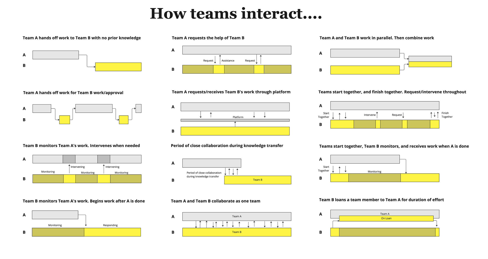
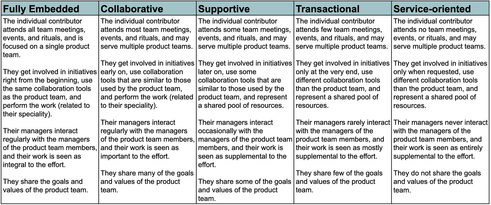
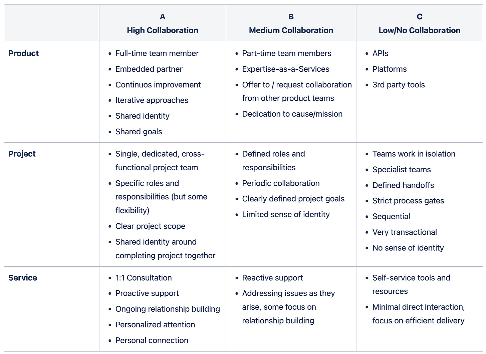

Midjourney: splashes of color, kandinsky drawing of two teams of humans connected by lines, colors, splash of neon

*Introducing the new TBM numbering scheme! This is my 200th TBM post since January 2020, so it is as good a time as any to redo the numbering scheme.*

How can product teams work more effectively with enabling teams like education (external and internal), documentation (external and internal), support, content and communications, product marketing and customer marketing, internal tools, legal, etc.?

Let's dig in. 

**The Challenge**

----------

First, let's look at some of the things that make collaboration between product teams and enabling teams more challenging:

* Consistency vs. Flexibility

* Exceptionalism

* Blindspots

* Baggage

* Incentives

* Product Centricity

* Work Styles

### **Consistency vs. Flexibility**

 ###

Product teams want flexibility and want to work in whatever way works for them. They resist converging on a plan until the last responsible-for-them-moment and refrain from making any promises or commitments that could back them into a corner.

Meanwhile, teams that work with many teams (naturally) want consistent workflows, documentation, tools, and advanced notice about precisely what is coming down the pike. 

Every time either team—product or enabling—context switches and has to adapt to how a different team works, they incur a context-switching tax.

### **Exceptionalism**

 ###

Product teams and enabling teams both have trouble accepting that their discipline can't solve *every* problem—they both suffer from siloed thinking. Product teams dream of products that magically sell and support themselves, and enabling teams dream that everyone reads the docs, takes the training, gets through the onboarding flow, reads the copy, and calls support when they have trouble. 

[Neil writes](https://twitter.com/nsdoodles/status/1627391521807912962?s=20):

>
>
> As a designer who prioritizes this type of work on my team, I typically see the pushback in two forms: 1. Perception that there is no immediate benefit, so they don't want to incur the cost, 2. It is/feels non-technical, so there's little intellectual interest in doing it.
>
>

No matter the function, you can be sure they misunderstand *other* functions—"oh, education, like setting up an academy?" or "if a developer isn't writing code, that's kind of a waste, right?" or "how hard can doing support be?" To top it all off, disciplines like ecosystem design and service design (that take more of an end-to-end view) feel foreign to product teams AND most enabling teams. So most teams lack the background to tackle the problem holistically.

### **Blindspots**

 ###

Most product teams fail to prioritize learning how people learn about and buy their products, how internal teams sell and support their products, and how people interact with anything outside the interfaces they build. For various reasons—many out of their control—enabling teams are also prone to a narrow view and may lack insight into how people use the product. 

### **Baggage**

 ###

There is baggage. Product teams remember when external requests, gates, and requirements hampered their flow. "Legal always asks us to lock down scope early—they don't understand product!" 

Enabling teams remember all the times that product threw stuff over the fence at the last minute—or they were cut out altogether due to "time constraints". "These disrespectful prima donnas in product and engineering, who do they think they are!"

### **Incentives**

 ###

In many environments, management incentivizes product to ship and move on (or chase vanity metrics or more short-term gains). They believe that highly-paid engineers and designers should focus on coding and designing, not worrying about content, training, education, or onboarding. The thought of delaying a meeting so the extended team can attend, or delaying a release to tie up loose ends, is seen as heretical. 

[Dustin Cole writes](https://twitter.com/TrudgeDMC/status/1627430840203444225?s=20):

>
>
> These things (documentation, enablement, etc.) can't be put on an engineering/feature-focused roadmap, and in my experience, the company always wants to know "what's next?" from the PM. I've had some success prioritizing these things if I put the expected impact of docs improvements etc., on the roadmap.
>
>

[Ben Novak writes](https://twitter.com/titlecharacter/status/1627388469658980353?s=20):

>
>
> It's almost never properly incentivized for promotions, comp, etc., and it's always the first thing leaders suggest cutting when the deadline gets close. The larger org does not properly value it, and teams know it.
>
>

[Nico DiPlacido writes:](https://twitter.com/tweetNeeks/status/1627516690337595394?s=20)

>
>
> They don't have to sell, use, implement, or train whatever they ship.
>
>

Enabling teams get treated as a cost center with incentives around high process conformance, efficiency, and maximum productivity. "How can we support the MOST product work with the FEWEST number of people?" Sadly, in many cases, the team is seen as fungible, and there are few opportunities for advancement or cross-training, especially with support.

When something goes wrong, everyone points fingers:

>
>
> The product team is driving too hard! We can't keep up!
>
>

>
>
> The enabling teams are too rigid and have to work with us!
>
>

 At the highest levels of leadership, no one OWNS end-to-end success (except the CEO, I guess), and there is no agreed-upon North Star and set of inputs.

As one might expect, this manifests in the tools teams use, [as Justin Pitcher points out](https://twitter.com/justinpitcher/status/1627402428311019530?s=20):

>
>
> I find myself regularly frustrated by how our tooling (e.g., kanban for engineering team) fights against truly cross-functional collaboration. Our flow lead times are lies because they're missing so many humans who touch it after the code is integrated.
>
>

Even when organizations WANT to see the end-to-end flow of work, that becomes difficult. 

### **Product Centricity, Or…**

 ###

In some environments, "process and documentation" IS seen as more important than the actual product. From a government employee trying to advocate for product-thinking:

"In government, we have too much documentation and not enough product."

In other environments—especially among "modern" product companies—I'd argue things have swung in the other direction. There's too much focus on the product (code and interface) and not enough care and concern for the end-to-end experience across the rest of the company—The Product.

Why? There may be a deep fear that building alone can't solve all problems (or overconfidence that it can). Or an underlying investment thesis around cost efficiencies that hinge on "great products and skeleton support teams."

No joke, I have heard founders say things like:

>
>
> Investments in our product will last forever—everything else is temporary.
>
>

*Side note: Many founders also forget that their key differentiator may be what they know about their customers, not what they have built for their customers.*

### **Work Styles**

 ###

Work styles also differ. Product teams are encouraged to work more iteratively and collaboratively (e.g., "cross-functional teams")—but within the confines of writing code and designing interfaces.

While working that way makes rational sense to individual contributors on enabling teams, the dominant approaches (and incentives) in those groups favor more project-like, workgroup-oriented, individuals-with-individual-project. I remember a learning experience designer telling me:

>
>
> We never get to go back to anything we deliver. Once it is shipped, it is shipped, and we're at the end of the chain. Sure, LXD tries to be iterative, but it ends up as waterfall as you can get.
>
>

This dynamic creates a curious paradox where enabling teams *say* they want to shift left and get more involved at the start of efforts, but they are 1) too short-staffed to make that happen, and 1) their methods and work styles optimize for (sadly) getting involved late. Even when they DO get involved early, things don't click.

Not that I am a huge fan of "move fast and break things", but there ARE situations when a product may rightfully choose to leave a lot of things unfinished and loose to reduce risk quickly. Because enabling teams never get to go back and fix things, this seems irresponsible and disrespectful (to them and customers). 

**So where does this leave us?**

----------

While there are no silver-bullet solutions to the problems above, there are good places to nudge things in the right direction.

### **Move Beyond Projects**

 ###

The standard model in most companies is to treat work as a series of projects. Enabling teams latch on to these projects as the basis for their work. The net effect is context switching and discontinuity. Instead, product should consider more extended, thematically consistent streams of effort. Ship and experiment quickly, for sure, but shoot for focus. Why? Enabling teams will do less context switching.

### **Visualize the "Work" End-to-End**

 ###

The team isn't "done" until customers can apply the change in their environment. Make sure your work board continues after Delivered. If there are bottlenecks, the team should stop loading up downstream groups with more and more work. Ideally, they try to help those teams.

*Sidenote: One of the most amazing things I've witnessed was watching a group of engineers, a designer, and a PM come to the aid of an education team—stand up a new LMS for them, get analytics going, fix data sync issues, and integrate their work more broadly across the product...all because the education team felt safe enough to say "we can't support that now, and we need to!"*

I'm routinely amazed by how engineers and designers who work on customer-facing products are told explicitly not to help GTM teams fix elementary problems because "the product" is viewed as precious. No! The whole company is the product.

### **Lower WIP**

 ###

Most companies have too much work in progress and incentivize high utilization. You must tackle that problem before teams can partner together effectively. Slack in the system is a prerequisite for working together; otherwise, everyone will be at their limit, and no one will have room to collaborate.

### **Develop New Muscles Together**

 ###

As a general rule, when product teams are trying something new, it is essential for representatives from enabling teams to get involved early and start together and work together. Why?

* Work will be very fluid and will change course often.

* When there are a lot of unknowns, product teams face a considerable premature convergence risk. If forced to settle on solutions too early (e.g., because enabling teams need that certainty), they risk shipping something that doesn't work.

* The product team needs to work in ways that are natural and a good fit for the problem. Asking them to conform to global standards for this type of effort is a recipe for disaster.

As things stabilize, teams may work more transactionally (with periodic check-ins, roadmap reviews, participatory design sessions, metrics reviews, etc.) Yes, you may eventually have very "ticket-oriented" models, but that is after things are very regular.

Above all, don't assume you can treat all work and all teams the same way.

### **Work Together—Even Briefly**

 ###

Working together is the best way to fix the empathy gap and overcome professional culture clashes. Even short collaborative sessions can boost understanding. Consider some early participatory design activities to consider the end-to-end enablement of the team's work. What would amazing look like—with all the company's moving parts aligned around supporting your customers?

### **Make the Collaboration Model Explicit**

 ###

I recommend [Team Topologies](https://teamtopologies.com/key-concepts) as an excellent tool for explaining how teams collaborate. Check it out.

Recently I have been using additional aids to get teams thinking about how they relate.

**Here’s a good one for getting the conversation going:**

**A quick spectrum:**

This one isn’t as well thought out. It is a work in progress. I was shooting to describe how not all product work is highly collaborative, and not all project is low collaboration.

### **Incentives**

 ###

Last but not least, you'll have to consider incentives. Does your company incentivize product teams to ship and forget (or chase short-term metrics)? Can an enabling team press pause on an effort like in my example above?

Conclusion

----------

I hope this was interesting. As stated in my post [on principles](https://cutlefish.substack.com/p/product-enablement-principles):

>
>
> How you document, how you support, how you educate, how you capacity plan, how you address legal ramifications, how you market, how you sell, etc., is ALL part of customer experience. In SaaS, the whole company is The Product.
>
>

Yes, there are limits to the cognitive load a team can withstand. There's also a cap on team size (though that number is larger than people think, provided everyone is genuinely dedicated to the mission and not juggling fifty jobs).

Between being devoted entirely to working with four other people to serving an organization of 1000s, the answer is typically somewhere in the middle (but managers get biased to believing they can spread people super thin). Juggling the needs of product teams and enabling teams is not easy.

But if we consider that the whole company is The Product I believe great things can happen.