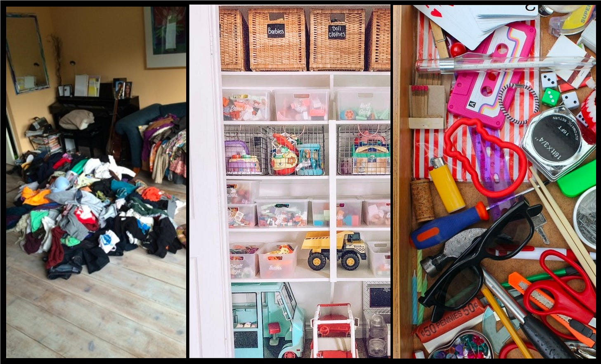
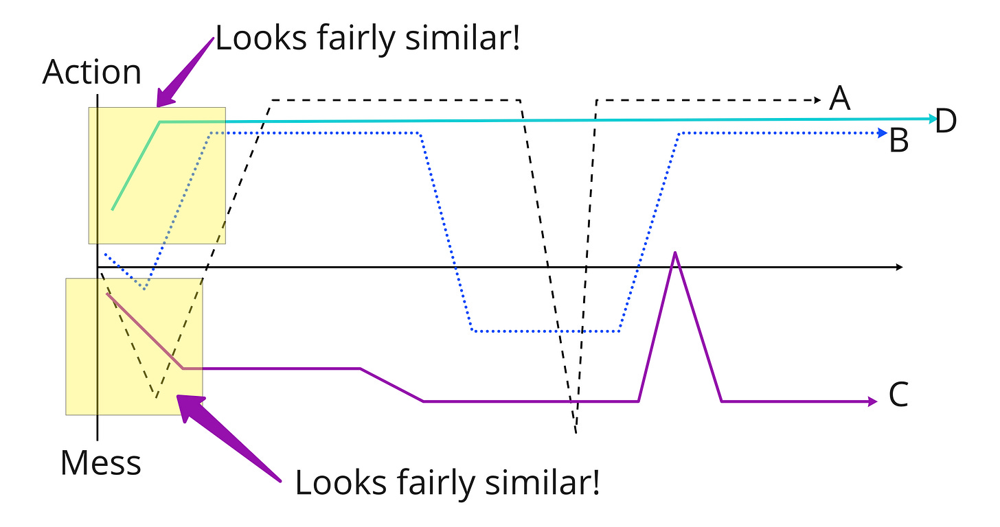

This post is going to start with something seemingly unrelated. But we’ll get there…

People approach home organization in different ways.

Some people empty everything out on the floor. They want to see everything, organize it, and then put it away—even if the process takes hours, days, or weeks.

Some people organize as they go. They are always tidying up, sorting, re-sorting, and rearranging. It is muscle memory.

Some people need a catalyst—people coming to stay, or a party. Once they have that deadline (and upped ante) they become an organizing machine. It is all about seizing the moment. They don't go deep, but they get the job done.

Some people have no qualms shoving things in a junk drawer, garage, or closest. Other people can't fall asleep knowing a junk drawer exists. Some people care about utility and usability. Other people could care less—if it gives off the right vibe for the guests, that's enough.

In context, none of these are *right* or *wrong.* What’s your approach?

I've been thinking about how all this relates to work.

As you can tell from the title of this newsletter, I like emptying the mess out on the floor. I go deep, and then “flip the switch” and get into action mode. I enjoy this process. I enjoy looking at a hundred stickies, and boiling the mess down to three key points. Then I get super focused on action—maybe too focused—and learn by acting.

Some of the people whose work I admire take a different approach. They stay more action focused from the get-go, and only go as deep as they need to. They say things like:

>
>
> For what we need to decide right now, this is sufficient. Later we can get to that stuff.
>
>

Both approaches—and many other variations—can be a real asset to a team.

A challenge I’ve encountered is that it is easy to confuse jumping headlong into the mess with analysis paralysis. Or “not bringing solutions”. Or “being unrealistic”. Or “you’re making this too complicated!” Why? Emptying the drawers can look *very similar* to analysis paralysis. At first. Anyone who has walked in on a friend with all of their belongings on the floor can relate.

In this drawing, A and C start out the same. Meanwhile B and D are off to the races.

I love being on teams with a nice balance of As and Bs. Even Ds. They get the job done! But at first, A is probably thinking “there goes B, jumping headfirst without clarifying the problem; B is going to pull a D!"

And B is thinking, “there goes A, about to make this WAY too complicated for the average human; A is going to pull a C!"

Many people don’t think about their default style. Nor do they think about their triggers, or how they trigger other people. As and Bs can be very dismissive. If I’m honest with myself, I’ve been dismissive in the past. I would rush to conclusions about someone’s bias to action. I would also get very triggered when someone suggested I was “overthinking” something.

So what’s the fix? Is there a fix?

It starts with self-awareness. Get to know your team members. Discuss different approaches to work. Assume good intent.

If you are a mess explorer, consider whether it helps you to expose all of the mess in public. Are you overwhelming people? Is it helping your cause? Can you be more empathetic with your approach? If you love to get moving right away, consider if you’re giving team members time to process and get their bearings. Is it helping your cause?

Finally, though it can be challenging, working together helps!