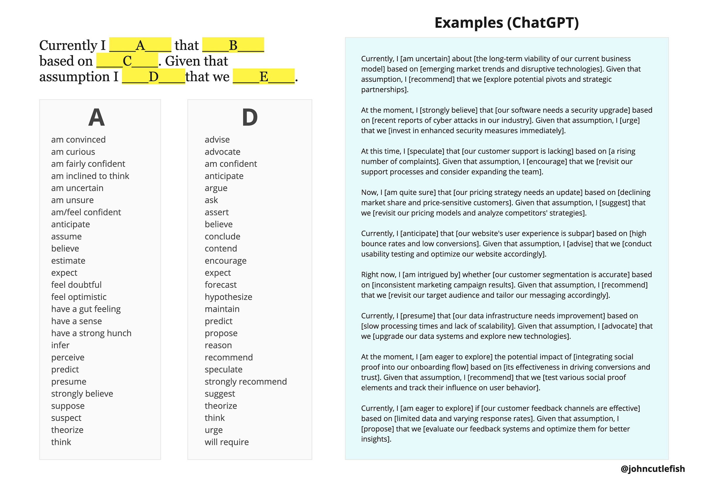

I used to do a lot of assumption mapping and elicitation exercises. One of the significant challenges was what to do with all of the discomfort and anxiety-inducing assumptions. Teams understood the *theory*—why it might benefit them to surface assumptions, designate “operating assumptions”, prioritize risky assumptions, and make plans to reduce uncertainty where it counts. But putting that into practice was hard.

I’ll never forget a CPO telling me:

>
>
> That was great, but now what? The team asked great questions and had great ideas, but now I’m worried we’ll get stuck in analysis paralysis.
>
>

So I started to think about how skilled product leaders *naturally* talk about assumptions. And a couple of things stood out:

1. Precise word choice to convey confidence and intent (“gut feeling” is very different than “am fairly confident,” and both can be valid)

2. Incorporating evidence, observations, signals, perceptions, etc.

3. A proposed next step

Example:

>
>
> Currently, I am reasonably confident that we’ve hit the upper bounds for optimizing the account configuration workflow based on our history of focused experiments and improvements—we’re hitting a local maximum—and qualitative feedback from customers. Given that assumption, I propose that we stop working to improve it for now, and plan to revisit it with fresh eyes in Q4.
>
>

\#3 was interesting because I typically don’t respond well when someone proposes a solution immediately. But I noticed that adding the next step makes the assumption *real* *and salient* and less existential and open-ended. The next step doesn’t need to be a demand or pitch, either—it can be a proposal to do more research, consider another perspective, etc. In a sense, the next step helps make the assumption real (similar to how a proposed option makes an outcome real).

With that, here’s a potentially helpful prompt:

---

### **Currently I [\_\_\_A\_\_\_] that [\_\_\_B\_\_\_] based on [\_\_\_C\_\_\_]. Given that assumption I [\_\_\_D\_\_\_]that we [\_\_\_E\_\_\_].**

 ###

---

The key here is to normalize word choices for A and D that express the range of confidence levels, and conviction about next steps. Someone should be able to use this who “has a hunch”. And someone should be able to use this who has high convictions both about their assumption, and the next step.

Here is the prompt, some options for A and D, and some examples generated by ChatGPT.

