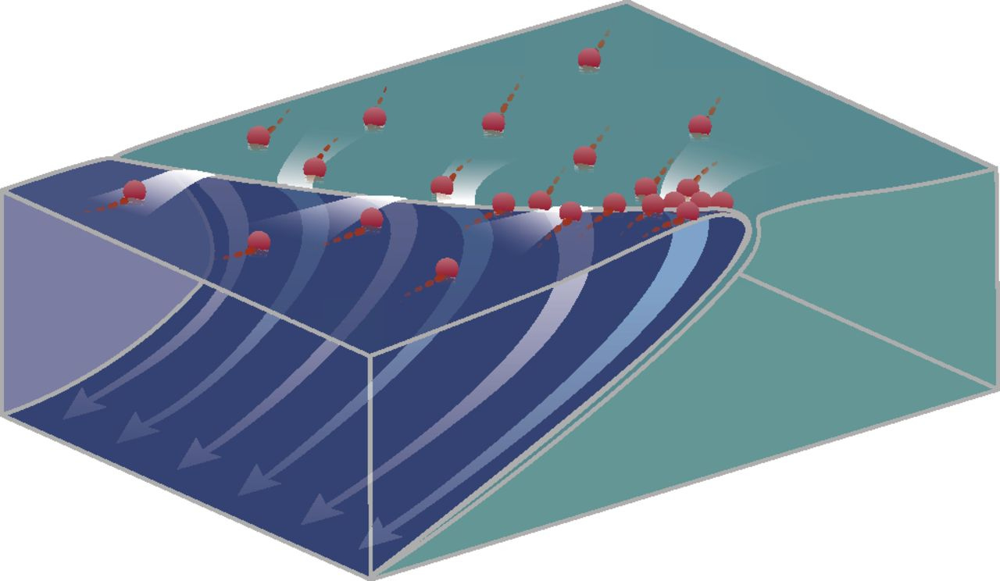

**[Ocean convergence and the dispersion of flotsam](http://Ocean convergence and the dispersion of flotsam)**

---

The old guard knows how to navigate the mess.

The new guard sees the mess, and wants to avoid it.

➖

The old guard applies knowing (but tired) eyes.

The new guard applies fresh (but unwary) eyes.

➖

The old guard is skeptical other patterns can work (except what they want to try)

The new guard is eager to apply what worked elsewhere (or avoid what didn’t).

➖

The old guard has stuck around despite challenges. They are in a loop.

The new guard recently left their prior challenges. They’ve left a loop.

➖

The old guard wants a fresh start. Can the new guard help?

The new guard has a a fresh start. Will the old guard help?

➖

The old guard is hoping they’ll gain new advocates (to help stalled progress)

The new guard is hoping they’ll gain new supporters (to make progress)

➖

The old guard leverages informal networks.

The new guard is in network creation mode (and is stymied by informal networks).

➖

The old guard has implicit understanding (which is hard to communicate)

The new guard needs explicit explanations (and often doesn’t get those explanations)

➖

The old guard over-indexes on nuance (“don’t oversimplify things!”).

The new guard overlooks nuance (“don’t overcomplicate things!”).

➖

The old guard feels they know what to ignore.

The new guard has trouble knowing what to ignore.

➖

The old guard: “this is why it’s so hard!”

The new guard: “why are you making it so hard on yourself?”

➖

The old guard: “we need more autonomy, and fewer dependencies!”  
The new guard: “why doesn’t anyone step up and own anything here?”

➖

The old guard is on auto-pilot, and *that’s* unsustainable.

The new guard is hyper-intentional, and *that’s* unsustainable.

➖

The old guard has optimism (and pessimism) steeped in reality.

The new guard has optimism (and pragmatism) steeped in possibility.

➖

The old guard is playing a long game seeking novelty.

The new guard is seeking quick wins seeking regularity.

➖

The old guard seeks acknowledgement and trust.

The new guard seeks acceptance and trust.

➖

The old guard tries to preserve influence.

The new guard tries to expand influence.

➖

The old guard: “Yeah but...”

The new guard: “So what?”

➖

*Did you enjoy this post? Please consider subscribing to my newsletter. It is free. A post each week.*

Subscribe