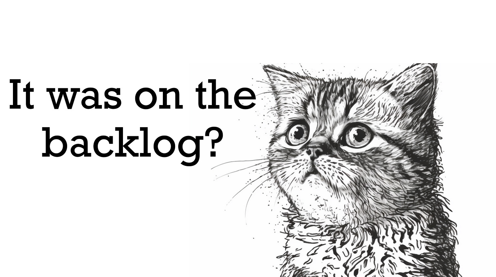

So much can be learned from this very basic question.

>
>
> **What are you working on right now, and why is it the most important thing you could be working on?**
>
>

Wrong Answers Only

----------

**We committed to doing it**  
OK, but context and conditions change. Should you rethink that commitment?

**It will move [metric]**  
OK, but is that the right metric? And is this the highest leverage way to move that metric? Why does that metric matter for customers? How does moving that metric contribute to long-term outcomes?

**It is a dependency for [another effort]**  
OK, but is that effort the most important thing you should be contributing to? Have they made a bulletproof case for why you should contribute? Should you contribute to another effort?

**The leadership team said this was a P0 last December**.  
OK, but why? What was their reasoning? Do you have new information to share with them that might change their mind?

**We promised this to a customer to close a deal**.  
We don't want to disappoint a customer, but what if you could do something else that would be even more valuable for our customers? What is the cost of renegotiating our promise?

**We've already put so much work in**  
Remember sunk cost fallacy. Disregard the work we've put into it so far. What is the current value and future value? And what are our other options?

**Our competitors are doing it**  
Why is following their lead a good idea right now? 

**It's a quick win!**  
Great, but are we striking the right balance between short-term gains and long-term success? What does your bet portfolio look like at the moment?

**Well, it is [CEO's] idea**  
I get the pressure, and I'm not advising that you take unnecessary career risks, but is it a good idea? Do you think [CEO] would at least be open to hearing about some other options to achieve the objective?

**It was on the backlog**.  
What should have been added to the backlog that might be a better option? Why did it sit there for so long if it was so important?

**Team B was idle**  
Maybe keeping them idle instead of inventing work to keep them busy is beneficial. What if they get locked up in this project and can't pursue a better option?

**The last time we did this, customers loved it!**  
Past success doesn't guarantee future success. Have conditions changed? Perhaps customers have tired of us doing this? Maybe because they loved it, they don't need more of it.

**It's a good opportunity to learn new skills**.  
That is awesome. But that *alone* isn't a good reason to do something. What other options did you consider that would *also* help you learn new skills but were perhaps more valuable for our customers?

**It is the one thing we can finish with our current skill set**  
It might be a good opportunity to "learn new skills!" 

**We're getting near annual planning. Not worth committing to something now**  
Your customers don't care about annual planning! If it is valuable, it will likely get funded.

**This is a perfect project for [Person] because they are awesome at [Technology]**  
They are also passable at [Other Technology]. What if that is the better thing to work on?

**It will generate immediate revenue!**  
If we're in complete survival mode maybe that makes sense. Are we?

**This is a perfect project for [New Team Member]**  
I understand that onboarding [New Team Member] is a top priority, but have you exhausted ways to engage [New Team Member] on the highest leverage we could be working on?

**We can finish this by the end of the quarter!**  
So what? Will the world end if you finish something else 15 days into the next quarter?

**This will be a big win for [Department]**  
But is it a big win for our customers? Will it contribute to the long-term, sustainable growth of the company?

**Our investors will love this**  
But will they love it in 12 months?

**We can do this without any additional budget**.  
That is a constraint. But is it the BEST thing we could do without asking for the additional budget? And seriously, if there is something better we *should* focus on, we should try to make the case.

**It's low risk!**  
Managing risk is important, but we must focus on more than low-risk things. What riskier but potentially higher-value things have you considered?

**This will be great for recruiting people**.  
Do we want to recruit people based on one effort? What if they join and find out it was kind of a dud?

**But [Company] is an amazing logo!**  
Yes, this might make some economic sense. But what is the difference between the monetary value of [Company] vs. landing three slightly less notable brands like [Company], [Company], and [Company]?

**This will keep us ahead of upcoming regulations**.  
How far ahead do we need to be? Do these regulations help our customers? What are the costs of the fines relative to the value we might gain from waiting, learning, and figuring out a solution later?

**We have to present this at [Industry Conference]!**  
How much money will that be worth to us in three years? Will our customers care?

**If we build this platform, all the company's teams can use it!**  
But will they? Are they asking for it? Do you need to jump straight to a platform model now, or can you explore some important use cases and prove this?

Right Answer

----------

The right answer will answer:

1. Who will this help? 

2. So what (for our customers, partners, etc.)?

3. Why now?

4. Why this? What options did you explore?

5. Why us?

6. Why is this high leverage?

7. Does it align with our strategy? 

8. If not, should we change our strategy?

9. How does it balance short and long-term benefits? Risk? Upside?

10. What's the opportunity cost?

Of course, if you are a leader and hope people can answer these questions, you'll need to foster an environment where respectful pushback and Why-asking is supported. This is not about constantly questioning everything—disagreeing and committing is a thing—but even when we commit to something, we should also commit to considering new information.