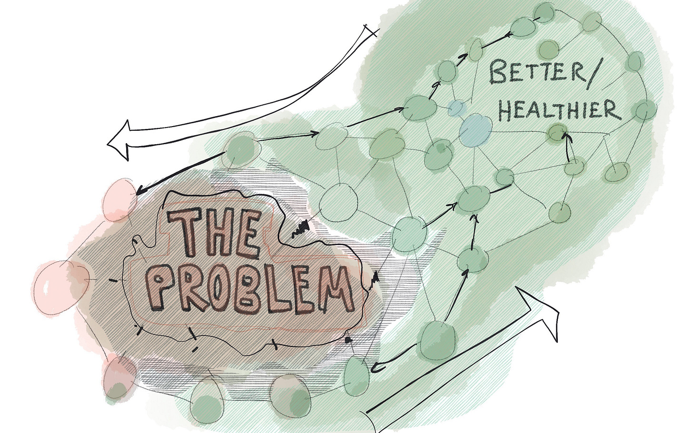

Short post this week. [The book pre-order thing is going so well.](https://gum.co/MTAVD) A big thanks to everyone who chipped in and shared.

On to the post…

During a Q&A session today, someone asked me about success theater (a term I use often). **"How do you** ***beat*** **it? How do we** ***stop*** **the Success Theater?"**

Success theater is one of those phrases that triggers an immediate, negative response. It sounds disingenuous, insulting, and frustrating. ["It’s all optics and smoke and mirrors, and the experience sucks."](https://medium.com/@johnpcutler/success-theater-b60a1666fe67)

In the past, I would list all the things you should *stop* doing. I'd rile people up. *Success theater sucks, right? We need to tell the unfiltered truth!* But I've come to understand things differently in 2020.

The way to "beat" success theater is not to battle it head on. Instead, you need to plant and grow a better narrative. A genuine alternative. New connections and roots will form, and the better story (or stories) will steal the oxygen and energy from the old way.

**Success theater provides a sense of momentum, celebration, motivation, recognition, and closure (albeit in a shallow way, and not for the whole team).** If you provide a new narrative that meets those needs but in a deeper, more meaningful, and more effective way, people will embrace the new way.

Change works like this often. We go where we look. If we spend all of our team getting angry about X, we'll naturally crash into X and get stuck on X. So maybe the thought for this week: Are you getting dragged down by what you are trying to stop?

Do you see opportunities to focus on a better/healthier narrative?

