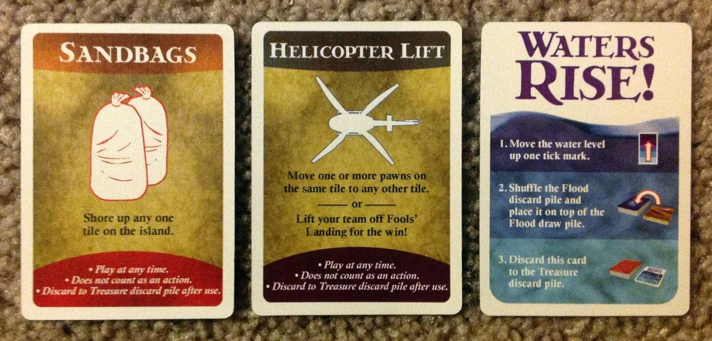
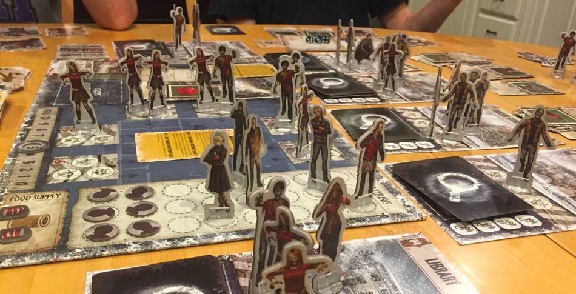
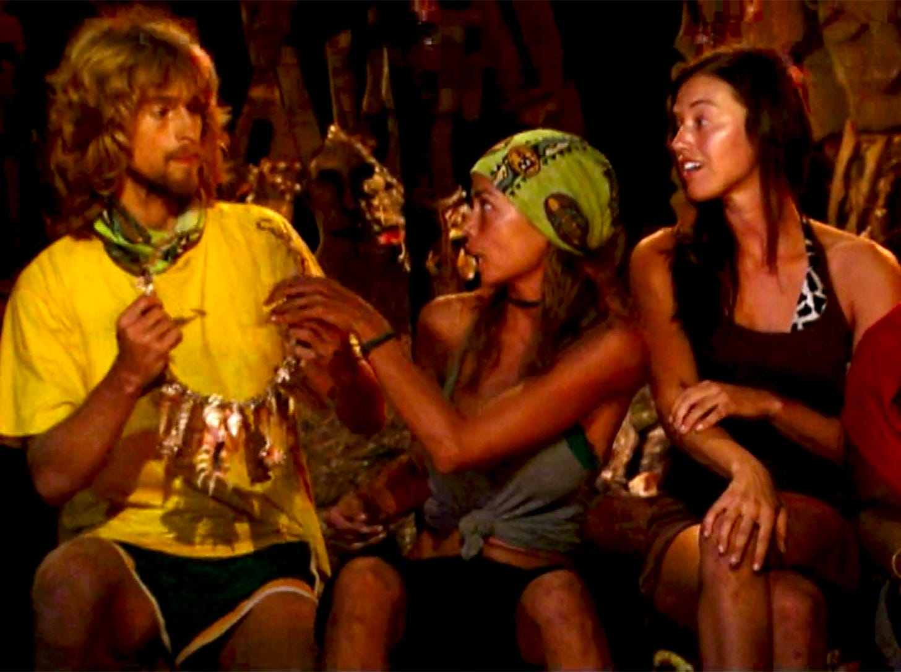

In [the first post of this series](https://cutlefish.substack.com/p/tbm-229-winnable-and-unwinnable-games), I discussed what makes a good game, how experienced people can sense unwinnable games (and make them winnable), how even experienced people can end up playing unwinnable games, and how game clashes can be at the root of many conflicts.

This week I will explore how different games can be "good" but very different, the role of mechanics and balancing forces, game transitions, and the "spirit" of the game.

*Warning! I am thinking "out loud" here. I've never considered this topic, and there is a good chance it will go in weird directions. I'll keep going because I promised to, but this is uncomfortable!* 

Two Companies

----------

Compare two companies:

**Company 1**: 

* Focus on competing with other companies (not with each other).

* Less need to attribute blame to a single person/group. Open to complex causes

* Culture of collective responsibility, cooperation, and continuous improvement

* Innovation is a byproduct of collaboration and cross-fertilizing ideas

Example: Southwest ("we're all in this together"), Spotify (still?)

**Company 2**:

* Competition between departments for budget and control of narratives

* More need to identify a single root cause, single responsible individual/group, etc.

* Culture of individual responsibility, competition, and control

* Innovation is a byproduct of internal competition and independence

Example: Microsoft (before 2014). Amazon?

Two Games

----------

Let's compare them to board games:

**Company 1** is like [Forbidden Island](https://en.wikipedia.org/wiki/Forbidden_Island_(game)). Players team up to collect four treasures (The Earth Stone, the Crystal of Fire, the Statue of the Wind, and the Ocean Chalice) from an island that is sinking. All players win if they find all the hidden treasures, and they all make it back to the helicopter and fly away, and they all lose if they cannot.

**Company 2** is more like [Dead of Winter](https://en.wikipedia.org/wiki/Dead_of_Winter:_A_Cross_Roads_Game), a cooperative (is meta-cooperative a thing?) survival game. Players are a colony of survivors in a post-apocalyptic world populated by zombies (of course). Each player has a unique faction of survivors under their control with a shared objective to achieve AND their own secret personal objective. Each faction has unique abilities and strengths. The colony has limited resources, which players must juggle to ensure 1) the colony survives and 2) they achieve their personal objective.

Dead of Winter

Central Twists (Balancing Forces)

----------

Each game has unique devices and mechanics that create **dissonance and balancing forces.**

In Forbidden Island, the rising water level intensifies the pressure on the players to shore up the sinking tiles and gather treasures quickly. The shared sense of urgency (the island sinking) offsets the tendency for groupthink, diffusion of responsibility, slow decision-making, and the lack of healthy competition.

In Dead of Winter, two related devices are critical for gameplay: crisis cards and secret personal objectives. Crisis cards are drawn each round and introduce a common threat that all players must contribute to resolving. However, each player's ability to contribute is influenced by their secret objectives, which may not always align with the group's collective goal. Players must balance between working for the common good and their interests.

These devices' beauty is that they manage the inherent weaknesses in each game/company type. They create dissonance, but this dissonance is necessary and important. It pushes against complacency, groupthink, and siloed thinking. And forces cooperation under pressure, negotiation amidst individual interests, and continual.

Spirit of the Game

----------

In each game, some moves would technically fall within the rules but are not in the *spirit of the game*.

**Forbidden Island**

Consistently acting unilaterally without consulting with the team. Players can technically move and shore up tiles in Forbidden Island without consulting their team members. However, doing this repeatedly might leave important tiles at risk of sinking. It's not in the spirit of the game, which encourages communication and cooperation, and it's unlikely to be a successful strategy in the long run.

**Dead of Winter**

Refusing to contribute to the crisis contribution. Technically, a player could hold back resources to keep for their (secret) personal objective, but this could result in the failure of the main objective, causing the game to end in a loss for everyone, including the non-contributing player.

Why is this important? 

In any organizational culture, the spirit of the game goes beyond the "rules." This spirit of the game encompasses the shared understanding and meaning, values, and attitudes that players bring to the game. The unwritten code of conduct guides behavior and is informed by the context, the history, and the players themselves.

**Consistently twisting the rules creates a new game**. 

Death of Winter can easily become Survivor. 

The spirit of the game is what ultimately makes the game more than just a set of rules. The same applies to a company: its culture goes beyond its formal rules and processes. This is why attempts to "just" figure out incentives and brute-force a company culture tend to fail (or leave you with a different game). You can't shake the core beliefs of the founders, even when they pretend to play another game.

Transition to New Games

----------

A cooperative "us against the world" (Forbidden Island) scenario can morph into a more complex one with interweaving individual and collective objectives. The challenge lies in managing this complexity while preserving the company's vision and mission.

Faced with disruption and an existential threat, a competitive survival scenario (Death of Winter) might need to morph into a cooperative one, where the whole company must innovate and adapt to survive and succeed in the face of disruption. The challenge now is fostering more cooperation and shared purpose while maintaining the sense of urgency and innovative drive that defined the company in its earlier stages.

Companies are constantly transitioning between different games—new players join, new rules emerge, the spirit of the game changes, and efforts to circumvent rules become new games.

Some Questions to Ponder

----------

* What are the central twists or balancing forces in your organizational game? What job do they do?

* Are there practices that technically fall within the "rules" but go against the spirit of the game you believe your company should play?

* Consider moments when you've noticed rules being consistently twisted. What new game is inadvertently created in these instances, and what are its implications for the company?

* How is the game in your company changing?

If this interests you and you want me to continue this exploration, please leave this post a ♥️. I will write a Part 3 and Part 4 (and more) if there is enough interest.

[Part 1](https://cutlefish.substack.com/p/tbm-229-winnable-and-unwinnable-games) | Part 2 | Part 3 | Part 4