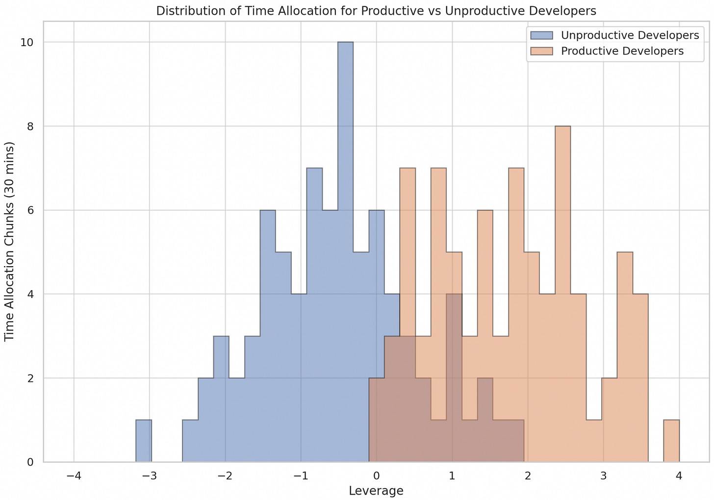

Developer productivity is so August 2023.

**Enter Developer Counter-Productivity.**

Productive developers spend more of their time and energy on high-leverage activities. Counter-productive developers spend more time and energy on low or negative-leverage activities. This skew is often only marginally within their control (and sometimes completely out of their control). It explains why the same developers in a different environment can be so much more (or less) productive.

This post is about where the time/energy goes. Yes, individual knowledge, skills, motivation, and habits matter. But in most organizations, these things pale compared to developers' daily challenges and environment. Instead of measuring individual developer productivity, it would be better to focus on addressing the known sources of low/negative leverage. Maybe when you’ve gotten these things under control you can starting focusing on team “performance”.

**Action item for your team:**

For the next two weeks track when your time falls into these buckets.  

**Action item for managers:**  

Where can you shift time spent in these areas to higher leverage areas?

*Note: For brevity I used “time spent” instead of “time and energy spent”. The distinction is important since we don’t have the same levels of energy throughout the day. Assume I mean “time and energy spent.”*

Reactive, Unplanned Work

----------

* Time spent on reactive, unplanned work that only fixes the most immediate issue. This includes dealing with unplanned system outages, security incidents, or other emergencies that could have been prevented with better planning or monitoring.

>
>
> *It feels like I'm just putting out fires all day. Instead of coding, I'm playing whack-a-mole with system issues.*
>
>

Context Switching and Startup Costs

----------

* Time spent context-switching and incurring "startup costs" to move between tasks, get set up, and collect the necessary things to do the work.

* Time spent getting situated in new parts of the codebase.

* Time spent orientating yourself to tasks you were working on but paused.

* Time spent "getting your head in the game" after a long, draining meeting.

>
>
> *Just when I get into the zone, I have to switch tasks. It takes me another half-hour just to pick up where I left off.*
>
>

>
>
> *Every time I have to context-switch, it's like starting my day all over again. So draining.*
>
>

>
>
> No, I don’t ‘have a second’. Because a second turns into half an hour.
>
>

Non-value-adding Administrative & Compliance Work

----------

* Time spent on administrative work that has no direct value to customers or the team.

* Time spent getting approvals to use certain tools (or making do with less effective tools during that time, or when you give up altogether).

* Time spent on performative compliance efforts that don't effectively reduce risk to customers or the business.

* Time spent navigating global mandated processes without the freedom to adapt them to local concerns.

>
>
> I spent three hours today just filling out forms to get access to a tool that should be standard for my job.
>
>

Ineffective Planning

----------

* Time spent estimating, speccing, discussing, and pitching ideas and work before the 'last responsible moment.' This is often part of largely performative planning activities. Writing specifications and proposals and not getting valuable or collaborative improvements to the ideas.

* Time spent unnaturally or ineffectively splitting work into units for sprint planning, burn-downs, sprint metrics, etc. Adding unhelpful abstractions of the work on top of the actual work.

>
>
> We had a two-hour meeting about a feature that won't be built for another six months. What a waste of time.
>
>

>
>
> We spent weeks planning, and now the requirements have changed. All that effort feels wasted.
>
>

>
>
> We didn't plan at all and just started coding. Now we're paying the price.
>
>

Dependency Management Overhead

----------

* Time spent coordinating and managing dependencies that could be safely removed.

* Time spent waiting for deliverables from other teams that are behind schedule, causing delays in your work. In theory, you can do other work, but often, it is not high leverage.

* Time spent in meetings and discussions to align with other teams when a more streamlined communication process (or less structured, more embedded) could have been effective.

>
>
> I feel like half my job is chasing other teams for updates. Why can't we just have a clear plan and stick to it?
>
>

>
>
> We're always waiting on another team. It's like our project's success is out of our hands.
>
>

Ineffective Meetings and Communication

----------

* Time spent engaging in ineffective communication, ineffective meetings, synchronous meetings that should be asynchronous, and asynchronous meetings that should be synchronous. This includes processing 'noisy' information where the signal has been lost.

* Time spent in meetings and other activities where the things that need to be said aren't said due to low psychological safety, judgment, fear of retribution, and needing to repeat those activities repeatedly.

* Time spent repeating the same information to different audiences in the same way. We expect to re-contextualize information for different audiences, but if it is the SAME information, that is counterproductive.

* Time spent scanning communications for relevance and 'catching up' on communications.

>
>
> We just had an hour-long meeting that could have been an email. My whole day is thrown off now.
>
>

>
>
> We keep having these meetings, but no one speaks up because they're afraid of backlash. It's pointless.
>
>

>
>
> We tried to handle this complex issue through email threads and ended up misunderstanding each other. Should have had a quick call.
>
>

Redundant Manager Briefing & Orientation

----------

* Time spent briefing and orienting managers because they are too busy to be directly involved.

* Time spent getting people back up to speed or getting people current on progress because they were too busy to remain involved in what was happening.

>
>
> My manager is so out of the loop, I have to spend hours each week just catching them up.
>
>

>
>
> I briefed my manager last week, and today they asked the same questions. Do they even listen?
>
>

Consensus Seeking and Decision-making Drag

----------

* Time spent seeking consensus across a large group of people when decisions could be made more locally.

* Time spent dealing with hasty local decisions that could have been better made with a couple more people involved. Making key decisions without appropriate support and information.

* Time spent adapting to rapid and reactive top-down changes in direction.

>
>
> So we're having another meeting to decide what we already decided last week? Great.
>
>

>
>
> I feel like we're in a decision-making loop. We discuss, decide, and then second-guess ourselves.
>
>

>
>
> A decision was made without involving anyone who actually works on the project. Now we have to redo it.
>
>

Ineffective Collaboration Arrangements

----------

* Time spent working alone when working together would be more effective, and vice versa.

* Time spent using transactional processes and work approaches for things that should be collaborative. And using collaborative and high-touch methods for situations that can be safely transactional.

>
>
> If we paired, this would be done in an hour.
>
>

>
>
> I can’t get a second to work alone on this.
>
>

Lack of Help and Support

----------

* Time spent thrashing due to lack of help, difficulty getting help, people being too busy to help, or a culture that frowns upon asking for help.

* Time spent locating the right individual or department to assist with a specific issue leads to a runaround.

>
>
> I could solve this in five minutes with a little help, but everyone is 'too busy' to answer a simple question.
>
>

>
>
> I finally found the right person to help me, but it took three days of getting the runaround.
>
>

Ineffective Documentation

----------

* Time spent writing documentation that no one reads or skimping on documentation that could save people time and improve their work experience.

* Time spent interpreting specifications or context once or twice removed from the source.

>
>
> I spent two hours today deciphering outdated documentation. I still don't have my answer.
>
>

Poorly Maintained Code and Docs

----------

* Time spent navigating or working with difficult-to-understand or poorly maintained code, documentation, etc., without fixing issues as you encounter them.

>
>
> The code is such a mess that it feels like archeology, not programming.
>
>

Workarounds

----------

* Time spent doing workarounds that themselves are slower but also create additional confusion down the road for other team members.

* Time spent documenting and explaining workarounds to other team members.

* Time spent revisiting and maintaining workarounds.

>
>
> We have so many hacks in the code now, it's like walking through a minefield. One wrong step and everything blows up.
>
>

>
>
> I spent half my day documenting a workaround that's just going to confuse the next person who sees it.
>
>

Inefficient Onboarding

----------

* Time spent getting new team members up to speed on things (that could be effectively streamlined) without having enough time to share broader context and build relationships.

* Time spent repeatedly covering basic project details for new hires because of a lack of standardized onboarding materials or procedures.

* Time spent correcting mistakes or misunderstandings that arise from an incomplete or rushed onboarding process.

>
>
> New hires spend their first week just figuring out our convoluted setup process.
>
>

>
>
> It feels like every new team member is reinventing the wheel because our onboarding is so disorganized.
>
>

Tooling Challenges

----------

* Time spent getting finicky tools to work, using outdated tools, or getting tools to play nice together. This includes manually reinstalling tools and repeatedly setting up your environment manually.

* Time spent using the wrong tool for a job, working more slowly, and producing more errors or workarounds.

* Time spent trying to diagnose issues ineffectively—something is not working, and you are trying to figure out why, and you don't have the tools/observability to be effective. In some cases, you leave issues open. In other cases, it takes much longer to get to the bottom of things.

* Time spent resolving conflicting versions of libraries or packages when they could be standardized across projects.

>
>
> If I had a nickel for every time I had to manually reset my dev environment... I'd have a lot of nickels.
>
>

>
>
> We automated the task, but the tool we used is so complicated that now no one knows how to fix it if something goes wrong.
>
>

Manual, Automation-friendly Tasks

----------

* Time spent on manual, high-volume, repeatable tasks that are good candidates for automation. This also includes fixing errors caused by doing these tasks manually.

* Time spent manually updating dependencies when automation tools could have been used to keep them up to date.

>
>
> Why am I still doing this manually? We have the technology to automate this! It feels like we’re stuck in 2004.
>
>

Waiting on Slow Processes

----------

* Time spent waiting on a slow-running process without the ability to context switch. You can't do something else, but you're waiting.

* Time spent waiting for compute-intensive tasks to complete, like builds or data transformations, which could have been optimized.

>
>
> I could have finished this hours ago, but I'm still waiting on the build to complete.
>
>

>
>
> I tried to multitask while waiting, but the context-switching just made it worse.
>
>

Rework, Validation, Feedback, and Premature Convergence

----------

* Time spent working on something without validating earlier assumptions as it degrades the leverage of what you are doing right now.

* Time spent locking down something prematurely, often to 'show something' to managers, when it would have been better to start more minimally and evolve it over time.

* Time spent delayed due to a lack of immediate feedback. Yes, you can do something else while waiting, but you incur context-switching costs, and the valuable task requiring feedback is on hold.

* Time spent working with incomplete context or information where your work might be better informed and more effective (or your time might have been better spent focusing on learning)

* Time spent chasing perfect information or complete certainty when roughly right decisions will suffice.

* Time spent trying to decode how people translate customer needs when it would be better to connect directly. Time spent working off of hastily pulled together research or things not researched with the right methods.

>
>
> I wish we had just validated this before building it out. Now we have to backtrack.
>
>

>
>
> We should have just shipped this and started monitoring feedback.
>
>

>
>
> A product manager made up this user story, I can tell. I’m not sure they really understood the data or feedback.
>
>

>
>
> I guess I’ll just keep going based on the assumption that this is true. But the evidence is super shaky.
>
>

Building Low-Value Features

----------

* Time spent building things that customers don't use, are over-built or over-engineered, or focus only on short-term revenue, thereby passing the costs to future developers.

* Time spent doing made-up projects due to delays in feedback and direction and pressure to remain busy during lulls and gaps.

* Time spent completing "promotion-drive" efforts solely designed to test individual developers.

>
>
> I built this feature that nobody uses. It's like building a bridge to nowhere.
>
>

>
>
> Well, my performance review said I was light in this area, so we invented this project I could work on to prove myself.
>
>

>
>
> Sure we closed the customer, but that is some weak-assed revenue.
>
>

Unreleased Code

----------

* Time spent on code that sits around without being released to customers, not eliciting feedback or producing value.

* Time spent not integrating code and seeing how it plays with the broader codebase.

>
>
> My code is just gathering dust because it hasn't been released yet.
>
>

>
>
> Who knows if this will even pass the checks anymore.
>
>

>
>
> We’re on the fifth phase of this projects, and haven’t actually delivered anything. Funny, right? The burndown looks good though.
>
>

Artificial Deadlines & Rushing

----------

* Time spent working ineffectively to meet artificial deadlines, often leading to working overtime even when in degraded mode.

* Time spent working hastily and making mistakes along the way, feeling rushed.

* Time spent delivering work before it is needed or ahead of work that might be more valuable.

>
>
> We're rushing to meet a deadline that someone pulled out of thin air—and dropping a lot of balls in the process.
>
>

>
>
> I’m working at like 50%. I’m not making great decisions.
>
>

Poor Timing/Energy Fit

----------

* Time spent during poor timing/energy fit periods. For example, afternoon meetings for tasks that require deep thinking and morning meetings during the best concentration window.

* Time spent trying to rest and recharge, but it is not effective due to interruptions. You are less effective when you try to get productive later in the day.

>
>
> Why are we having a brainstorming meeting at 4 PM on a Friday?
>
>

>
>
> They scheduled a routine update meeting during my most productive hours. There goes my flow.
>
>

>
>
> Every time I say I am going to take a real lunch, I end up on a stupid Zoom call.
>
>

Skill Mismatch

----------

* Time spent on things where there is poor skill fit. Either something that is way out of the person's skill set or something that is way below their skill set.

>
>
> I hate to admit it, but I am way over my head.
>
>

>
>
> I’m bored, and half checked out.
>
>

Knowledge Loss

----------

* Time spent re-learning information was lost when people who didn't have an opportunity to pass along that knowledge left the company.

>
>
> Our key expert left, and now we're spending weeks just to re-learn what he knew.
>
>

>
>
> No one on the team has actually met a customers. That’s crazy.
>
>

Missed Opportunity Costs

----------

* Time NOT spent on high-leverage work, exchanging valuable context, cross-training other people, and keeping up with technology trends. These represent opportunity costs that the other items on the list keep you from attending to.

* Time spent not fixing the things mention in this list, especially when not fixing something makes it harder to fix in the future.

>
>
> I wish I had time to work on more impactful projects, but I'm stuck doing reactive tasks.
>
>

>
>
> I wish I could just spend one day making these paper cuts go away.
>
>

Second and Third-Order Effects

----------

* Time spent doing less effective work due to the second and third-order effects of all the items mentioned above, including loss of morale and confidence, psychic harm, "checking out," and disconnecting from work.

>
>
> All these small inefficiencies are really starting to affect team morale. It's a downward spiral.
>
>

>
>
> The money is good, and I’m going to lock in my options. I can’t change this place.
>
>

Did I miss anything?