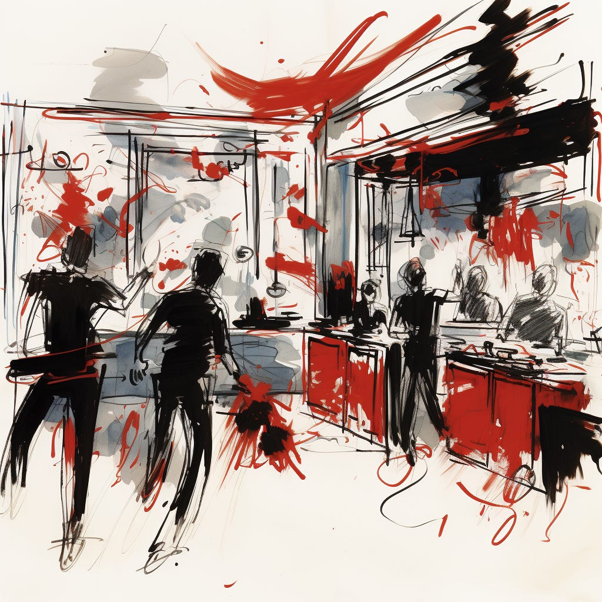
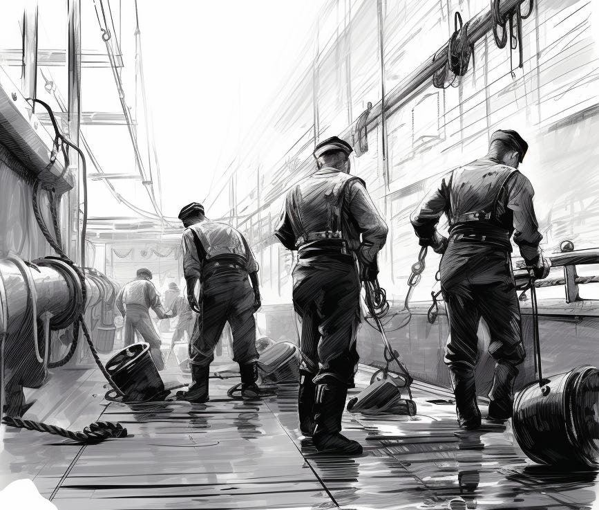
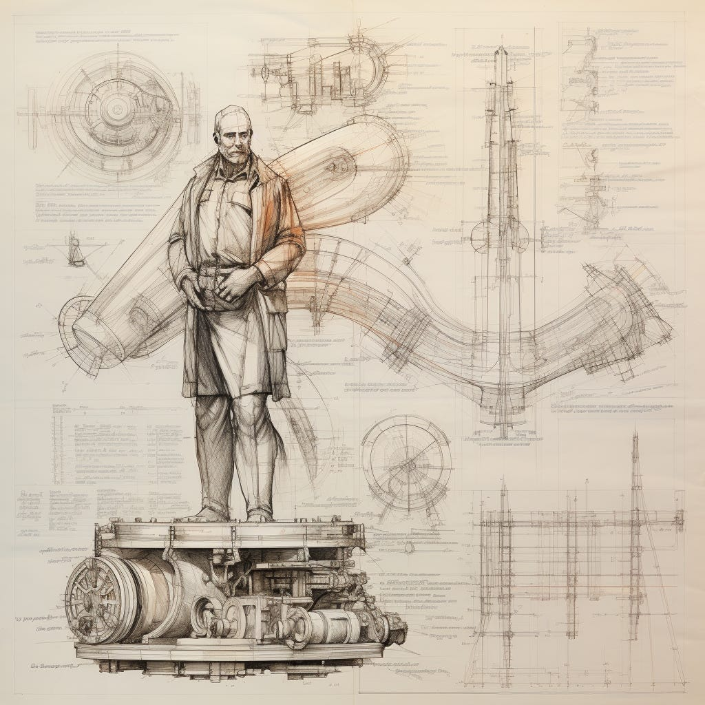

This is a post I’ve wanted to write for a long time. The basic idea is that waste in product work is invisible. But if we COULD see it, what would it look like? I’m not a great fiction writer, but I tried.

One big realization when writing this post is that being able to sense these areas of waste *despite* them being difficult to see is a real mark of experience. It’s one of the things we all need to eventually learn (and explain to others).

*Images are from Midjourney.*

1. Building stuff no one wants

----------

A restaurant kitchen buzzes with activity. Chefs pour their heart and soul into every plate. Runners and servers juggle sky-high trays, barely avoiding running into each other. The kitchen doors swing open and shut frequently, but the dining room tells a different story despite all this hustle. Outside the dining room tables, no one is eating. The tables are covered with uneaten food, and many don't even have guests (they've left or never arrived). Where there ARE guests, there's a never-ending cycle of requesting more dishes but eating nothing. You can almost smell the food going to waste.

2. Unfinished projects and context switching

----------

You're juggling multiple home improvement projects amidst a busy schedule. You start one project, gather all the necessary tools and materials, and set up your workspace. After making some progress, you're forced to shift gears and care for something more urgent a few hours in. When you return to the project, you spend precious minutes remembering where you left off, figuring out your next step, and retrieving the right tools from a now cluttered toolbox. Days later, another shinier project beckons, and you must pivot again, leaving the first half done.

This cycle continues, with each project advancing in fits and starts. Weeks and months roll by. When you near the finish line, your initial enthusiasm has waned. Instead of celebrating, you're left feeling drained and overwhelmed, questioning whether the renovations were worth the chaos (especially now that you're considering selling the house).

3. Debt and interest

----------

You plant a garden. At the outset, things are "perfect," but you get busy and neglect it as time passes. Weeds sprout, and it isn't that bad (at first). There's always "next weekend". Days turn to weeks. Weeds multiply, competing with your plants for nutrients, sunlight, and space. Whenever you think about caring for the garden, the whole project seems daunting. It's all an intertwined mess, and distinguishing the weeds from the other plants becomes increasingly difficult. At a certain point, you have to decide whether it is even worth trying to fix the issue. It might be time to start over.

4. Over-constraint and too many drivers

----------

A family plans a summer vacation (a road trip). Everyone has an agenda: fishing, spa, amusement park, historical sites, and great restaurants. They'll pass by a distant relative. Why not visit? The fishing spot is best after dawn. The spa requires reservations. The amusement park gets crowded after 10 AM. The historical site has a single guided tour in the afternoon. The relatives can only meet for dinner. Trying to fit it all in, the family creates a tight, hour-by-hour schedule (in a spreadsheet). The trip starts with high energy, but gradually things go to crap as all the normal unforeseen hiccups creep into the picture. A week later, they return home stressed out and ready for a vacation.

5. Product offering too broad. Tooling debt

----------

Imagine a kitchen where every new recipe requires buying a unique kitchen gadget. Over time, drawers overflow, counters are crowded, and cabinets can't shut. It's hard to find space, let alone the right tool, when you want to cook something. Some gadgets you only use once, while others are broken. You haven't had time to sort through them. Over time, you cook less and less because your once usable kitchen is now an Amazon kitchen tool graveyard.

6. Chasing high utilization

----------

Imagine a call center for a large multinational company. To keep costs low and efficiency high, management decides they want their agents (CSRs) to be on support calls for 98% of their working hours. To accomplish this, they minimize breaks, keep training time to a bare minimum, and limit admin time (e.g., recording call details, following up on previous issues, or coordinating with other departments for resolution). The result? 

* Less slack for high call volume situations

* Burnout, more mistakes, less patience, and declining quality of service. 

* Incomplete records make solving future cases more difficult.

* Increasing call volume (due to unresolved issues)

* High employee turnover

7. Interfaces between teams become limiting and over-constrained

----------

Port Alpha and Port Beta see an opportunity to increase trade by establishing a simple trading agreement. Port Alpha sends fresh fruit to Port Beta, and Port Beta sends crafted goods back to Port Alpha. The relationship is harmonious…at first. There's an explosion of fresh fruit and crafted good variations. To keep things fair, both ports institute ever more complex quality checks. Since the Alpha and Betas speak different languages, they hire an army of translators and bi-lingual lawyers to unpack and maintain the agreements.

Next: taxes and tariffs! Paperwork explodes! Dispute multiply! Port Alpha and Port Beta inadvertently create a monstrous bureaucracy punctuated by distrust and strife (and rich lawyers).

8. Professional identity linked to throwing people at problem

----------

One day, a crew discovers a minor leak in the hull of their merchant ship. The leak is a concern but not catastrophic. The captain forms a new team, The Bailing Brigade, to manage the situation. Their sole task is to bail water. Day and night, the BB works to keep the ship afloat. Over time, the BB begins to take immense pride in their role. They invent unique bailing techniques and new tools. They hold bailing competitions.

Quickly, their identity revolves around bailing. The idea of repairing the leak gradually becomes off-limits—if there's no water to bail, what would happen to the Bucket Brigade? And the leak isn't *that* bad. This continues for years until a "private equity" shipping conglomerate emerges from the depths.

9. Unmanaged growth obscures waste

----------

Imagine a small village tucked away in the mountains. Every resident knows one another, and word travels fast. If someone's roof leaks, neighbors pitch in to help. If a trader rips someone off, word spreads by sundown. Then, someone discovers gold nearby. The village transforms into a booming town—the population swells. Tents, new roads, and new buildings pop everywhere. Maps can't keep up. Abandoned excavation sites litter the outskirts, and faulty equipment and machinery pile up.

What was once a glaring issue in the quiet village — a single piece of broken equipment or a wasted resource — becomes just another unnoticed part of the landscape. The bigger and busier things become, the harder it is to notice — let alone address — the small inefficiencies that accumulate and impact the whole. This all lasts until the boom goes bust.

10. Theory of constraints. Over-production. Matching supply and demand

----------

Ships from all over the world stop and load up at the Port of Mercantile Bay, but there's a problem. Everyone is busy, but nothing is moving—something about supply and demand and some critical system upgrades.

Captains constantly contact their home offices, updating them about delays. Crew members wake up every day hoping for the signal to dock—when the answer is "No," they keep themselves busy maintaining the ship. Dockworkers ready their equipment, and cranes pivot in anticipation. Local harbor masters juggle communications with multiple vessels, scheduling and rescheduling docking times. Agents constantly renegotiate shipment deals due to unforeseen delays. 

It's a hive of frenetic activity, but *nothing is moving*. The horizon is dotted with anchored ships, all waiting for their turn to dock. Containers pile up: some destined for boats that can't get to them, and others offloaded from ships but stuck in the port without transport out. Days turn into weeks, causing a snowball effect of negative outcomes.

11. Organizational design challenges

----------

Imagine the Grand Bazaar bustling with vendors, skilled craftspeople, and wholesale and retail buyers. The arrangement of stalls defies logic: a perfumer wedged between a blacksmith and a baker, a potter adjacent to a fresh produce vendor and fishmonger, and a silk merchant neighboring a butcher (watch that knife!).

To produce their wares, vendors constantly need items from distant stalls, leading to a constant logjam of transported raw materials and parts. Because of this disarray, 'Bazaar Navigators' emerge, guiding customers through the chaotic weave for a fee. Up springs the BNO organization. 'Bazaar Brokers' also pop up, bridging trades between disparate stalls. What could be a bustling hub of trade and commerce is now a chaotic sprawl with a high cognitive load and lots of hustle and bustle with nothing to show.

12. The project isn’t that simple (with hints of HIPPO)

----------

Imagine a quaint town square. The town council decides to erect a modest statue to honor a historical figure who *just happens* to have the last name of the town council treasurer. On the surface, it's a simple project: a statue, a pedestal, and an unveiling ceremony. But as the project unfolds, the complexities multiply. The selected design looks a LOT like the treasurer, raising eyebrows. Rumors circulate when it's discovered that the treasurer is an investor in the local marble quarry chosen for the statue's construction and the trucking company slated to transport the marble. A political opponent jumps at the chance: time for an internal review! PowerPoint! Lawyers!

Meanwhile, the town's historical society has gotten involved. The pedestal's foundation becomes a larger issue when it's discovered that rerouting a water pipe is necessary—a pipe abutting an ancient aqueduct (dubbed "the monolith"). Multiple teams must coordinate, ensuring the aqueduct remains untouched. And that's not all. The unveiling ceremony will be a big deal: a big launch. To top it off, there's no end in sight: once (if ever?) the statue stands proudly, it will need regular maintenance—cleaning, protection from vandalism, and periodic restorations.

13. Chasing high utilization, and losing sight of differentiation

----------

Imagine a renowned winery somewhere. They are known for high-quality wine. They have a limited amount of land to grow their grapes, and they must decide which variety to cultivate every season. The vintner knows that filling every plot with vines isn't the goal; the key is ensuring each vine produces the best grapes.

After a string of experiments with psychedelics and the unfortunate passing of a family member, they decide to diversify. On the surface, it seems productive. Every patch of land is green and bursting with fruit. But here's the catch: each grape variety requires unique care, from pruning to pest control. The vineyard workers constantly switch between caring for one variety and another, never truly mastering the care for any single one.

Moreover, the wine-making process for each variety differs, leading to a backlog in the wine production phase. To make matters more intricate, the winery's reputation was built on its signature blends. But with workers so focused on individual varieties and not communicating, there's no synergy to develop that next award-winning blend—the net effect: lots of grapes but no memorable wine.

14. Knowledge silos and departmental incentives

----------

Imagine a vast library. In this library, individual librarians are tasked with curating, cataloging, and managing their unique sections. Each librarian keeps busy—acquiring new books, documenting them, organizing shelves, and ensuring their section is up-to-date. The path to becoming the Head Librarian lies in continuously expanding their sections with new acquisitions and maintaining them flawlessly.

However, there's a catch. The librarians rarely venture beyond their sections. Conversations are limited, and sharing insights is almost non-existent. When a reader inquires about a topic that spans multiple sections, no librarian has a comprehensive answer, nor do they have any practice collaborating to find one. All of that burden is put on the visitor. While every librarian deeply engages in their work and their sections are thriving individually, the library suffers. Knowledge is siloed.

15. Individual vs. group incentives

----------

Imagine five MBA candidates tasked with devising a comprehensive business strategy for a fictional multinational corporation. The assignment is clear: analyze various aspects of the company, from finance and marketing to operations and human resources, and present an integrated business plan. Success with this group project can make or break the semester.

Eager to shine individually, each student chooses an aspect they believe will get them the most attention. Sophia dives deep into revenue forecasting and complex investment strategies. Jackson, passionate about branding, immerses himself in crafting the perfect marketing campaign. Meanwhile, an operations whiz, Priya meticulously maps out supply chain logistics. Trying to differentiate himself, Liam explores niche markets in Southeast Asia, believing this unique angle will give the group (and his personal strengths) an edge.

As the deadline looms, they try piecing together their parts. But instead of an integrated business strategy, what emerges is more akin to five separate presentations loosely strung together. Each student produced top-notch work within their domain. But the lack of collaboration and communication means their "business strategy" lacks cohesion. They all get Cs and contest their grade, claiming that group projects are unfair.

Hope you enjoyed this little departure!

Cheers

John