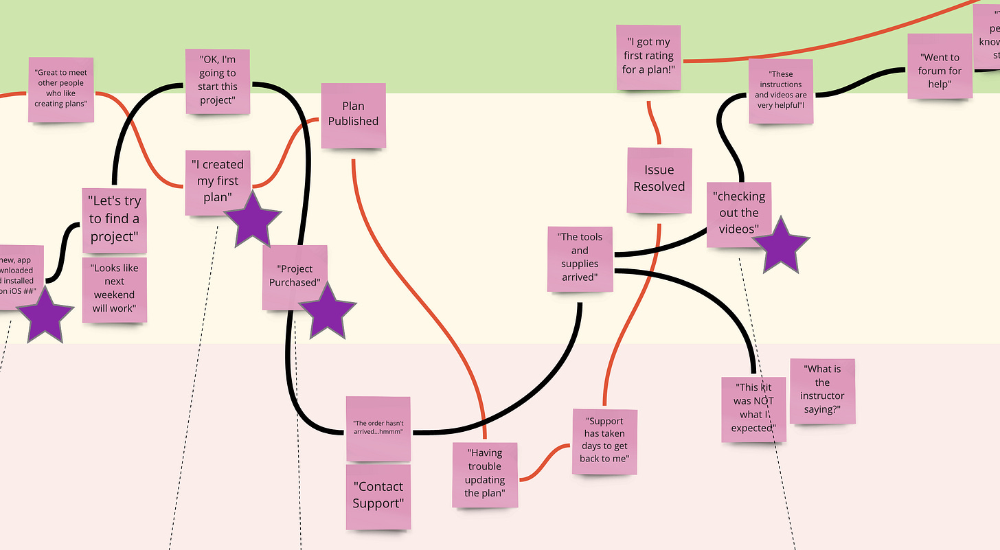

*Big thanks to everyone who purchased the [2020 TBM collection on Gumroad](https://gum.co/sErvL)! I’ve been hesitant about selling something after my canceled book project in 2020, so it means so much to be getting something out there. You can find the free web version [here](https://johnpcutler.github.io/tbm2020/).*

I chat with many teams eager to find magic metrics.

They want to know why customers renew. They want to learn the *key to organic growth*. They want to know exactly what their competitors have on their dashboards. Industry benchmarks. The *right* goals. The *right* OKRs. The *right* KPIs. ROI. Justification for the strategy-de-jour.

That's lots of pressure.

I met with a distraught product leader recently. He was deep in analysis paralysis. "What if I pick the *wrong* metrics?" he wondered. "What if I track the *wrong* things? What if I can't guess all the questions I am going to need to answer? What if I mess this up?"

My advice was simple.

>
>
> **Start counting things that happened that you care about.** Start adding the context that you care about. Build trust and familiarity with the data.
>
>

He was still stuck. "What should I care about?" he asked. I asked him for a tour of his team's product, with a special focus on:

* The product's "promises" and reason for being

* Key value exchanges (the user's investment in energy pays off)

* The start and end of key workflows

* The product's nouns and verbs as described by customers

* The adjectives and adverbs for users and key actions

* Big areas of uncertainty, big sweeping product questions

* Key jobs-to-be-done, scenarios, personas

* Examples of the unhappy path

* The new customer vs. existing customer experience

* A bit of competitive research

In thirty minutes we had amassed a good list of events, event properties, and user properties. Was it perfect? No! But it was enough to start counting and getting a sense of what was happening in their product every day. It took his team around 2hrs to instrument fifty events, three-hundred event properties, and a dozen user properties. And the team now incorporates measurement into all their work!

Why is this important?

Fancy predictive analytics and picking the right KPIs is not the starting point! You don't wake up one day and get those things right. It takes experimentation and exploration. You also don't answer most questions on the first go. I joke with teammates that the better an insight looks, the greater the chance something is wrong.

The teams that get this right build the muscle to measure and count things. Collect usable data. And then, over time, improve the quality of their insights. This is the key difference between data snacking, and integrating measurement into how you work more thoughtfully.

So...Start by Counting Things.

