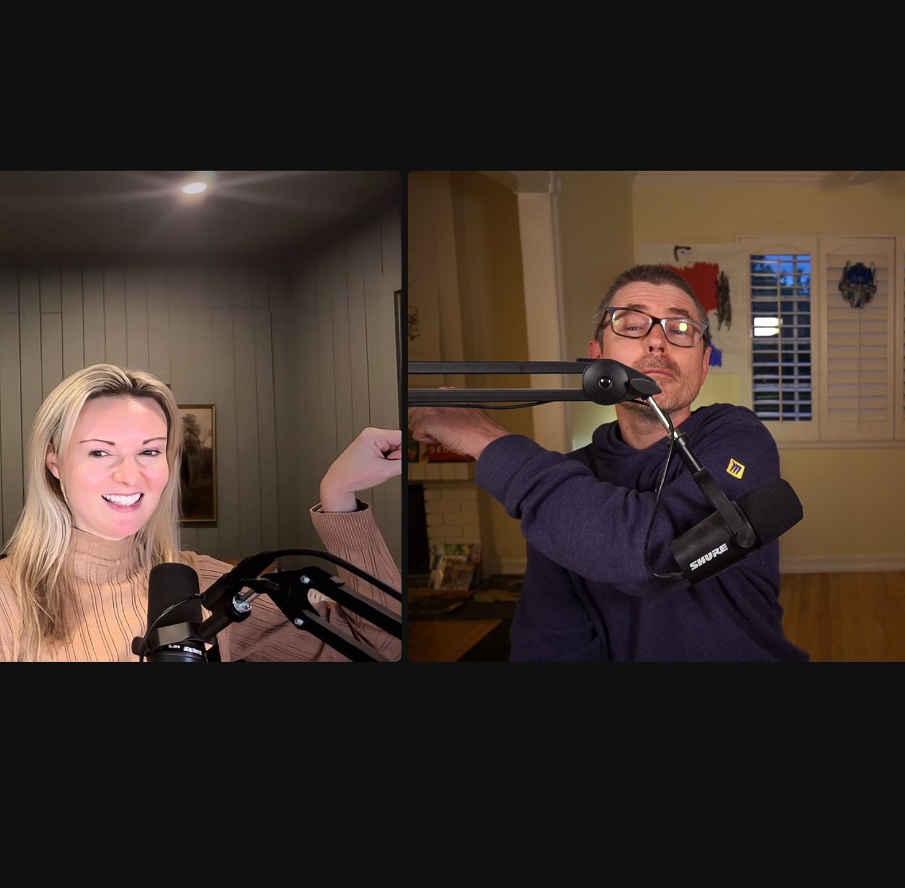
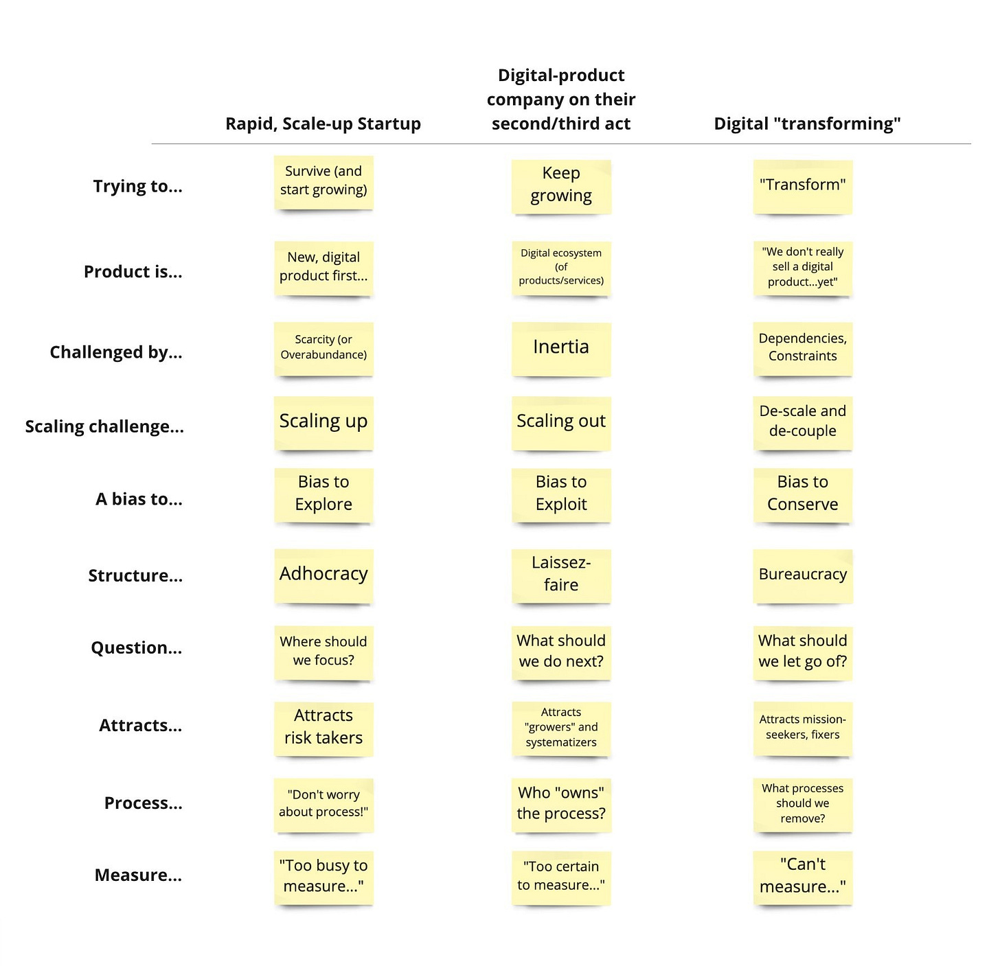

*This post was co-written with [Melissa Perri](https://open.substack.com/users/3269092-melissa-perri?utm_source=mentions). We started chatting about the podcast, and an hour in we figured…hey, let’s put this out there.*

You've probably already listened to (or are about to listen to) [Lenny's Podcast](https://www.lennyspodcast.com/) with Brian Chesky. We're both big fans of Lenny and were very grateful for him bringing him on to share more context around his earlier statements about how he changed product management at Airbnb. Hearing these things first-hand is so valuable.

Here is the podcast if you haven't checked it out.

But as always, the best content always sparks more questions. 

Melissa and I co-wrote this post to share what questions were going on in our minds as we checked out the podcast. In our experience working with many different companies, we've observed diverse situations leading up to what Chesky described, so while listening we constantly found ourselves curious and wanting more details. What else was happening? How did this relate to the broader context?

We have limited knowledge of what was going on at Airbnb (some friends, etc.), and we don't know Chesky. Given the number of questions people have asked us about Spotify, Basecamp, Shopify, FAANG (MAMAA), SaFE, [insert companies that do interesting things], we figured we would get ahead of this and write something we could give people. 

It's always important to understand the context behind what you hear in podcasts, and here are the questions we would ask to uncover if this would work in other situations.

Backgrounds of the Leaders

----------

* The founders had started Airbnb pretty quickly out of school. What experiences did they draw from when building AirBnB and determining how to run it? Who was advising them? How did the advisors change over time, and how did their advisors shape the company at different stages?

* How did Chesky work with Joe Gebbia, the co-founder and Chief Product Officer of Airbnb from 2008 to 2022? More about this story, and other background about the founders and how the relationship evolved, would be very helpful.

* Is every founder a product person? Is a founder the right product person for the entire lifecycle of a company?

* Chesky mentioned that the job of a leader is "to be able to motivate a team to see potential in them[selves] that they don't see in themselves, and to push them." What is his understanding of what a CEO and CPO must provide for the company to lead them on the right path at scale? Was this happening? What do CEOs and CPOs do that *don't* fall under the "motivate a team..." category?

In our experience working with founders, we've found that they can be magicians at running the "zero to one" playbook. However, they start to get uncomfortable when the scale kicks in. It becomes very difficult for them to figure out what is happening, who to trust, where to "lean in," when to delegate, and when to "go deep." They go on kicks, persuaded that X is the problem, only to discover that it is Y (and Y isn't something you can solve in a day, and your advisors don't know everything). It can be very hard to transition to thinking of your company as a product vs. just the product as the product and addressing the known unknowns regarding competence, leadership style, etc.

**(NOTE: Neither of us has been given $9 billion to build anything, so just getting that out there. This is incredibly difficult—even if you've done this many times.)**

Without experience scaling companies (and frankly, even when you have that experience), you quickly find there's no set playbook on how to do those things. Frequently, founders don't get the mentorship they need in Product Management leadership and CEO leadership to transition from startup to growth to enterprise. Or they don't hire the leadership expertise in Product Management, thinking this is an innate playbook that founders should possess. Or they get caught hiring people who, on paper, "have done it before," only to find that the "it" wasn't well defined. 

Was this a problem at Airbnb? Or something else? Or something in between? The interview didn't go in this direction, but hearing more about these struggles would be amazing. One thing is for sure: it can be hard to rekindle the fire a founder has for their business and product, so despite any existing challenges, it is incredible to have someone as passionate as Chesky still involved.

State of the Company

----------

* What was the company's strategy when it decided to pursue these changes? AirBnB was disrupting a travel industry that had already settled into being in the arbitrage business (Booking, etc.) At the time, other companies in the valley were doing similar things in different domains and hitting the arbitrage vs. differentiation challenge. Chesky mentions in the podcast that they did not want to be "in the arbitrage business." When did he realize they were going down the wrong path? Was it explicit in the company and product strategy not to go that way? Who was responsible for defining that strategy? Oh, to be a fly in the wall in those strategic discussions! In our experience, things like this brew for a very long time. It’s can be a saga.

* To what degree did the "wartime" nature of their challenge influence Chesky's approach? How was the team doing during all this? Many companies reported a newfound desire for crisp decision-making during this period and have tried different ways to keep that practice alive (with varying degrees of success).

* What was the effect of the low-interest rate "peacetime" happening in Silicon Valley *before* they had an existential moment? A lot of the interview sounds like classic SV peacetime: factions, product-ifying everything, hiring people from well-known companies who turned out uninterested in working, throwing people at problems, hiring people to build platforms, and five years later, you still have a million dependencies, etc. and the original developers have long since left for greener options. Check out [$400,000 a Year and 10 Hours A Week At GOOGLE](https://www.youtube.com/watch?v=yD2JaAnMMo0) for some laughs.

Leadership in "wartime" vs. "peacetime" looks very different. During "wartime," more control is usually warranted when a company is going down the wrong path to set it right. Airbnb's business declined by 80% during COVID-19, which is about as existential as possible. It was a "wartime" shift for sure. 

Do wartime practices work in peacetime, or should they change once the war is over? Is there a scenario where Chesky must disrupt how they work again to keep up with new threats and opportunities? What would that shift look like? And will he be able to sense the need for the change? Who does he trust to tell him what he's doing has stopped working?

In our experiences, companies experience macro pendulum shifts in working over multiple years or decades. Satya Nadella became CEO of Microsoft in 2014, a catalyst for a shift we are still witnessing. What we're seeing at Airbnb today is a function of decisions in the last two years AND decisions since they were founded in 2007. If you're a startup, go back to see how Airbnb behaved as a startup (in context at that time). If you're a scaleup, do the same thing.

Companies are constantly transitioning between more centralized and more decentralized versions of themselves—explore, expand, and extract, etc.

Using this simple model (below), is/was Airbnb all three things at once? Is Airbnb a classic Silicon Valley story of meteoric, unprecedented growth, which realistically was almost impossible to reign in? And how applicable is Airbnb's journey to your journey?

Remember, macro patterns are very predictable but also very complex. One can look at this table and nod but then realize that a company can be all over the map simultaneously.

*Half-joking: If you are a frustrated founder with a team of 100-150, and you're looking for a way to "fix" things, we guarantee that asking everyone to sit in a meeting with you will definitely make something happen. But seriously, learn what you can from Chesky. A watched pot does boil—at least until the water evaporates.*

Structure of the Company

----------

* In the late 2010s, it was very sexy to establish the GM/business unit model and detached products into silos even when they were interconnected. Why was that a popular approach at that time for businesses? What were they optimizing for?

* AirBnB seems to have adopted the GM model. Who was responsible for that strategy, and who assigned those titles? Were the units distinct? Was it a good idea to treat these as "separate businesses" (when it sounds like there were many dependencies)?

* When they were scaling, what companies inspired them? Who were they modeling their growth after? What was the board saying? 

*Caveat: Don't underestimate the impact of the macro environment on this. When money was cheap, investors were more optimistic, and "landing" really qualified senior leaders often required granting them "ownership" (at least on paper)...this made more sense. This is no knock on the GM model.*

It sounds like Chesky and AirBnB decided it had gotten too granular and isolated when defining teams and domains. The "units" were distinct but perhaps had too many dependencies, and the customer journey crisscrossed the domains. Sometimes, this happens when teams introduce a GM model prematurely or to satiate *internal needs, not customer needs*—customers don't care and don't imagine these as distinct products. Sometimes they are facing ridiculous pressure to grow, and lots of available money to make that happen—the answer is growth at the expense of fragmentation.

Companies frequently take inspiration from other successful companies, but they don't consider if that's the right model for their context. At the end of the day, Airbnb is a tightly connected platform. Did it create silos through the GM model, and did that affect their approach to strategy and decision-making?

Product Management Team and Empowerment

----------

* How did they model their product manager hiring practices until this change? What were the main criteria for hiring new PMs? What skills did they reward? 

* Is there an alternate explanation for the loop Chesky describes whereby when he tried to empower people, they would go slower, but things happened when he got into the details?

Chesky mentions that they made the Product Managers more commercial instead of purely technical. It sounds like many of them were order takers or local optimizers rather than strategic thinkers—data-driven but driving in data circles, growth-hacking but losing the thread. All good Product Managers should be commercially minded. So, how did they hire the product managers, and how did they reward them? There are a bunch of different product management philosophies out there; what philosophy did they ascribe to? Who set the tone? Who was providing the strategy to lead the product management team?

We've also seen a misinterpretation of the word "empowered." Were people asking Chesky to "let us do what we want," or were they asking for decisive decision-making, a strategy, and resolving "ties" (with dependencies)? Chesky mentions "empowerment" several times (often in the context of delegation, which differs from empowerment). One definition of empowerment is "providing the team with authority, necessary resources, skills, support, and clear goals." Does that match his definition? If not, what's behind that? Are people asking you as a leader for more empowerment? If so, what do you suspect is behind that?

Learning how his view on empowerment changed over the years would also be amazing. A helpful model to explore here might be power over, power with, power to, and power within.

One of the incredible things about founders who have spent their lives in one company is that they have completely fresh eyes regarding ways of working. Dismissing these people is never good because fresh eyes can be so important. However, remember that this is n=1, one company, one founder, one experience, one product, etc.

Wrapping Up

----------

To wrap up, we wanted to make one thing extremely clear: these questions aren't meant to imply that the decisions Chesky made were wrong for his company. Rather, we wanted to give you a sense of what questions went through our minds and what questions you might want to explore before adopting some of these practices and ideas. It's also perfectly fine to be just motivated by hearing someone describe how they tried to solve their problem!

Chesky has been wildly successful in growing Airbnb to where it is today. While he acknowledges at the end of the podcast that the results remain to be seen, we sincerely hope it works well for Airbnb and are excited to follow the journey. I hope he returns to the Lenny podcast and shares how things are going and what's learned. We're grateful for him sharing his journey publicly and embracing a growth mindset. 

We would encourage other leaders to take the plunge so the community can learn more (while remaining curious and seeking context).