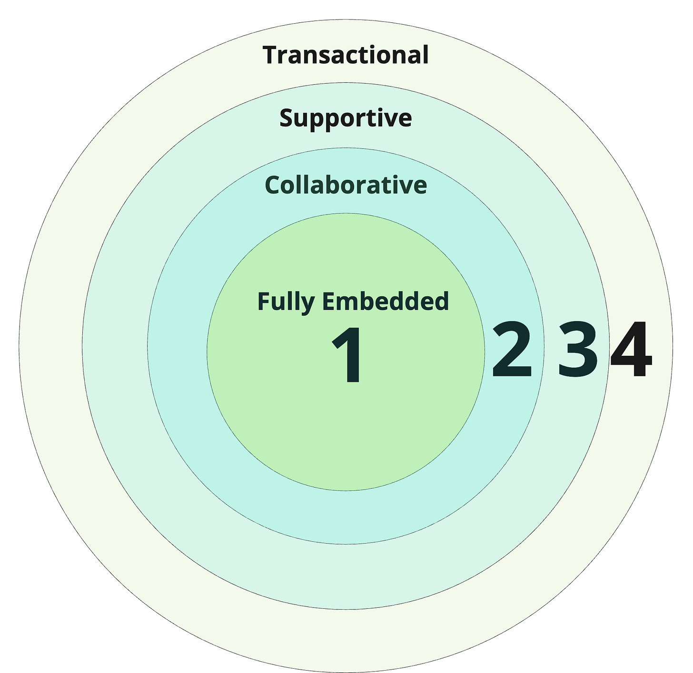
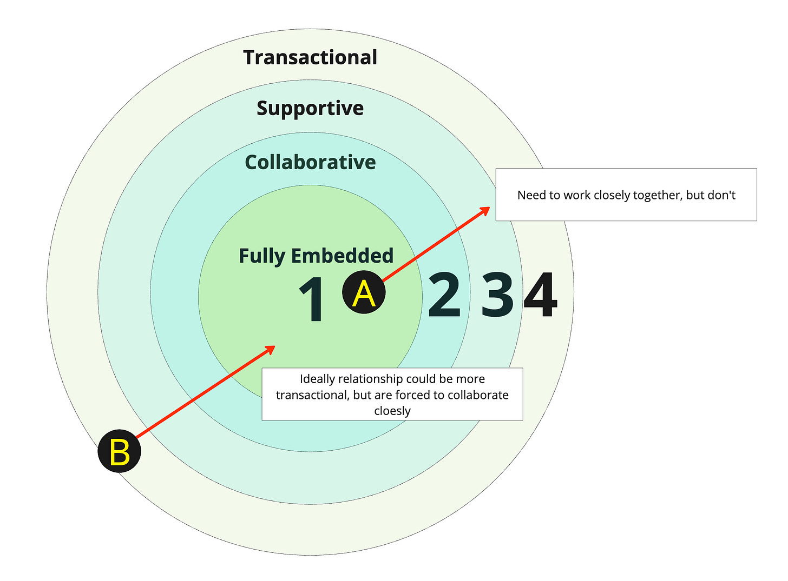

This is a multi-part series on wrangling dependencies in faster growing companies. If you are new to this series, consider checking out [Part 1](https://cutlefish.substack.com/p/tbm-261-dependencies-in-faster-growing) and [Part 2](https://cutlefish.substack.com/p/tbm-262-dependencies-in-faster-growing) (though this post stands alone). Part three of the series is short, but it is one of the most fundamental issues you must address when figuring out dependencies.

Consider a spectrum.

On one end of the spectrum, you have:

* Highly collaborative

* Attend all meetings and rituals together

* Have shared goals, values, and norms

* Involved from the start of an effort

* Use the same collaboration tools as all other contributors

* Managers of team members consider themselves a team

On the other end of the spectrum, you have:

* Never synchronously meet or interact

* Managers rarely/never interact with each other

* Share no rituals and norms

* Goals may compete with or contradict each other

* Get involved only when requested (through a transactional ticketing system)

Throw in two ways of working in the middle. We now have Fully Embedded, Collaborative, Supportive, Transactional. We can visualize this as a series of overlapping circles with some categories between the max and min described above.

The first big step in making dependency wrangling easier is to ask yourself:

What type of working model SHOULD we adopt for this work? 

Does this effort require close collaboration? Is this a routine request that looks like many other items in Team B's work queue? Or is the initiative exploratory with lots of handoff risk, coordination costs, etc? Would it be best to start, work, and finish together? Or do we want this to be more self-service and platform-like in the future? Do we expect to be doing this again? How do goals and incentives align?

What you tend to find is one of two problems:

* **A:** Teams that ideally could work more closely together that are forced to work more transactionally

* **B:** Situations where the relationship could be more transactional, but teams are forced to collaborate more closely

**Problem A** is a problem of strategy, alignment, priorities, and addressing why the relationship must be more transactional.

**Problem B** involves interfaces, working agreements, siloed knowledge, kingdoms, gatekeepers, etc.

So, it's simple (no, it isn't)! Start by figuring out what the work deserves and unblock what's getting in the way. Why? Dependencies become MUCH HARDER to wrangle when there is a lack of coherence between what the work deserves and how the teams can work.

For most companies, due to high WIP and premature convergence caused by long planning horizons, Problem A is more prevalent. But don't underestimate the degree to which Problem B leaves no extra brain space for the collaborative work that needs to happen. Taming the transactional things can go a long way.

I might keep going. Maybe like this if you’re reading along?