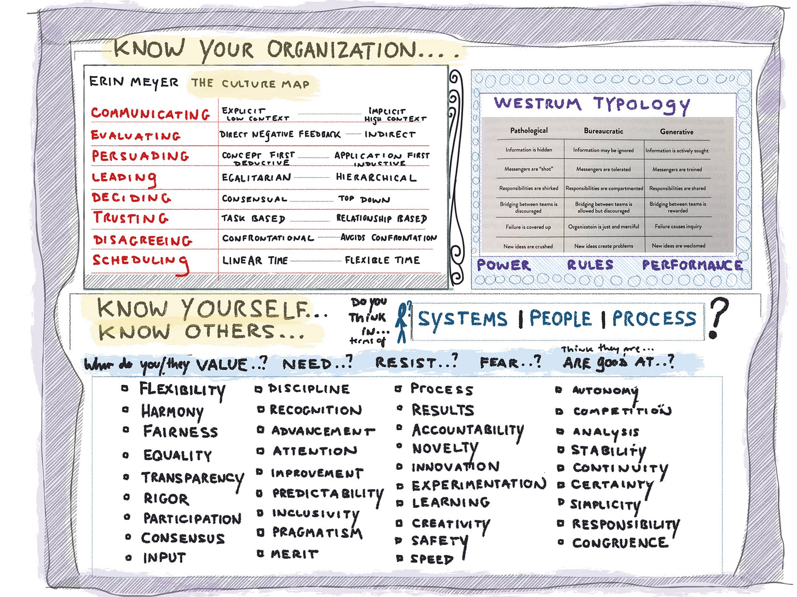

When you hear...

>
>
> We just need to execute
>
>

or...

>
>
> We just need to right people in the right roles
>
>

or...

>
>
> Bring solutions not problems
>
>

or...

>
>
> When everyone is responsible, no one is responsible
>
>

or...

>
>
> That is a low maturity team
>
>

...do you find yourself nodding or cringing? Why?

These phrases are my [kryptonite](https://en.wikipedia.org/wiki/Kryptonite). What are yours?

[I’ve started a crowdsourced Twitter thread to capture some](https://twitter.com/johncutlefish/status/1276078648936632322?s=20).

I cringe for various reasons. Some reasons predate my professional career. Some reasons involve my own views of work, teamwork, and leadership. And some reasons involve work experiences that left me hurt, angry, and frustrated.

Yet I have respected peers who use those phrases without a moment's hesitation. In front of hundreds of people even! People whose work and leadership I admire. I still cringe, but lately I've tried to become more curious.

What you start to notice is how perspectives on work differ. People have differing views on accountability, efficacy, leadership, and how work actually happens. Obvious, right? Yet many people — sometimes me, I'll be honest — don't pause to think about how their words translate. And don't pause to give people the benefit of the doubt.

Some people aren't even aware that different styles exist, or that different styles can be viable. Example:

>
>
> Why would you ever need to configure Jira to have multiple assignees? That just doesn't make sense. The thing would never get done!
>
>

This is especially true in places like Silicon Valley where people have experienced notable successes. Success often breeds myopia.  

A couple years ago I put together [this list](https://medium.com/@johnpcutler/look-before-leaping-9e4049a7c0f4):

The idea was to encourage people to consider their work culture -- to step back and observe, before jumping in to a change initiative. This is vital if you want to embrace the beautiful mess and be an effective teammate.

I think I'm making three points here:

1. Consider how your own words come across. When in doubt, use more specific language with less baggage. Don't know phrases that have baggage? Ask your team. Invite feedback. This is especially important for leaders. One misstep to a large audience could take weeks to repair.

2. Accept there are many different views of work. Explore these differences with your teammates. Get this out in the open.

3. Come to grips with your own "kryptonite", and reflect on whether your knee-jerk response is helping or hurting. Try to stay curious.