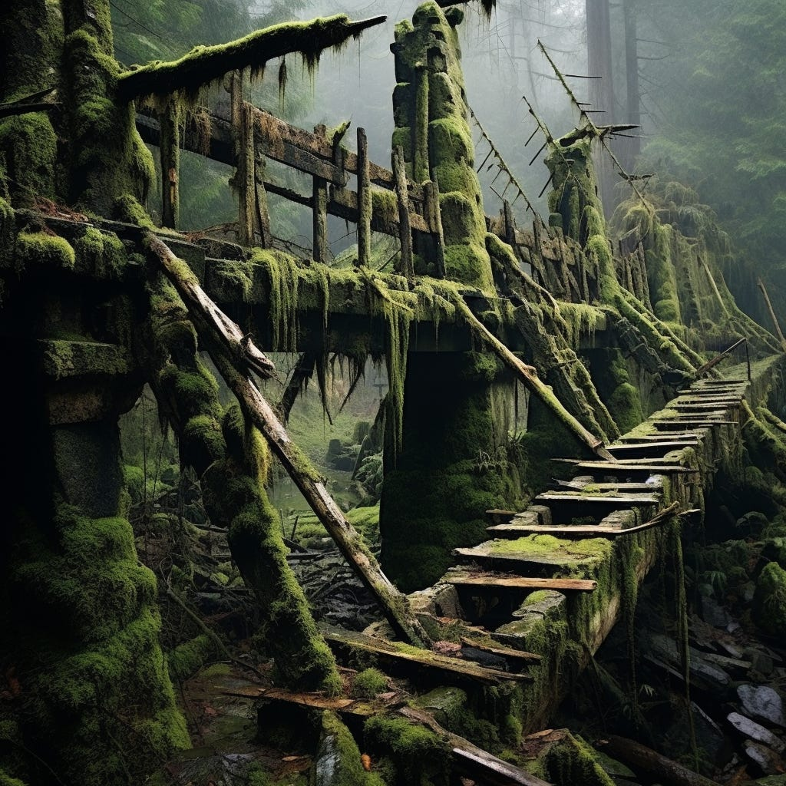

You are an explorer and have stumbled into a fertile valley. The valley has a river. You've decided to build a bridge.

**Your options are:**

1. **Quick and dirty**—something barely capable of getting you across the bridge. Unsafe, but does the job right now. 2-3d

2. **Perfection**. A bridge capable of handling diverse traffic (humans, animals, and motorcycles), supporting lots of weight, and withstanding future floods. Deep foundations. Relies on interesting (but not obvious) physics. 10w

3. **Pragmatic quality**. A reasonable, safe bridge suitable for a couple of people to cross at once. The design and how the bridge works is fairly self-evident. It is clear how it works. Nothing fancy. 1w,

You weigh your options. You plan to cross the river more than once and encourage children to use the bridge. Quick and dirty is not an option. As much as you'd love the craft of building the perfect bridge and showing off your bridge-building acumen, you don't even know whether you'll make a regular habit of farming the land on the other side of the bridge. Not worth it. Plus, over-engineered things can be harder to extend.

You pick option #3 (Pragmatic Quality). It seems like the best balance of time, extensibility, safety, and getting today's job done without trying too hard to anticipate future loads.

During a particularly busy farming season, there is a lot of pressure to improve the bridge.

You have two options:

1. **Rushed improvements**. You bolster up the bridge haphazardly, where it seems to be sagging and weakest. Just add more wood and materials. 1-2hrs per session.

2. **"Refactor" and clean up as you go.** Regularly remove debris. Reinforce the structure strategically and redesign key bridge parts as needed—3 hours per session.

Imagine two potential futures, an A/B test of sorts.

**Future 1**

----------

You pick #1 (**Rushed Improvements**) because those 2 extra hours seem like an eternity. But over time, figuring out what is going on gets harder and harder. When someone proposes cleaning things up, it almost never seems worth the time. Need to hold more weight? Just add more wood. Flood risk increases—signs of stress increase. Questions also start popping up about structural integrity. Your farmer accomplice, who made a lot of improvements, leaves. No one understands the bridge's structure (outside of "add wood"). At a certain point, a low-level anxiety starts to creep in.

All it takes is a modest flood for the cracks to form. You have a mossy, moldy bridge that could break at any moment. There's a good chance you'll have to delay your farming efforts or take significant risks while you construct a new bridge. None of your prior work is reusable.

**Future 2**

----------

If, instead, the team chooses to **refactor and clean up** (#2), it takes a bit longer for each improvement (at least at first). But because things are "cleaner," what is happening and where the structure is under stress is clearer. Flood risk remains in check because there's not a whole mess of logs propping up a bridge. Instead of lugging big logs to fix the problem, they can focus more on keeping the structure working with small additions. Eventually, this approach will be faster per session because there will be less heavy lifting.

The farming season is proving to be very productive, and you predict that you will need to rebuild the bridge to support a more diverse load at some points. Thankfully, because the structure you've built has high integrity and is functional, you can build the new bridge "into" the old bridge without too much disruption (you can even reuse some of the components). During the 6w build, there were no disruptions and no safety issues.

**Discussion**

----------

Here's something I've noticed about how teams talk about technical debt.

Sometimes you have a scenario where the team *started* with pragmatic quality and didn't clean up as they went for whatever reason. Over time, this thrust them deep into Future 1, where the barriers to making any progress on working down the debt are very high, let alone lugging the logs to support the bridge and build the current feature.

***Technical debt = a maddening, wicked mess.***

But sometimes, they refer to technical debt as a Future 2 scenario. It is manageable with a bit of extra work *today,* and the trick is persuading other people that it is worth cleaning up as you go so that you don't SLIP into a Future 1 situation. This is a different problem.

***Technical debt = A potential decision to do some work today to save everyone time tomorrow. A current (typically small) gap to be filled.***

In still other situations, we're talking about a team taking the Quick and Dirty approach for whatever reason (a prototype or MVP), and then someone never got around to addressing that.

***Technical debt = Shouldn't have been in production for any extended period.***

Let's not forget the situation where the original team sought perfection (YAGNI, you aren't going to need it), and so doing, made the system impossibly abstract and difficult to extend. Is that debt? Perhaps when the team tries to get work today and has trouble extending it for different use cases.

***Technical debt = We spent so much time over-engineering things that we eventually started cutting corners to make it work for the evolving use case.***

Finally, you have the Future 2 migration problem, which, thankfully, the team prepared for! Yes, the bridge is no longer fit for purpose, and there is a delta in functionality and scalability, but we're well prepared for the transition. Yes, we could call that debt, but it is much more manageable.

***Technical debt = Delta in fit-for-purpose that must be eventually bridged.***

Are these the “right” definitions….probably not. But they can help better understand where a team is coming from.