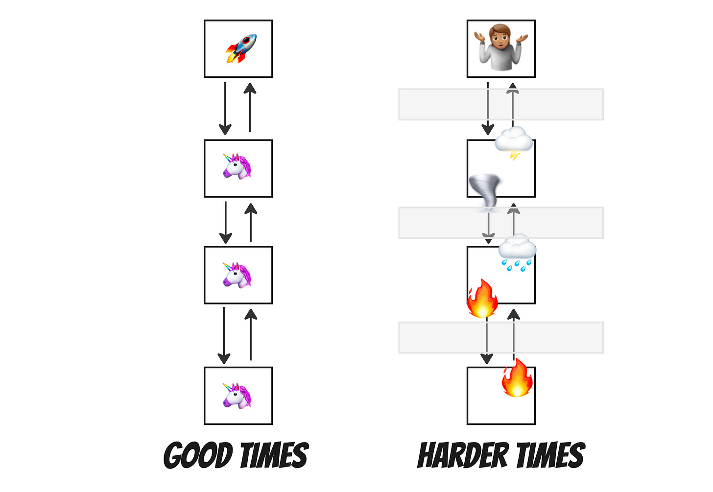
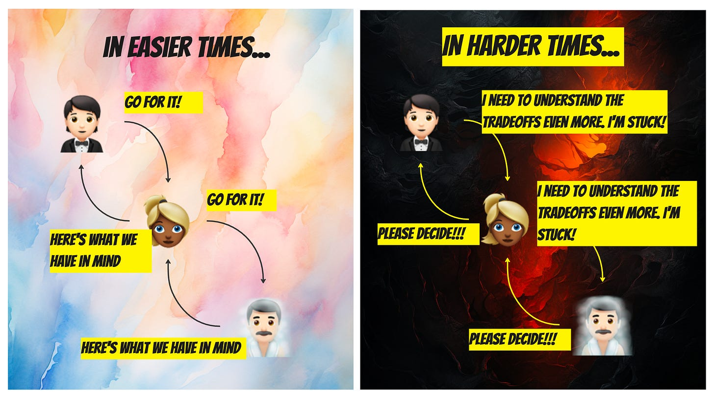
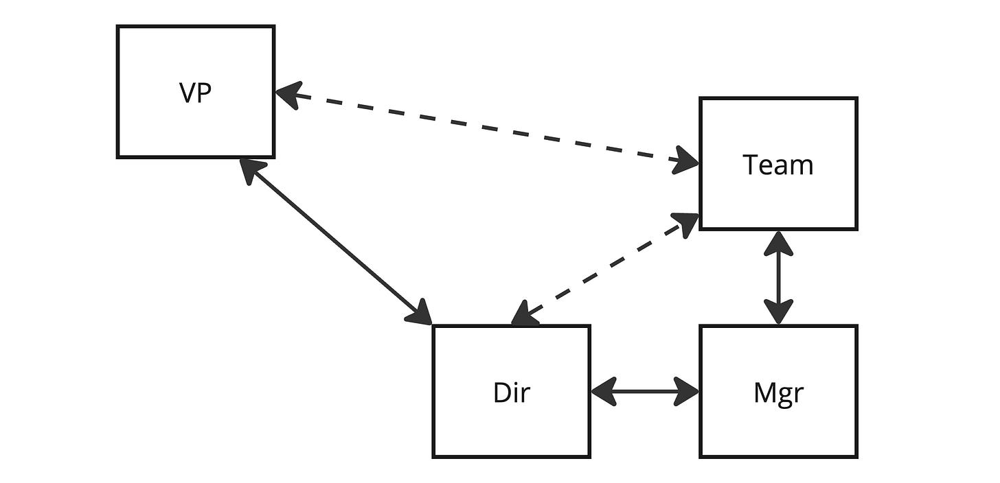

I have been reading a lot of content recently that encourages leaders to "go deep" and become experts in team-level details. Two examples:

>
>
> *If you don't know the details, how do you know people are doing a good job? People think that great leader's job is to hire people and just empower them to do a good job. Well, how do you know they're doing a good job if you're not in the details?*
>
>

[Brian Chesky on Lenny's Podcast](https://www.lennyspodcast.com/brian-cheskys-new-playbook/#transcript)

>
>
>  *As people grow in the organization, they end up with huge orgs. A lot of these leaders lose (or maybe they never had it) the capacity to go and deeply understand the details of what's going on with each of your teams. How can you push for something in an executive meeting if you don't really understand the exact specific problems they have? How can you defend a trade off if you don't understand the trade offs to be made?* 
>
>

[Martin Gontovnika on LinkedIn](https://www.linkedin.com/posts/mgonto_after-working-with-dozens-of-companies-as-activity-7155180830699462656-lZ7x?utm_source=share&utm_medium=member_desktop)

Why the trend?

Based on discussions with people working at diverse companies, here's what's going on.

During high growth and low-interest rates, companies scaled up and out rapidly. They added layers, groups, and products. Because things were going reasonably well, there was little emphasis on defending and detailing tradeoffs. Instead of answering the question, "So what are we getting for all this money?" there was a lot of answering the question, "How much money do you need, and how many people will you hire?"

I don't think leaders went home each day and said, "You know, I'm done with details; I don't need 'em!" Rather, the bulk of their time was spent hiring, onboarding, cascading information, being the department's spokesperson, and talking about more sweeping strategies. Meanwhile, they wanted to empower the new managers who reported to them to bubble up the details that mattered.

Of course, when the challenge shifted to frugality and profitability, leaders in this situation had no real way to understand the reality on the front lines. Suppose teams are struggling with debt, dependencies, competing priorities, etc. In that case, things are *especially* difficult because, in tougher times, there is a lot of fear about who will get blamed.

Fear breeds defensive opacity. The front lines resent leaders for getting paid the big bucks but being out of touch. The leaders resent the front-lines for being opaque. A wicked cycle develops.

In good times, it was go, go, go. In harder times, leaders feel pressure to make a lot of fine-grained tradeoffs and hyper-optimize allocation. Meanwhile, teams on the front lines desperately want *someone* to decide! Any decision, even.

>
>
> We need to understand the tradeoffs
>
>
>
> Please decide!
>
>
>
> We need to understand the tradeoffs
>
>
>
> Please decide!
>
>

So what can you do about all this?

Leaders need to step back and re-establish the foundations. What is the heartbeat of the team? How does information flow? When do teams get to have direct interactions with senior leaders? You can have deep insights into what teams are working without creating a culture of fear and alienating middle management.

Whereas before you might have relied on the "cascade" to bubble up the details, it is probably better to adopt a structure like this:

Respect existing reporting lines, but bring the teams closer to senior leaders at least occasionally to encourage the flow of information and model the discipline (and safety and respectful feedback) needed to navigate the current reality. It isn't about "flattening" the org chart but rather about ensuring people who can discuss reality are in the room.

In short, the current emphasis on "going deep" and "getting into the details" is a reaction to an overreaction and overstretching of the org chart. So, it is time for a reset without over-reacting again.

Yes, spend time to understand what is happening and be a better advocate during more challenging times.

No, don’t heap on even more asks for detailed trade-offs and detailed plans, so you can play defense.