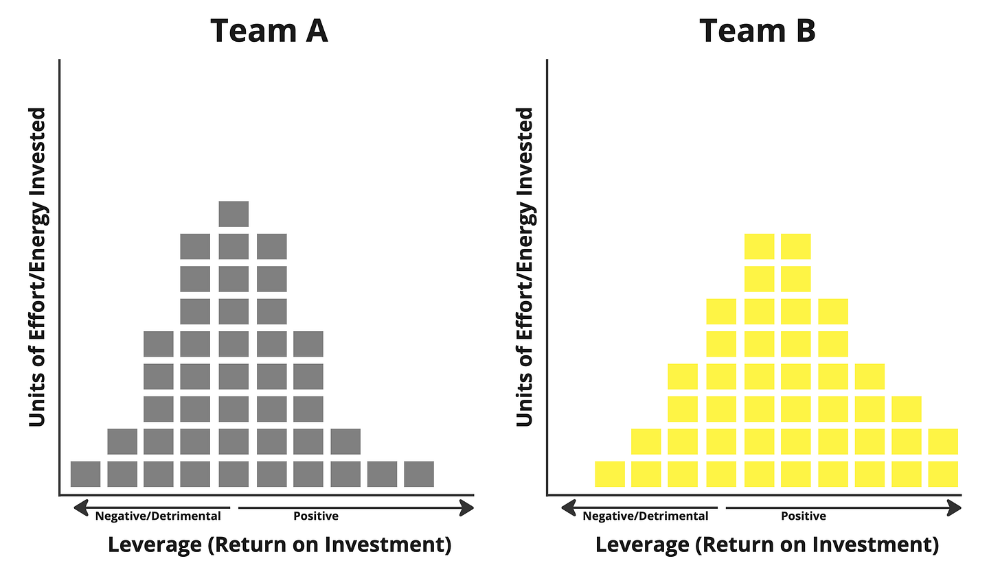

My *current* mental model for team effectiveness involves imagining a team’s time/energy investment as a distribution across leverage (or return on investment). To me, this explains why relatively small improvements can greatly impact team efficacy. It also explains why team productivity and efficiency discussions often miss the mark.

Imagine two teams. The data here is based on reality, but I use arbitrary units.

On the surface, the distribution may not look all that different. But it is.

Team B has five units of energy allocation that ended up at the two highest levels of leverage (11% of total) vs. Team A’s one unit (\~2% of total). While both values are a relatively small % of total energy allocation (product is hard, and no team bats 1.000), the difference here is huge when considering the long-term impact of 5x the highest leverage work. Team A also has \~35% of its energy going to negative ROI things compared to \~15%, influencing morale, focus time, trust in the team, etc.

This could easily happen if Team A:

* Made slightly less good decisions due to less access to trustworthy data

* Waded through a bit more technical debt

* Navigated a couple more dependencies

* Dealt with one or two misguided top-down requests that flopped

* Did work to earn short-term revenue at the expense of long-term results

* Had a bit less psychological safety

* Was required to converge earlier on their plans

None of Team A’s challenges are that big in isolation, but they absolutely add up. Successful teams enjoy many virtuous and self-reinforcing loops while struggling teams experience exponential headwinds due to wicked loops. 

We can’t predict and force every energy investment to produce outsized results, but we can foster conditions where those results emerge more often and setbacks are less of a factor. The aggregation of marginal gains (or areas of drag) can compound to create a disproportionately large impact, for better or worse.