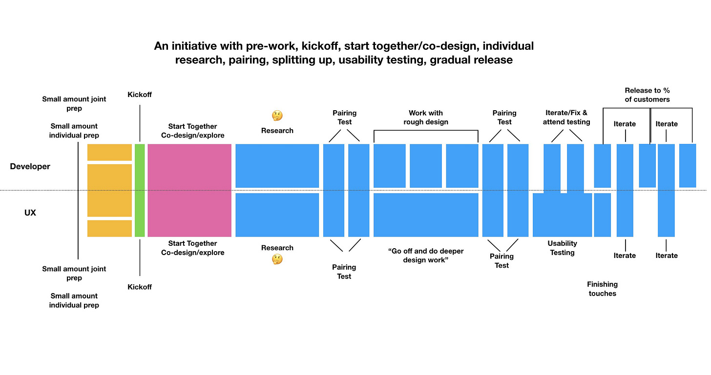

This is a real-world, cross-functional team.

They did real work. In the real world. They kept track of how they worked, and shared that information. I translated it into this simple graphic:

Notice the periods of collaboration interspersed with individual work. Notice the mixed parallelization and the serialization of tasks. Notice the arc -- divergence at first, then convergence, and frequent integration throughout.

To some, this looks inefficient. It looks like an annoying mess.

To others, it looks effective and fun. It breaks “rules”. It is a beautiful mess.

**The critical point is that this team is figuring out how they want to work AND figuring out the best way to work given the nature of the problem/opportunity.**

Often when you hear debates about things like "how should we do UX with Agile", there's a subtext. Management may be requiring the team to do sprints. Points gotta add up, right? There may be pressure to keep developers topped up. Designers may feel rushed, and want to carve out time to do deep work. The team -- or more likely the managers of the respective functions -- are looking for The One Way (with an outside expert's stamp of approval).

The rushed designer — instead of advocating for working differently on a particular effort — looks for solace in a standard approach. But work is rarely that standard. Progress is rarely that predictable. And people are rarely that consistent -- even day to day and hour to hour.

So, consider these questions:

"What does this effort need right now?"

"What do my teammates need? From me? Right now?"

"What do I need?”

Refer back to the image and try to understand the underlying principles…especially how divergent work is followed by “integration”, and how after starting together, the team embarks on some parallel research. Note how cycles shorten towards the end of the effort. Note the “white space” that team team members leave open for slack.

I shared this real world example to show what is possible. By definition, this specific sequencing (from another team) will be *wrong* for your team. It’s the spirit of adaptation and matching the approach to the challenge that counts. And applying the right principles at the right time.

When a team has the agency to adapt their work style and working agreements, amazing things can happen.