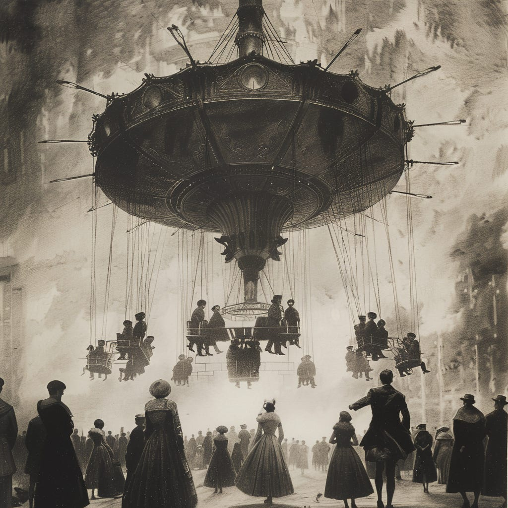

Some news:

* The [first run of my prioritization workshop](https://maven.com/john-cutler/run-an-effective-prioritization-activity) went well! A big thank you to the first cohort. I will be announcing the next date in the next couple days. [Join the waitlist](https://maven.com/john-cutler/run-an-effective-prioritization-activity) if you are interested.

* The podcast is now available on [Apple Podcasts](https://podcasts.apple.com/us/podcast/the-beautiful-mess-podcast/id1746001497) and [Spotify](https://open.spotify.com/show/4iNxxfbZjfWnUBxquYO66F). I released episode 3 with Gene Kim over the weekend.

---

I was reading an article about Indeed's recent round of layoffs (8% or 1,000 people, on top of a 15% layoff last year), and I stumbled on this quote from Chris Hyams, Indeed's CEO:

>
>
> *Despite our efforts so far, our organization is still too complex; we still have significant duplication of effort and too many organizational layers that slow down decision-making. We have been working to simplify every aspect of our business, but without meaningful change, we can't get where we need to go.*
>
>

This post is not about Indeed, but it triggered a thought.

The first thought that came to mind was, "Why were these layers and duplicated efforts added in the first place?" From interacting with many product leaders across a wide variety of companies, there are *some* common patterns (this is in no way a reflection of what happened or didn't happen at Indeed—even if I had a perspective there, I'd never share it publicly). During periods of rapid growth and optimism, we tend to observe:

* Doing more things, and hiring senior leaders to lead those things

* A strong desire for (and incentives for) independence. Less appetite to run and collaborate with shared/centralized teams

* There is less concern for duplicate roles. Incentives to work around teams to hit goals, etc. This often causes the creation of duplicate services, structures, etc.

* A proliferation of dependencies (and the need to manage those dependencies *locally* in ways that don't require global coordination)

* Structuring for future states (e.g., a VP that will *eventually* oversee a large team). Rapid hiring, with more ambiguous, less stable roles and responsibilities. Hiring people who have done "it" without really a full definition of what "it" is

* Increased need for filters/relays to channel bottoms-up feedback upward and top-down context downwards

* If execution falters (which will naturally happen under conditions of rapid scale), efforts to address the problem with more middle managers, coordinators, etc. "It must be an execution problem" vs. a strategy or strategy deployment problem.

* Newcomers join without requisite context and little time to internalize the context, making hurried decisions with long-term implications.

These patterns are so ubiquitous that I almost see them as a form of organizational physics. But one question fascinates me—given that periods of growth and contraction are constant—is whether there are any tactics to tame the severe pendulum swings. Or are we destined to overshoot? Some companies *seem* to do better than others in this regard. How do they operate?

In almost every company, there are early signs that things are going wrong. The trick, I think, is figuring out how to sense, evaluate, and respond accurately to incoherence. 

Easier said than done…

The challenge is that these signals are easy to miss amidst all the noise. With scale, noise levels increase. By adding hops, signals become noisy. These signal issues quickly create "cascades" that make it difficult to tease out potential areas to intervene and be proactive. Alex Komoroske's [amazing presentation on Slime Molds](https://komoroske.com/slime-mold/) explains this in incredible detail. Even when the signal breaks through, in rapid scale mode, you'll undoubtedly have far more problems and areas of friction than you can practically act on. "I've got so many problems to deal with, I don't even know where to start!" exclaims the overwhelmed leader. No one wants only to bring bad news.

Imagine a scenario where team members were instructed to "log" incoherence when it happened. Have trouble deploying? Log it. Had a soul-crushing meeting trying to navigate twelve dependencies? Log it. Can't tie your work to the strategy? Log it. Forget vague engagement surveys that happen twice a year. See something…say something. I've never met people working on the front lines who couldn't accurately describe the sensation of "drag" and lack of flow. I'm 100% sure that in companies experiencing similar things to what Indeed is experiencing today, people expressed early signals 3-5 years ago.

What would happen?

If this were a local activity, and the people in the room could do something about the problem, you might have no problem sensing and responding to incoherence. But imagine this "at scale". Imagine that you needed more than a few people in the room to fix these issues. Imagine there were incentives to ignore or minimize this feedback or instinctively blame middle managers for not dealing with it locally. Remember, during rapid scale, there is a bias to want to believe everything is a local problem—anything collective or cross-cutting is a threat to speed and independence.

One of the key elements of Lean is the [Gemba Walk](https://safetyculture.com/topics/gemba-walk/). A Gemba Walk is a management practice originating from Lean manufacturing (particularly within the [Toyota Production System](https://en.wikipedia.org/wiki/Toyota_Production_System)). A Gemba Walk involves managers and leaders going to the front lines to observe processes, engage with employees, and gain firsthand insights into the work environment. It has a couple of important components:

* **Observation**. The goal is to see and understand how work happens without filters or preconceived ideas about what is happening.

* **Engagement**. Interacting directly with employees—ask good questions, listen, and keep lines of communication open. There's a strong element of trust-building and understanding reality.

* **Respect for People**. Instead of starting with blame or fault-finding, the goal is to improve collaboratively.

* **Acting**. Contrary to some engagement surveys, the goal is to act and improve (after building trust, observing, asking questions, etc.). You show results!

That sounds compelling, and it seems like a clue. But not to everyone. I love that some of my friends challenge me on stuff like this. I shared this with a friend, and they remarked:

>
>
> *Who has time for any of that when you're growing fast? Who wants a leader walking around and watching you? Isn't this just a manager's job? I can't believe this is even a thing—it seems like common sense. That would annoy me. The whole point of empowered and independent teams is that they can figure this out by themselves. Smart people just figure it out.*
>
>

This is a wonderful perspective because it also highlights the challenge. 

In a rapidly scaling company, people fix what they can locally but don't bother with things that will be too costly or difficult to fix globally. Few incentives exist to "stop the line" beyond the local level. This means that more global challenges proliferate and fester, which in turn require more layers and operational complexity (and more politicking and bureaucracy). People figure out their boundaries, stay in their lane, and generally, the cycle spins out of control.

Remember, the Toyota Production System (TPS) emerged in Japan, a highly collectivist society, during a time of significant scarcity (aftermath of WWII). Another important detail is the role of the "Chief Engineer" (or "Shusa" in Japanese) in TPS. The Chief Engineer is accountable for the entire product development process, provides vision and direction, has a customer focus, integrates work across various cross-functional teams, is a technical expert, has decision-making authority, is a strong mentor and role model, and is generally a respected individual. In short, someone is uniquely accountable for walking the Gemba Walk and caring for the overall health of the process.

For various reasons, the thought of a GM or similar (in the software business) getting into this level of detail is relatively unheard of in the US unless the shit is hitting the fan. We have evolved management structures for this, and we value our flattish but modular management structures as they promise independence.

However, one has to wonder whether the lessons from the last couple of years may serve as an impetus for a different approach. Will a role like the Shusa emerge? Will we encourage leaders to walk the floor?

I'm not sure, based on what I'm hearing and seeing.

One concern is that leaders may be over-indexing and blaming individuals for their current predicament. They believe that if they magically had legions of "A-players," they could continue as they did during the late 2010s and early 2020s. They aren't asking themselves the hard questions like:

* "Why didn't we hear and act on the warning signals early enough?"

* "How do we foster an environment that is friendly to addressing problems before they spin out of control and cause a wild pendulum swing?"

* "How do we find the right balance between the local and global?"

* "Yes, we talk about leaders going deep, but how do they do so while preserving the trust and engagement of people on the front lines?"

* "How do we treat people who raise disconfirming information?"

* "How do we build the resolve to address more global issues?"

These are hard questions but extremely important in this current environment. As companies revise their operating systems they need to be proactive and establish the right foundational principles that will withstand the vicissitudes of the environment. Realistically, the empowered team model popular in Silicon Valley may not be well optimized for environments that are struggling with lots of dependencies, architectural issues, and needing to muster a collectivist response.

Ebbs and flows are a fact of life. The companies anticipating the swings stand to gain a great deal by not yo-yo-ing back and forth.