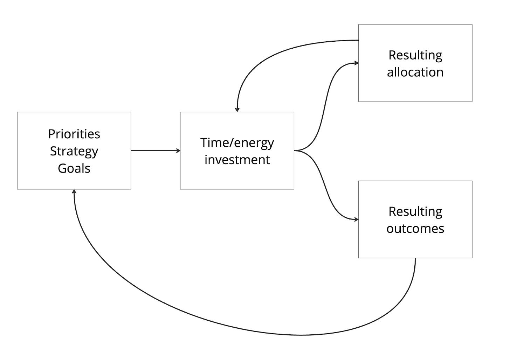
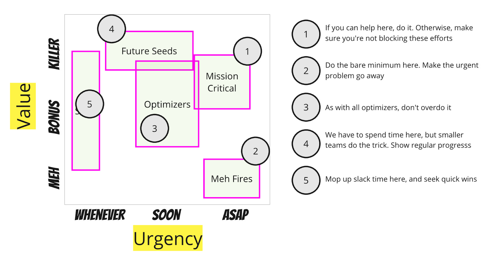
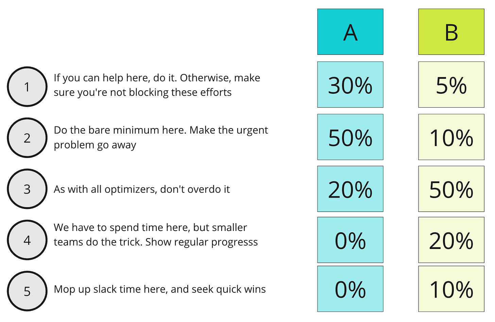

Over the years I have been seduced by using allocation %s as a primary way to describe strategy deployment. I was wrong. My thinking has changed.

A Seductive Model

----------

Many companies express their strategies (or plans) using % allocations to different investment buckets. For example:

* 25% — expand addressable market

* 25% — increase customer satisfaction for existing customers

* 30% — modernize our stack/infrastructure/technology

* 20% — "Keep the lights on" activities

The percentage in question is typically some combination of $, "heads," or time.

If you've ever used a similar approach when tackling your personal productivity or personal budgeting, you can appreciate how rationally appealing this is. We imagine our time/energy to be finite; therefore, "apportioning it" feels like a helpful way to prioritize and hold ourselves accountable. 

If we *say* something is important but spend very little time on it proportionately, that can be a huge wake-up call to reassess our priorities and reallocate our time. Translate this to personal budgeting, and it is immediately clear why CFOs love $/investment allocation schemes.

When my latte budget equals my book-buying budget, that's a good signal I might have a problem. Nothing feels more rigorous than putting your budget vs. actuals in a spreadsheet and asking the hard questions, not to mention whatever you must do to fulfill any accounting laws and requirements.

The Problem

----------

So, what is wrong with this approach? And what is a better approach?

**What's wrong? In many cases, % allocations:**

* Mask actual priorities (when they exist). Or, teams use allocation %s instead of explicit priorities. Is the % low because we think that's enough investment for our highest priority? Or is it low because we care less about it?

* Mask implicit expectations around the outcomes we expect from these investment allocations. Will the 10% investment in X return 50% of our new revenue? Over what period? Based on what assumptions? What risk/opportunity profile includes downside and upside risk? Remember, the time/$/focus is an input. What is the output?

* We fail to capture the current blockers and inefficiencies related to that proposed investment. Are we investing 30% because we feel that is all *we need*? Or are we investing 30% because we acknowledge the situation is not ideal, but more money is required to improve the overall efficiency of that value stream?

* Obscure the overall investment required. A team that draws 5% of the overall R&D budget might generate 20% of all the support cases and marketing campaigns.

On the surface, % allocations look nice and structured. In reality, they are very confusing!

---

*Like the newsletter? Support TBM by upgrading your subscription. In the next couple days, I will be sending out information to TBM supporters about two events in September.*

[Support the newsletter](https://cutlefish.substack.com/subscribe)

---

Thought Experiment

----------

Here was my big breakthrough.

Imagine I force-rank a list of priorities. I got about my day, week, month, and year. Based on my strategy and priorities, I assume that my allocation of time/energy will look a certain way. For example, I assume that nagging, high urgency, and relatively low-value interruptions will only occupy 5% of my time/energy allocation. Meanwhile, if I play my cards right, I should have 30% of my time available for super high-value but less urgent quality time with my son.

I've done something important here. Instead of seeing allocations as the input—the controlling mechanism—I see them as an output of priorities, strategy, goals, etc. They are something to monitor and may influence how we course correct. 

Value/Urgency Buckets

----------

Here is a more detailed, company-centered approach to this.

This model is still a vast oversimplification, but companies often juggle allocating focus across these five buckets. 

See the post [The Magic Prioritization Trick](https://cutlefish.substack.com/p/tbm-245-the-magic-prioritization) to understand the axes in the chart.

**The Buckets**

1. Anything in the upper right is mission-critical. You can differentiate here. This "make or break" stuff can forever set your company up to win or lose. If you can help here, then help. If you can't help, get out of the way! Due to the urgency, every second counts—no dawdling. Give these teams a ton of support, especially when removing blockers not in their immediate control. 

2. Anything in the bottom right is a dilemma. You have to do it, but since it is not valuable, you should do the bare minimum to make the problem disappear. As with #1, if you can help, help; otherwise, get out of the way!

3. Optimizers are the meat and potatoes of the plan, but you need to play a careful game here, balancing value and investment. Disciplined approaches prevail to get the balance right. The big risk is scope creep and not delivering the value you expect (you're already on the cusp of it potentially not being a good idea). Use time boxes and batch-size limits.

4. Then, you have the "future seeds" you must invest in. The reality is that these efforts are typically better suited for smaller teams anyway, so big investments and allocations are not required. The big risk is that 1) these become forever efforts, or 2) they distract the organization from the core. So be sure to 1) keep teams small and 2) encourage thinking big and working small.

5. Mop up slack with super small batches in this category. These are "whenever items," so they should never come before higher-priority work, but they do add up and help teams "mop up" slack—a prerequisite for flow.

---

*Like the newsletter? Support TBM by upgrading your subscription. In the next couple days, I will be sending out information to TBM supporters about two events in September.*

[Support the newsletter](https://cutlefish.substack.com/subscribe)

---

Pay particular attention to the heuristics (e.g., "do the absolute bare minimum to make the problem go away.”) These heuristics control and provide forcing functions on "effort." I could have made this more complex with more categories, but let's run with it.

In a sense, this is a forced ranking of priorities—what falls in each category will vary by company. Still, the categories fall along a typical "curve" with value and urgency as inputs. The basic idea is: "Start from the top, try to help, get out of the way if you can't, and use work-styles appropriate for the value/urgency profile."

Back to Allocation

----------

Now, let's get back to allocation. 

Consider two companies in very different situations. Company #1 is involved in pure fire-fighting and survival mode, while Company #2 is in a healthier place. Based on their priorities, strategies, etc., their *resulting allocations* (emphasis intended) might look very different.

It turns out that Company A can't even get to Category 4. Why? Like it or not, there are a lot of fires and existential threats. Teams that "work down the list" never have enough time in the day to seize those opportunities. Given the situation, this *might* be intentional. The resulting allocation *may* resemble the natural outgrowth of our priorities. Or it *might not*.

Company B has a more balanced allocation mix. Despite #1 being the highest priority, there isn't much work of that type (if there were, you'd be lying to yourself about value and urgency). They spend most of their time on optimizers yet can still invest appropriately in future seeds.

The important point here is that allocations are an output. We may have a hypothesis on how allocations will pan out. Still, they result from our strategy/priorities/heuristics/risk profiles instead of the driver of a strategy and priorities.

Conclusion

----------

To simplify: Get your strategy, priorities, risk-taking heuristics, and goals straight, and treat allocation as a hypothesis. Then, play the game and see how things turn out.

Once you internalize this idea, other things become more clear:

1. Allocations fail to capture the mix of urgency and value critical for prioritization.

2. We can plan all we want around allocations, but the reality will unfold as it unfolds.

3. It isn't the allocation in isolation that counts—it is the outcome generated by that allocation investment.

4. Allocations involve all sorts of assumptions. Make them clear!

5. $1 spent in an area experiencing friction is not equal to $1 spent in a smooth-flowing value stream

6. Money talks. Allocations involve budgets. It is better to talk about the budget—"We are funding X team to Y!"—than to cloud the issue in allocations.

---

*Like the newsletter? Support TBM by upgrading your subscription. In the next couple days, I will be sending out information to TBM supporters about two events in September.*

[Support the newsletter](https://cutlefish.substack.com/subscribe)

---