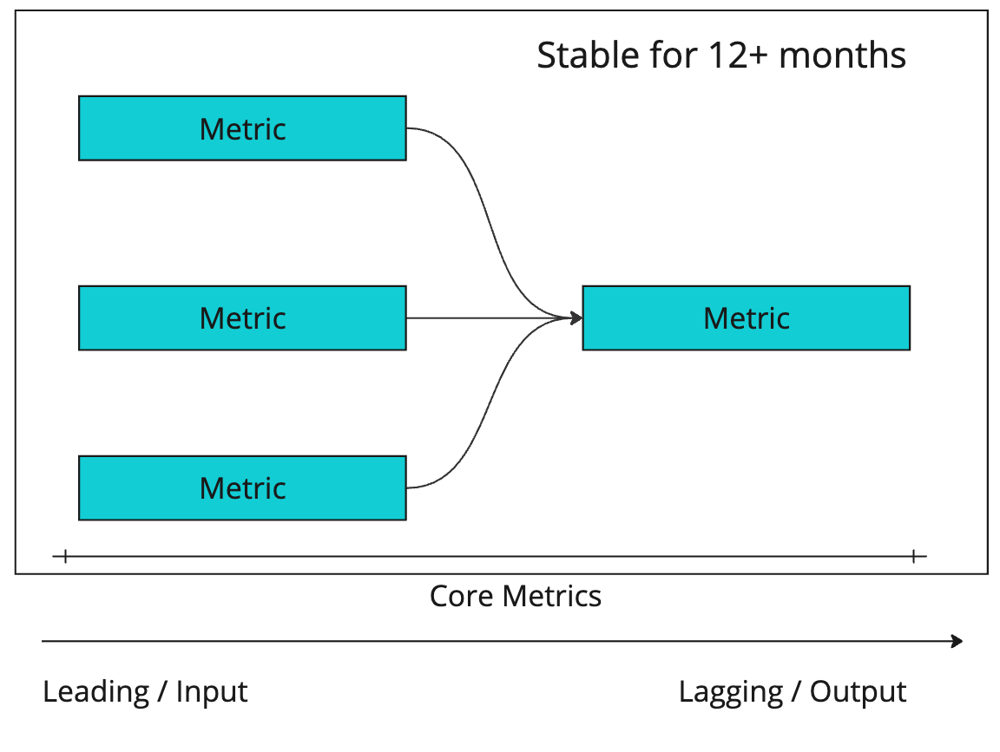
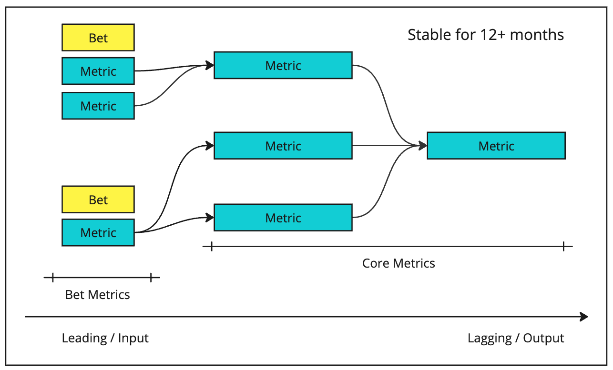
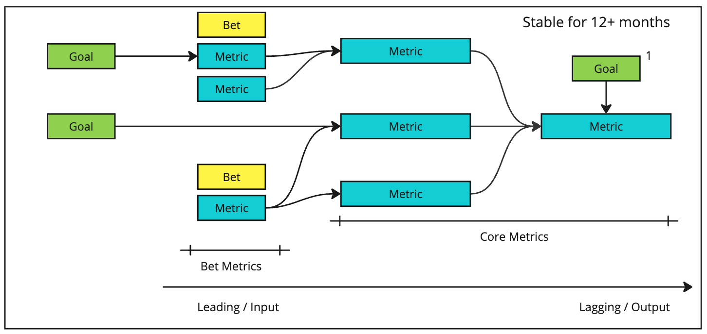
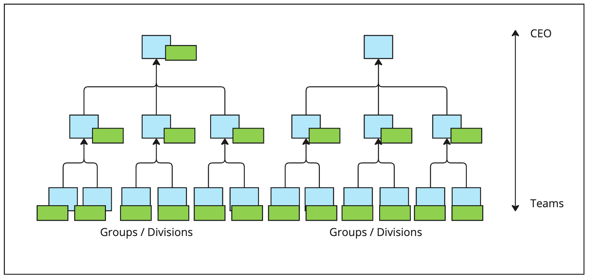
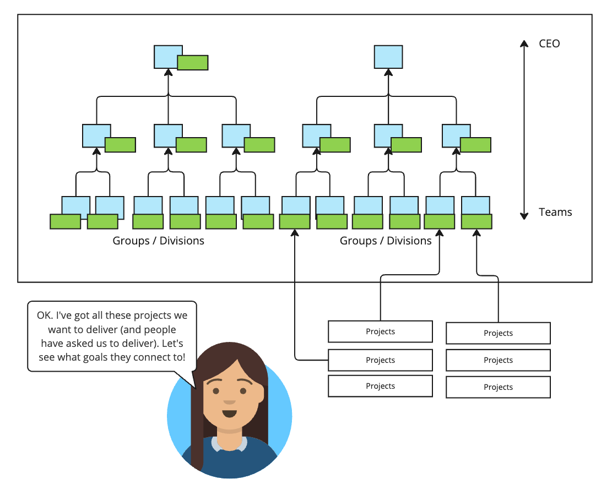
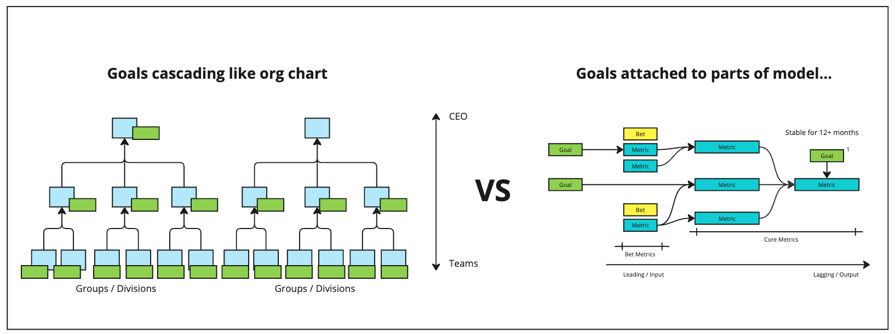
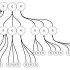
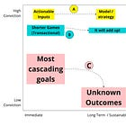
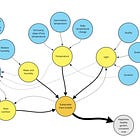

Goal cascades are compelling, but they don’t work nearly as well as we think they do.

Here’s why—starting with front-line teams.

**Core (Stable) Metrics**

----------

**Every front-line product team should have an array of** ***stable*** **metrics they care about.** Sure, sometimes you retire a metric, and sometimes you promote a metric, but for the most part, in anything but the smallest, frantic startup, these metrics can persist for at least 12 months. There’s a cycle of renewal and revision, but it is a long one.

Some of these metrics need to be more immediately “actionable” (or influenceable), and ideally, some are more lagging but represent the longer-term effects we are shooting for. You might even arrange these as a tree or causal relationship diagram based on hypothesized relationships. Over time, tweak this model based on what you learn.

You can tell you have a delivery-oriented or fungible team that “works on whatever” because they will say that establishing their core metrics is hard. It is! Because they don’t stay focused on one thing, and their team isn’t aligned/formed around a stable part of the domain.

---

*Like the newsletter? Support TBM by upgrading your subscription. Get an invite to a Slack group where I answer questions.*

[Support the newsletter](https://cutlefish.substack.com/subscribe)

---

**(Temporary) Bet Metrics**

----------

Bets—insert whatever word you use in your company, e.g., initiatives, opportunities, or “projects”—often involve unique metrics that are more ephemeral (short-lived). We use these metrics to determine if the thing is working as expected and having the intended local impact. We also typically want to figure out if these things positively or negatively influence *our core metrics* (this is important because while bets are transient, these metrics are more stable). Add/remove these metrics as needed, and remove them when you’re tired of looking at them and they’ve outworn their usefulness.

For teams tasked with just shipping, you can appreciate how bet metrics seem redundant and a waste of time.

**Goals**

----------

Teams should set goals using 1) a core metric, 2) a bet metric, or 3) some feasible input into #1 or #2.

If you can’t, please pay attention—it is a sign! Most (sane, well-thought-out) strategic shifts are a matter of allocation shifts and incrementally retiring or promoting metrics—not wholesale shifts that leave a team pulling new metrics out of a hat. Quarterly goal-setting should be *routine and easy* because 80%+ of the metrics you set your goals on are already in use. An actual strategy doesn’t shift that quickly.

If goal setting is a pain in the butt and feels like reinventing the wheel, you can be sure that multiple issues exist (those mentioned above AND likely a lot of dependencies to wrangle and project-based roadmaps).

This brings me to goal cascades, goal/project cascades, strategy cascades, etc.

Cascades vs. Models/Trees

----------

In many cases, goal cascades are literally “org chart cascades,” nothing more, nothing less.

This orientation would be fine if there were some kind of fundamental causal model or framework underpinning the goals that *just happened to mimic the org chart.* For example, the X Department had a key lagging metric that the contributing teams all contributed to. In fact, that would be an extremely strong signal that you had the right org chart.

But this is often not the case.

Someone leader on high says, “Here are some goals. Departments, figure out your high-level goals that connect to these goals, and then relay those goals, and let teams create goals.”

There is no underlying, stable model—except for teams like sales, which always try to hit targets for the same metrics. That is the generous anti-pattern. Even more likely is that teams reverse engineer mapping their work to goals based on whatever projects they had already committed to. Then, casually squint, map, and squint into an artificial 4+ layer goal cascade. It is an exercise in optics-driven box-checking.

**Remember, the only place in the company where humans show up and can influence things is on the front line. Anything else is a DOWNSTREAM effect, meaning it happens** ***because the front-line teams achieve actionable goals and influence*** **actionable inputs. Yet we insist on imagining that the teams are at the bottom of the cascade.**

Do you see the confusion? A formal org chart is a vertical, hierarchical tree, while metrics are more of a horizontal tree of leading and lagging metrics.

This means that while you might have a tree of leading and lagging metrics that is a couple of levels deep or “wide” (3 or 4?), you don’t need a three or four-level deep goal cascade because teams can’t action lagging metrics.

You only have two real levels: 

* Level 1: High-level lagging things that matter for the business as a whole and high-level guardrails that matter for the business as a whole

* Level 2: Stable core metrics, bet metrics, etc. on the team level

You don’t need big goal cascades in most cases. In a larger company, you *might* have an additional layer between L1 and L2, but that is about it. Intricate, multi-leveled input/output models and trees are OK, but that is because there are typically a couple of hops between actionable inputs and the lagging things we desire.

Summary

----------

Goal cascades are compelling but ultimately not effective.

You waste a lot of time in an intricate mapping and nesting exercise (and the mapping and nesting don't mean anything). In anything but the earliest startups, it is better to start with the premise that you should have teams focused on a relatively stable domain with a relatively stable set of metrics. As the strategy changes, you can update these models and shift your goals, but goal setting should not feel like a reactive game of navigating an artificial cascade.

Start where it really counts—teams. Yes, leadership should evolve the strategy. But you only really need two levels of cascading goals. The rest can be taken care of using team-level models.

---

*Like the newsletter? Support TBM by upgrading your subscription. Get an invite to a Slack group where I answer questions.*

[Support the newsletter](https://cutlefish.substack.com/subscribe)

---

I’m so passionate about this, I’ve tried to write this post at least four other times. I’ll get it right one of these days!

[

#### TBM 41/51: Why Goal Cascades are Harmful (and What to Do Instead) ####

](https://cutlefish.substack.com/p/tbm-4151-why-goal-cascades-are-harmful)

[John Cutler](https://substack.com/profile/5656342-john-cutler)

·

September 18, 2022

[

Read full story

](https://cutlefish.substack.com/p/tbm-4151-why-goal-cascades-are-harmful)

[

#### TBM 213: Goal Cascades vs. High-Conviction Models ####

](https://cutlefish.substack.com/p/tbm-213-goal-cascades-vs-high-conviction)

[John Cutler](https://substack.com/profile/5656342-john-cutler)

·

April 14, 2023

[

Read full story

](https://cutlefish.substack.com/p/tbm-213-goal-cascades-vs-high-conviction)

[

#### TBM 24/52: Beware of the Cascade ####

](https://cutlefish.substack.com/p/tbm-2452-beware-of-the-cascade)

[John Cutler](https://substack.com/profile/5656342-john-cutler)

·

June 10, 2021

[

Read full story

](https://cutlefish.substack.com/p/tbm-2452-beware-of-the-cascade)

[

#### TBM 25/53: Persistent Models vs. Point-In-Time Goals ####

](https://cutlefish.substack.com/p/tbm-2553-persistent-models-vs-point)

[John Cutler](https://substack.com/profile/5656342-john-cutler)

·

June 18, 2020

[

Read full story

](https://cutlefish.substack.com/p/tbm-2553-persistent-models-vs-point)