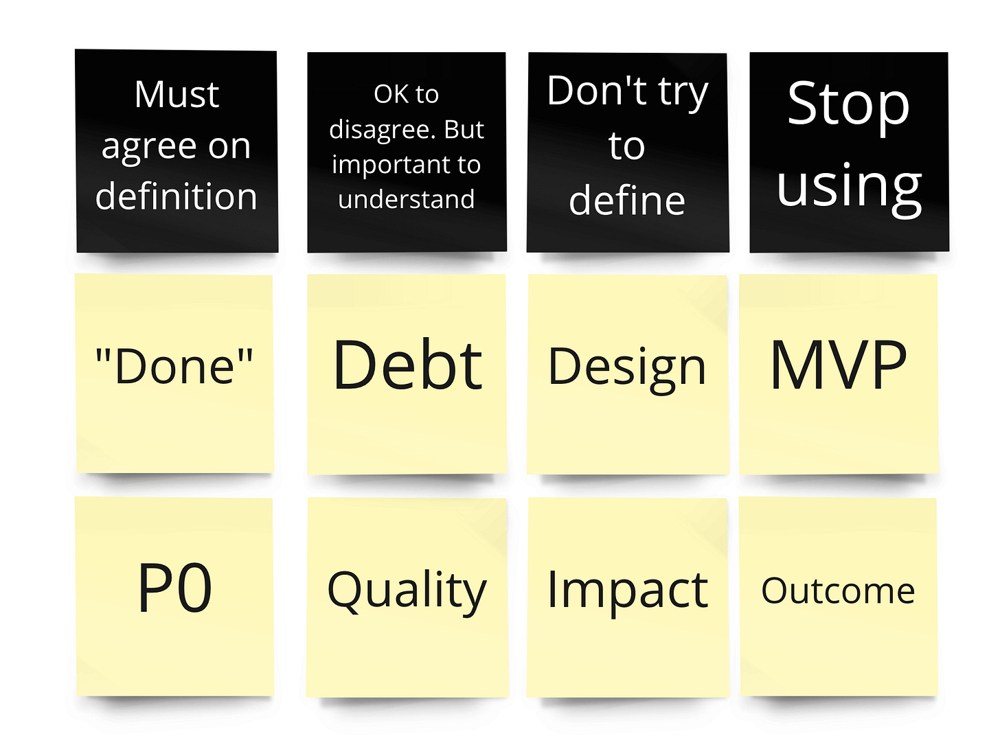

Here's a fun activity you can do with your team.

**1. It starts with a prompt:**

>
>
> What words do we use that *seem* to cause confusion?
>
>

Give people a couple minutes to brainstorm a list. Don't worry, the ideas will flow.

**2. Next, do a quick dot vote with the prompt:**

>
>
> Where should we focus our conversations and energy? Where is the confusion most acute?
>
>

Try to narrow the list down to \~10 words.

**3. Next, you're going to try to group the words into four categories:**

1. Words where we must *all* agree on the definition. The lack of a shared definition is harmful.

2. Words where we can/should disagree on the definition…as long as we understand each other's definition.

3. Words that should remain elusive. Where even attempting to define the thing may comprise the spirit of the thing. People can sort it out in the moment. Or, it is better to leave it alone for now.

4. Words we should stop using because they aren't helpful

How you accomplish this will vary by group size and team norms. One method is to first do the categorization individually. Then in pairs. Then in groups of four. The fun part ... if you can't agree on a category, then that is a good sign it is a #3 or #4.

**4. Finally, you will come up with a first pass at definitions. You might tackle this in a follow up activity. How you approach the definitions will be highly org-dependent.**

Try it, and let me know me know how it goes!