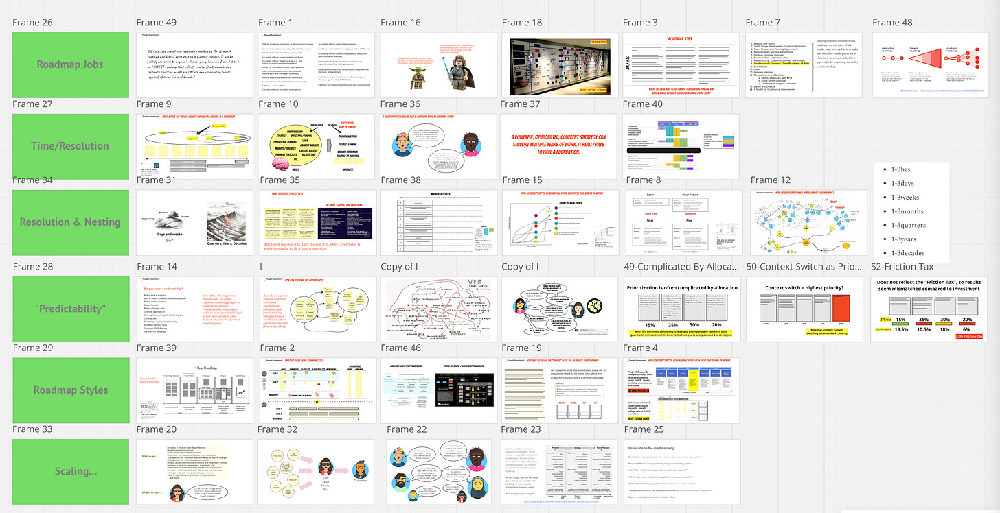

I had some family commitments this week, so keeping it short and:

1. Sharing a link to a potentially helpful presentation / Miro board focused on roadmapping

2. Posing a question I’d love your take on.

Roadmapping Miro Board

----------

I’ve been using this board lately to guide team discussions around roadmapping. It references multiple posts from TBM, as well as some new visuals, etc. Use it however you like, but I do appreciate being credited.

[https://miro.com/app/board/uXjVKEjdOkE=/?share\_link\_id=468338162096](https://miro.com/app/board/uXjVKEjdOkE=/?share_link_id=468338162096)

Question

----------

300+ posts, 44k subscribers, and 8,201,749 views later, I have been considering splitting TBM into two distinct newsletters:

* One focused on actionable tools, tricks, templates, step-by-step advice, etc.

* One focused on:

  * Some of the more existential questions currently surrounding the industry

  * Exploring the pressing challenges facing organizations, teams, and individuals

  * Topics like complexity, mental models, org-design, sense-making, frames, politics at work, etc.

I recently analyzed the 300+ TBM posts so far, and they are actually a fairly healthy mix of topics, including actionable and philosophical, pragmatic and existential, etc.

Like anyone, I like actionable advice, and like sharing actionable advice. But I sometimes feel I am forcing myself to write something actionable when there's heavy stuff on my (and other people's) minds. I'll chat with twenty design, product, and engineering senior leaders one week, and my mind is just brimming with the current macro-level puzzles. The amount of trauma (some) people are experiencing in the current environment is staggering. I'll write a string of posts exploring those heavy topics and lose the people who aren't interested in that stuff (or get too depressed reading it).

The same holds true for some of the advanced stuff around mental models, sense-making, complexity, frames, etc. Some people find it helpful and interesting. Other people detest it.

The posts are intermingled. When someone tells their friend to check out a simple actionable post, the recommended post is like a 300 level vision quest riddled with existential questions.

The net effect is that the feedback to the newsletter can be very polarized, and I worry sometimes I'm not doing the material and audience justice. One person's fun thought experiment is another person's impenetrable "word salad." The product development world is very diverse along multiple axes, which makes it awesome, but also hard to write for. Product 101 is know your customer, and if the customers are vastly different, you have a problem.

Anyway. Just a thought. Feedback appreciated. Maybe drop something in the comments or email.