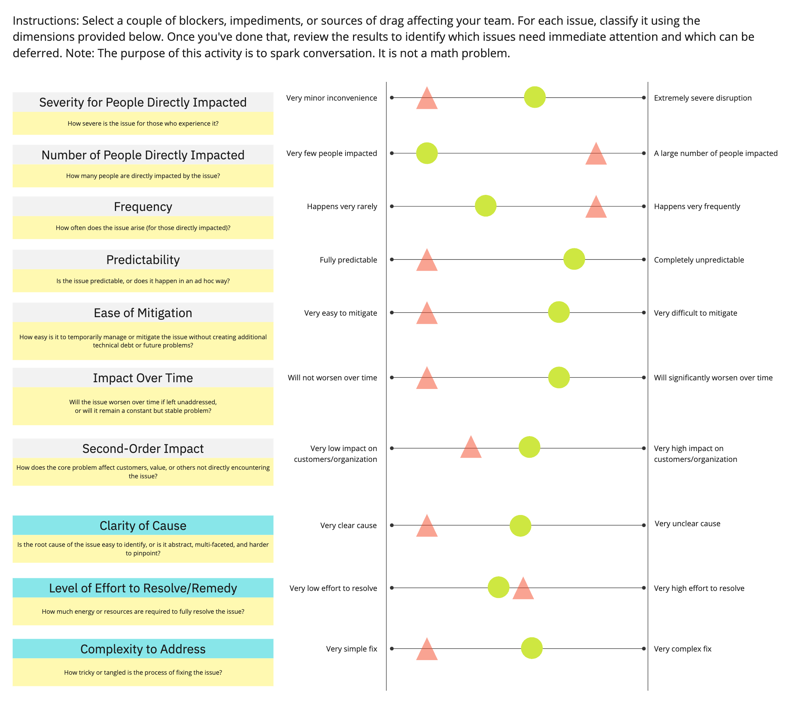

***Nostalgia alert! 😭** I’m dropping in to do a [free one-hour “North Star Lite” workshop](https://amplitude.com/events/cutler-workshop) with Amplitude on Wednesday, October 9th, at 9AM PDT. Just like old times! They are releasing [a follow-up](https://amplitude.com/resources/how-to-north-star-workshop?utm_source=substack&utm_medium=community-newsletter&utm_campaign=FY24Q3-Digital-Asset:Global-How-to-Run-a-North-Star-Workshop&utm_term=cutler) to the North Star Playbook I wrote with Jason Scherschligt that focuses on running the workshop internally. Check it out.*

---

I frequently encourage teams to surface blockers and impediments, sources of drag and friction, and things that generally cause frustration and dissonance. One of my most popular posts was [TBM 240: The Ultimate Guide to Developer Counter-Productivity](https://cutlefish.substack.com/p/tbm-240-the-ultimate-guide-to-developer), in which I detail common sources of drag.

A common pattern is that people will surface an issue, but the conversation will taper off quickly. The team doesn’t dig into their assumptions around impact, mid/long term effects, and what it might take to resolve the problem. Meanwhile, product management is spending every waking hour figuring out how to pitch the latest customer-facing hotness.

To facilitate an activity with a team today, I put together a simple tool to help encourage more fruitful conversations about the impediments they were raising. The team found it helpful, and helped them figure out where to make a business case for reducing friction.

Feel free to use the Miro version or a blank PDF version.

[Miro Version](https://miro.com/app/board/uXjVLZg3d50=/?share_link_id=242321138478)

[Blank PDF Version](https://drive.google.com/file/d/1cVhUPN1LahTPTe3EN-QQKxO8kRuldvfy/view?usp=sharing)

Example

----------

I’ve created a contrived example to explain the tool.

Consider two issues:

1. **Red Triangle**. Developers are frequently encountering minor linting rule violations across multiple projects, which are easily fixed but slow down code reviews. The issue affects a large number of developers and happens predictably with every code commit.

2. **Green Circle**. A smaller group of developers frequently encounters unpredictable merge conflicts in Git due to an unclear branching strategy. These conflicts are difficult to mitigate and are expected to worsen as the codebase grows.

The dimensions are as follows:

#### **Severity for People Directly Impacted**

 ####

How severe is the issue for those who experience it?

1. Very minor inconvenience. Linting rule violations cause small slowdowns in code reviews but don’t block work.

2. Medium severity. Merge conflicts significantly disrupt workflow, causing delays for affected developers.

#### Number of People Directly Impacted

 ####

How many people are directly impacted by the issue?

1. Large number of people impacted. The majority of developers encounter linting rule warnings across multiple projects.

2. Smaller group of people impacted. Only certain developers are regularly affected by merge conflicts due to overlapping branches.

### Frequency

 ###

How often does the issue arise (for those directly impacted)?

1. Fairly frequent. The linting warnings occur almost every time code is pushed for review.

2. Moderate frequency. Merge conflicts occur intermittently, but often enough to cause recurring issues.

### Predictability

 ###

Is the issue predictable, or does it happen in an ad hoc way?

1. Fully predictable. The linting warnings consistently happen when specific code patterns violate the rules.

2. Very unpredictable. Merge conflicts happen without clear warning, making them difficult to foresee.

### Ease of Mitigation

 ###

How easy is it to temporarily manage or mitigate the issue without creating additional technical debt or future problems?

1. Easily mitigated. Developers can quickly fix the linting warnings, or a team-wide rule adjustment can solve the issue.

2. Relatively difficult to mitigate. Manual conflict resolution helps but doesn’t solve the root cause, making it time-consuming.

### Impact Over Time

 ###

Will the issue worsen over time if left unaddressed, or will it remain a constant but stable problem?

1. Will not worsen over time. The linting rule issues remain a constant problem but won’t escalate.

2. Likely to worsen over time. As the codebase grows, merge conflicts are expected to increase in frequency and complexity.

### Second-Order Impact

 ###

How does the core problem affect customers, value, or others not directly encountering the issue?

1. Low to medium impact. While individually small, the cumulative slowdown in code reviews affects overall team efficiency.

2. More second-order impact. Merge conflicts can delay code integration, which may push back release timelines.

### Clarity of Cause

 ###

Is the root cause of the issue easy to identify, or is it abstract, multi-faceted, and harder to pinpoint?

1. Very clear cause. The linting rule violations are easy to identify and address.

2. Moderately clear cause. The branching strategy is known to cause conflicts, but fully resolving the issue requires further analysis.

### Level of Effort to Resolve/Remedy

 ###

How much energy or resources are required to fully resolve the issue?

1. Moderate effort. Updating linting rules or educating developers takes time, but it’s not resource-intensive.

2. Moderate effort. Changing the branching strategy will require coordination and planning, but it’s manageable.

### Complexity to Address

 ###

How tricky or tangled is the process of fixing the issue?

1. Very simple fix. Adjusting or updating the linting configuration is straightforward.

2. Moderately complex. Redesigning the branching strategy and aligning development workflows requires more effort and coordination across teams.

*Note: I think in many cases complexity to address and “clarity of cause” will be correlated, but I kept both because they trigger different discussions.*

Hope this helps. Let me know if you use it!

I realize that some teams diligently track impediments, only to find that they are constantly overruled when carving out time to address these issues. But in fairness, outside of the most urgent problems—the ones truly on fire—the specific details or the broader organizational impact often don’t get enough attention.

Keeping track of these blockers and revisiting their relative impact can be difficult. Teams often assume they won’t get a chance to fix the issues and resign themselves to venting. But I always try to stay positive and put in the work to treat these opportunities just like we treat product opportunities.