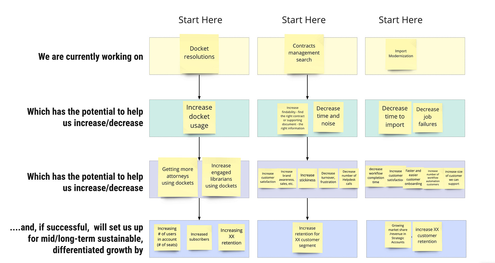

Here’s a simple activity I do in some of my workshops. 

I call it the “Bet Up” exercise. 

I like this exercise because there are plenty of top-down tree-based activities; start with a strategy and work *down* to the day-to-day work. In many ways the North Star Workshop I do is a strategy *down* activity.

With the Bet Up exercise, we flip that. We begin with work in progress. Teams reverse engineer a plausible driver tree, making an implicit strategy explicit. It might not be the perfect strategy—and ideally, we’d work the other way around—but it *is* what exists now. 

It looks like this anonymized real-world example:

Here’s how to run the activity:

1. Start with a blank canvas.

2. Divide attendees into small groups. Group people who work on similar areas of the product.

3. Ask each group to pick two or three efforts in the 1w-1mo range.

4. Place those sticky notes in the “we are currently working on” boxes.

5. Work down from that sticky using the prompts as a guide.

6. Include multiple items if multiple items exist.

7. Keep working *down* the tree.

8. When finished, have each group walk through their activity.

9. As a follow-up activity, cluster and group drivers.

10. “Flip” the tree, so the *work* appears as leaves.

Bet Up scales well. I’ve done this with around 100 people (20 teams). Once you get to the second or third row, you find similar drivers. At the fourth level, you see a lot of convergence. Even with 20 teams / 100 people, we quickly build a decent driver tree.

Why is this activity valuable?

To change a strategy, you have to be generally aware of the beliefs that exist right now. So while you may not *like* what you learn in this activity, it will give you a jumping-off point to focus on a revision of the strategy.

This is also an excellent activity for scanning for measurement focus. Are you missing things? Can each team trace the work they are doing to things that matter? Do teams have actionable inputs that connect to more lagging meaningful areas of impact? The words “increase” and “decrease” encourage teams to think about the levers they are moving, and not the solutions they are building.