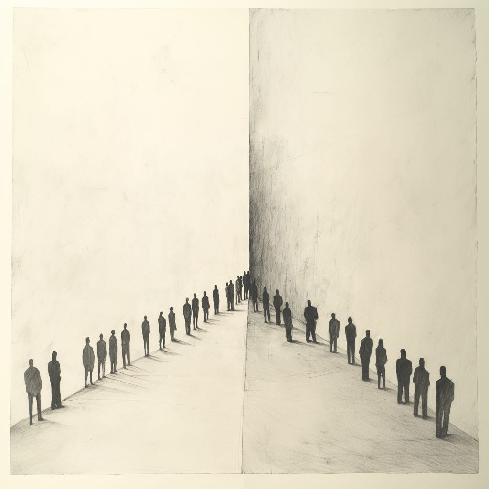

I've encountered several examples lately where people involved in tech share caustic, divisive messages that combine 1) in-group signaling alongside 2) out-group stereotyping, blaming, and scapegoating.

The best term I've found for this is parochial altruism, which simultaneously shows loyalty and selflessness toward one's in-group while showing hostility and exclusion toward out-groups.

I found [one post in particular](https://www.linkedin.com/posts/jasonmlemkin_the-mediocre-dont-just-quietly-underperform-activity-7272724339169353728-Jiep/) to be a striking example of this—describing "the mediocre" as almost a virus to be avoided. I had an extremely visceral response to the copy. A generous interpretation might be that the post emphasizes the importance of maintaining high standards and protecting team cohesion, but even still, the divisive language was striking. To get a true sense of parochial altruism, read some of the comments.

I've seen similar posts about "fakers," "professional managers," middle managers, coaches, consultants, glue people, "technicals," bureaucrats, and "process people."

What's going on?

Tech is currently a bundle of contradictions—abundance vs. scarcity, opportunity vs. mass layoffs, innovation vs. retrenchment, and exuberance vs. apathy. Amidst these contradictions, ego and identity threats pervade.

The leader whose company thrived under low interest rates now grapples with scrutiny and board doubt. The VP of Design, who fought for a decade for a seat at the table, faces an "org flattening," questioning their role as a designer and leader. The founder, desperate to catch the AI train, sits anxiously in their office space in the Mission District, questioning why the office is empty by 8 PM. "We've got one shot, everyone!" The newly laid-off product manager fixates on the Instagram-reel-like podcast episode with their former boss, blurring the boundaries between optics and reality.

Under threat, we cling more tightly to our in-group—reinforcing bonds and seeking validation—while simultaneously stereotyping and distrusting out-groups.

Take the example of the post I shared. There is a lot of talk about B2B SaaS taking a big hit (bordering on hot takes calling out whether it is even a viable model moving forward, which, ironically, are their own form of parochial altruism). Growth rates have plummeted. Layoffs abound. There's a lot of threat in that context currently.

The threat takes many shapes. Even optimistic people might feel FOMO or experience subtle pressures to prove their value, double down on their role, or seek validation within their in-group. It isn't only people who feel overt threat; it can manifest differently.

The lesson here is to recognize that the professional landscape is a bundle of contradictions and that we all may be vulnerable to these dynamics.

It starts with self-awareness. Some questions to consider:

1. How do I identify with a particular in-group at work (or, more generally, professionally), and how does this influence my perception of others outside that group?

2. How am I contributing—actively or passively—to the culture of stereotyping and scapegoating, and what are my motivations for doing so? What need is this filling?

3. In which moments do I default to simplistic labels? What is going on when this happens? When do I find myself slipping into a binary, 'us vs. them' mindset, and what might trigger this reaction?

4. What subtle pressures—FOMO, job insecurity, shifting industry trends—might push me to judge others harshly rather than show understanding or curiosity?

5. How will I choose to respond when I encounter people engaging in scapegoating or negative, divisive rhetoric? What will guide me in deciding if, when, and how to engage without wasting unnecessary energy or falling into similar patterns?

That last point is important. Maybe this post was a waste of energy and showed my cards too much, but I do believe there’s something for all of us to learn here.