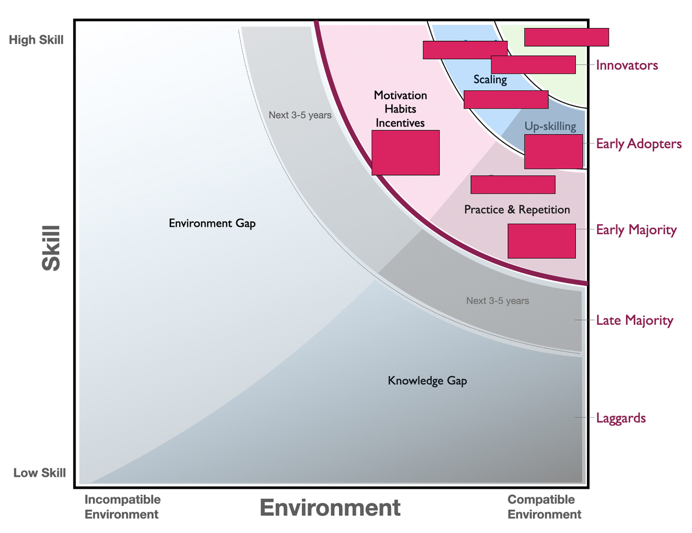

How does a product manager/leader new to a company (a startup) start to form a mental model around segmenting customers and gradually converging on an ICP (ideal customer profile)?

In my new job, I've jumped back into the deep end of hearing about how different teams and companies work. I did this for 4+ years at Amplitude. Now, at Dotwork, the discussions are even more specific around operating models, ways of working, strategy deployment, goals, planning, finance, and the role (and styles) of operations and enablement teams.

I've joked that my brain will explode in this gig, or I'll truly be in the matrix 😆 —or both. Plus, I’ve shifted from evangelist to head of product which really ups the stakes. Either way, as readers you will benefit.

**Beyond Simple Company Firmographics**

----------

A key lesson from Amplitude is that simplistic descriptions like "enterprise" don't cut it when it comes to products that touch ways of working (be it using data or thinking about operations and strategy deployment).

You can have massive enterprises that literally want to take out their credit card and get going yesterday. And smaller scale-ups that want to be hand-held for six months (no judgment there; that's what they expect). A company with a compatible environment might be a better fit than a “high performing” company.

There are logos behind each of the red boxes below, but you can see the mix of environment and skill that led to different motions:

This was later-stage Amplitude. There’s no way they could have juggled this many motions as a tiny startup.

To develop an ICP for a ways-of-working product, it is critical to get into the dimensions that matter and will dictate your strategy, what you build, your GTM motion, your success and support motion, and, more broadly, how you think of your whole company as a product. Simplistic ICPs help people plug targeting criteria into a marketing campaign and give SDRs the least common denominator for who to hit up on LinkedIn. But they aren't company-as-a-product-grade.

That last part is critical—in a startup, everyone needs to be aligned on what we'll need to do to make customers successful. Everything is the product, so you focus on the differences that matter. Every second counts in startup mode, so being super crisp about what matters is paramount.

**Becoming a Sponge**

----------

When you join a company, you first commit to spending an inordinate amount of time on calls. At first, you need to listen to determine what questions to ask. Our current goal is to expand our design partner cohort, and because design partners ideally become your key reference customers, it is important to get this right.

Become a sponge. And don't rush to squeeze out the sponge!

Instead of rushing to use existing dimensions like company size or age, listen for the dimensions that matter for your product. Slowly converge on that set of dimensions instead of limiting yourself to a fixed number of profiles.

**The Puzzle**

----------

In our space, one thing that becomes immediately apparent is the vast, vast "process and tools" spectrum. There are companies with groups of 1000s of developers and hundreds of teams working out of Google Docs and spreadsheets that don't mandate workflow tools (e.g., Jira). A leader summed up the model well: "It is controlled chaos, and it mostly works." On the flip side, you have companies of \<12 product teams with mandated workflows, templates, org-wide SOPs, centralized top-down rituals, and a heavy stack of specialized tools (or "the one tool").

This is the ideal place to zero in on organizational psychographics.

**The Dimensions**

----------

I try to avoid converging on any model until I collect a reasonable number of stories. Over the course of my conversations, so far I have noticed four key variables:

* Awareness. Are ways of working unintelligible, implicit, or explicit?

* Context around centralization, consistency, and decentralization.

* Rate of change and the direction of change.

* Perceptions around effectiveness (Is it working?).

I’m sure these will change and morph with time.

While reading these dimensions, keep asking yourself, "How might these impact product decisions, packaging/pricing decisions, the GTM motion, onboarding, customer success, marketing, etc., for a product that, at a high level, helps companies operate more effectively and efficiently?”

---

>
>
> ***Huge Caveat! Your dimensions will likely look very different! And you might be completely fine using straightforward firmographics.***
> ----------
>
>

---

### **Awareness**

 ###

**Are ways of working unintelligible, implicit, or explicit?**

* **Implicit.** In some companies, there's no real push to make ways of working explicit. Ask three different people, and you might get three different but coherent ways of describing how things work.

* **Explicit.** Other companies pride themselves on being very explicit about ways of working (but not necessarily process-driven, for example: "We expect people to work out dependency clashes among themselves, and only escalate when…"). They write long ways-of-working guides, enable teams on "the way," and are very deliberate about updates and how things evolve.

* **Unintelligible.** Finally, you have a third situation—there's so much change, clashing, disagreement, etc. that ways of working remain unintelligible.

***Why does it matter?*** A company with explicit ways of working may have an easier time describing how things work right now. A company where things are more implicit will need our help to tease out those practices. It is probably best to avoid environments that are unintelligible unless we work through a partner.

### **Consistency (Centralization & Decentralization)**

 ###

Next, you have **context around centralization, consistency, and decentralization.**

This context is heavily influenced by the background of leaders/founders, the structure of the company, architecture, business model complexity, maturity of the domain, growth rate, and age of the company.

A large, non-digital-product selling company evolving from a heavy project-driven IT development model to something more product-oriented can't escape centralization inertia. The architecture alone might require a consistent apples-to-apples sense of value to help settle dependency debates. Meanwhile, on the flip side, you might find a founder/CEO who has a knee-jerk reaction to any hint of consistency because it "slows teams down, and speed is everything, even if people experience pain." And every structure, variation, bias, and belief in between.

 Some companies believe (or are forced) to lean into consistency. Other companies believe (or are forced) to embrace decentralization, or a hybrid approach promoting local flexibility linked to centralized practices, tools, etc. through standard interfaces. The context is never static. Shifts in the macro-environment or growing pains can cause companies to "flip" their view on a dime or shift left/right on the spectrum.

***Why does it matter?*** It greatly impacts views on tools, ways of working, practices, rituals, etc. Our product is a great fit for companies that want to support concurrent operating models and encourage local variation while ensuring that leaders have a sensible view. If a company wants to do SAFe by the book and do it everywhere, it might be better to wait until they decide to be more adaptive; at this point, our product might be a better fit.

### **Inertia**

 ###

**What is the rate of change, and what is the direction of change?**

In a company experiencing rapid growth, everything breaks in a couple of quarters. What works for today will not work for tomorrow, and although painful, one could argue this is good. The primary dynamic is one of scale and all the growing pains that come with scale. In a standard "digital transformation," the company may experience a lot of change, but in many cases, the motion resembles "de-scaling" or "de-coupling." Many tech companies have laid off employees, hoping to shed complexity—some making wholesale shifts from business unit (BU) type setups to functional teams. They are still hoping for moderate growth but need to operate more efficiently.

***Why does it matter?*** This speaks to where a customer might feel pain: scale, focus on efficiency, or a "transformation" effort where they adopt new ways of organizing and working. This has huge implications for marketing and product.

### **Perceived Effectiveness**

 ###

Perhaps the most subjective (but important) detail: Is it working? And what is the current trajectory—are things getting worse, better, or somewhere in between?

Scaling something that is working but becoming difficult to manage with current tools is a very, very different proposition compared to a complete "rip and replace" of practices, org structure, and operating cadences based on the premise of needing a big step change. Like many things, teams balance evolutionary improvements and revolutionary improvements.

***Why does this matter?*** The perceived effectiveness of the status quo is critical to positioning and developing our product. Are we supporting a mighty ProductOps team that has figured out something that works but needs operationalization or a new leadership team intent on reorganizing and redefining the operating model?

### **Summary**

 ###

Putting these together, we get something that looks like this:

* **Awareness:** Unintelligible, Implicit, Explicit

* **Context:** Centralized, Decentralized, Hybrid

* **Rate of Change:** Slow/Stable, Rapid Growth, Slow/Moderate Growth, De-scaling/Adjusting, Revolutionary change

* **Effectiveness:** Needs radical change, Getting Worse, Working for Now, Getting Better

**So What?**

----------

Using this model, I can cluster the companies interested in our design partnership.

Here are two very brief examples:

* **Cluster 1:** Cluster one, we're finding rapid growth companies that trend towards being more decentralized and are experiencing rapid or moderate growth. Things are actually working, but they are cracking under scale. In many cases, they've used no-code tools to do incredible things, but these homegrown tools are becoming hard to maintain. They talk about being "tool skeptics" because they've done well. There's a push in some of these companies for a bit more centralization. Still, the savvy operations folks understand the inherent risks and want to ensure they are keeping some of that decentralization.

* **Cluster 2:** These are larger companies in a de-scaling and adjustment motion. Ways of working are more explicit, but there's a general sense that they need to shift into a more decentralized motion while also maintaining a high-level overview. These companies are looking to us to help them adopt new ways of working, whereas, with cluster one, they're already generally pretty sure of how they want to work.

(There's a cluster 3, 4, and 5, but we'll skip that for today.)

I don't want to blast out to my newsletter where we plan to focus (spoiler, it is Cluster 4), but you can see how this would matter.

Cluster 1 customers are happy with how things are working and want to make sure they can scale gracefully and preserve what's been effective. Cluster 2 companies are looking for more thought leadership, are looking for a more opinionated product, and are likely also a lot more complex at the moment. Clusters 1 and 2 will need very different things from our success team, respond to various marketing messages, and demand very different things from our product team.

Stay tuned….

Conclusion

----------

Organizational psychographics are a powerful way to segment customers, and I believe they are especially relevant for ways of working products that are highly sensitive to a company's changing environment, beliefs, culture, etc. Whether this is the right approach for your product is up to you, but hopefully, you found the post interesting. If you find your ICP to be specific but not actionable, consider the alternatives.