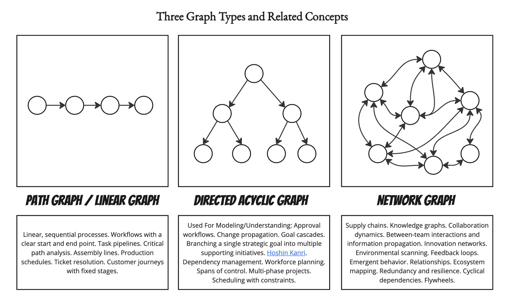
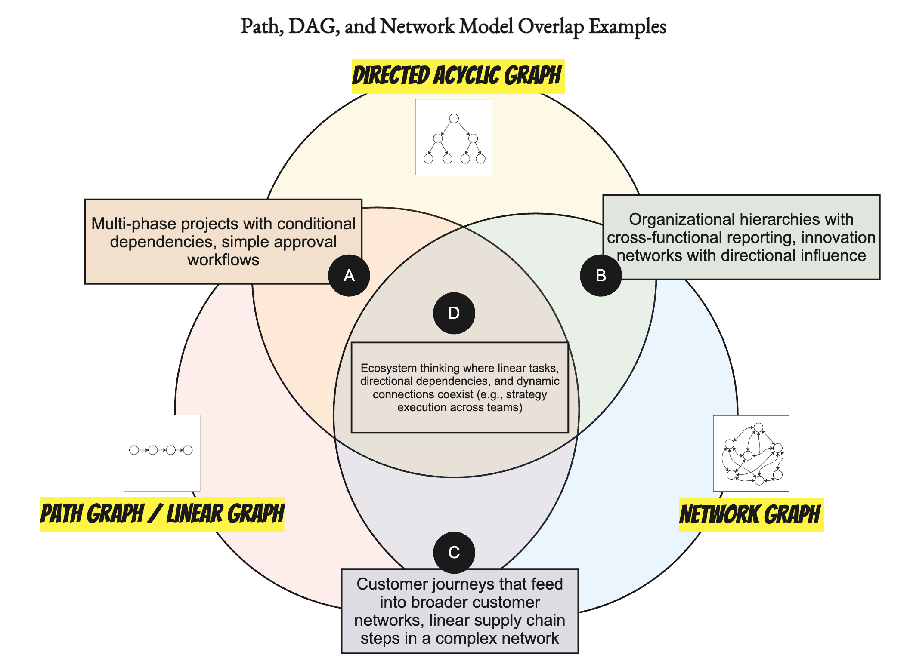
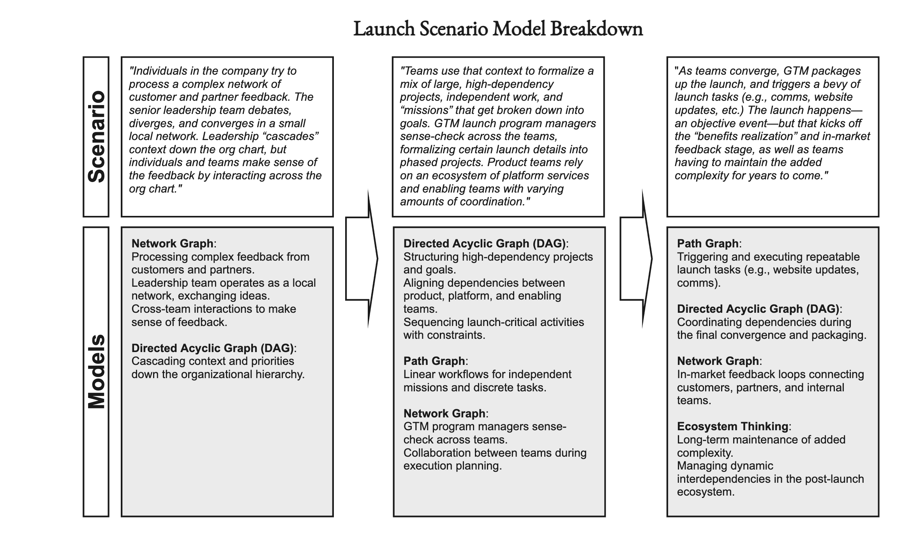
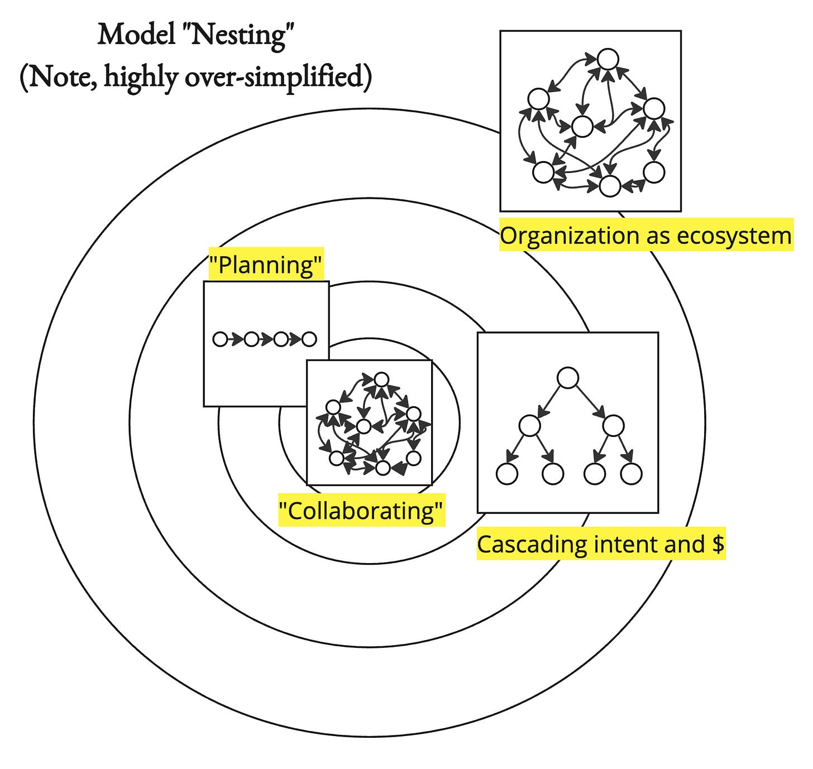
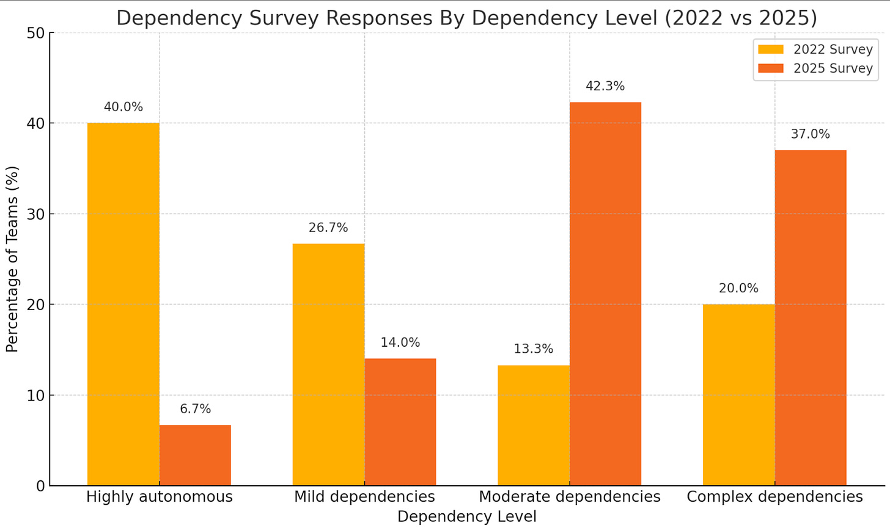
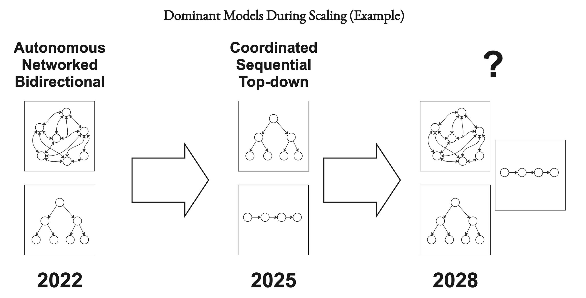
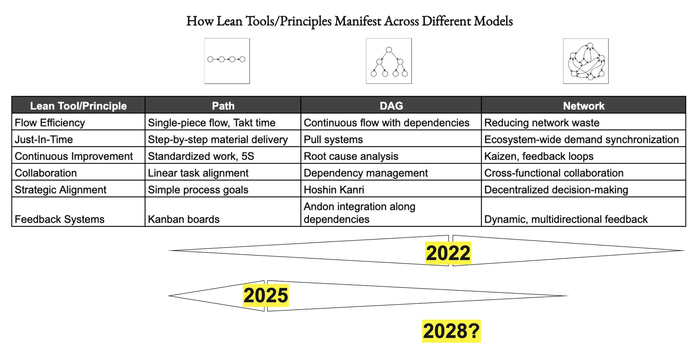
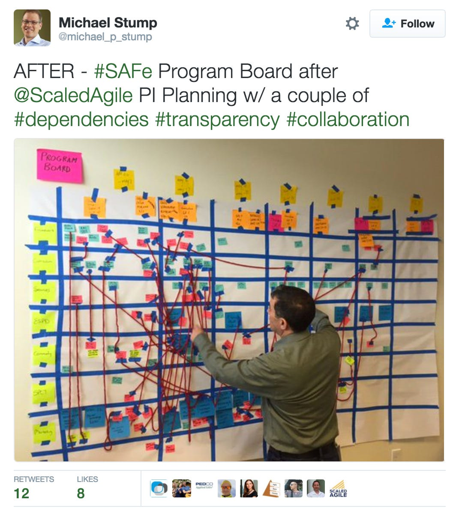
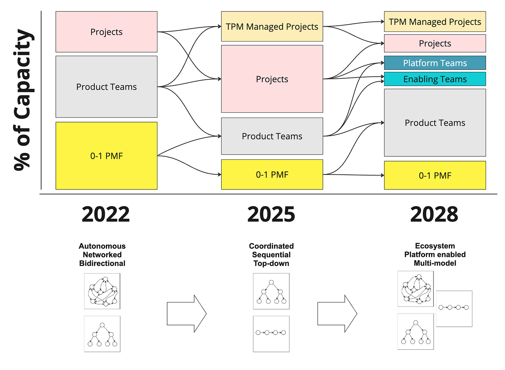

If you've followed my work over the years, you know that I frequently mention ideas from Lean, such as limiting work in progress, continuous improvement, "respect for people," Andon cords, reducing overburden (Muri), systems thinking, etc. I frequently recommend Mary and Tom Poppendieck's book [The Lean Mindset: Ask the Right Questions](https://www.amazon.com/Lean-Mindset-Ask-Right-Questions/dp/0321896904).

But something has been nagging at me.

* First, rapid scale-up tech companies often seem to ignore Lean's lessons, assuming that teams are "independent" (even when they aren't) and that Lean only applies to manufacturing.

* Second, big companies seem overly indexed on *some* aspects of Lean and, in doing so, end up chasing a local maximum. It is all about delivering big projects across a rather incoherent org chart.

This has become especially relevant at my day-job (Dotwork) where we work to model company operating systems for our design partners. We have to decide when to be opinionated, and when to let customers “model anything.”

Key Lesson: Everyone can learn from Lean, but they need to consider context carefully.

Paths, DAGs, and Networks

----------

Consider three approaches we might use to model and understand different aspects of how an organization (a sociotechnical system) functions and operates.

**Path Graph / Linear Graph**

Used For Modeling/Understanding: Linear, sequential processes. Workflows with a clear start and end point. Task pipelines. Critical path analysis. Assembly lines. Production schedules. Ticket resolution. Customer journeys with fixed stages.

**Directed Acyclic Graph**

Used For Modeling/Understanding: Approval workflows. Change propagation. Goal cascades. Branching a single strategic goal into multiple supporting initiatives. [Hoshin Kanri](https://en.wikipedia.org/wiki/Hoshin_Kanri). Dependency management. Workforce planning. Spans of control. Multi-phase projects. Scheduling with constraints.

**Network Graph**

Used For Modeling/Understanding: Supply chains. Knowledge graphs. Collaboration dynamics. Between-team interactions and information propagation. Innovation networks. Environmental scanning. Feedback loops. Emergent behavior. Relationships. Ecosystem mapping. Redundancy and resilience. Cyclical dependencies. Flywheels.

Overlaps

----------

Of course, humans, organizations, and product development are messy endeavors. You often combine models to make sense of things and get things done.

**Overlaps Examples:**

1. PATH/DAG: Multi-phase projects with conditional dependencies and simple approval workflows

2. DAG/NETWORK: Organizational hierarchies with cross-functional reporting, innovation networks with directional influence

3. PATH/NETWORK: Customer journeys that feed into broader customer networks, linear supply chain steps in a complex network

4. ALL: Ecosystem thinking where linear tasks, directional dependencies, and dynamic connections coexist (e.g., strategy execution across teams)

Launch Scenario

----------

Let's make this more tangible. Consider the lifecycle of an average product launch and the different models involved. As you read, try to pick out the model and model overlaps.

**Scenario**

>
>
> Individuals in the company try to process a complex network of customer and partner feedback. The senior leadership team debates, diverges, and converges in a small local network. Leadership "cascades" context down the organizational chart, but individuals and teams make sense of the feedback by interacting across the organizational chart.
>
>
>
> Teams use that context to formalize a mix of large, high-dependency projects, independent work, and "missions" that get broken down into goals. GTM launch program managers sense-check across the teams, formalizing certain launch details into phased projects. Product teams rely on an ecosystem of platform services and enabling teams with varying amounts of coordination.
>
>
>
> As teams converge, GTM packages up the launch and triggers a bevy of launch tasks (e.g., comms, website updates, etc.) The launch happens—an objective event—but that kicks off the "benefits realization" and in-market feedback stage, and teams have to maintain the added complexity for years to come.
>
>

Here are some model ideas paired with parts of the scenario:

You have all three models in play simultaneously—interacting with each other at different resolutions, across different timeframes, and with varying degrees of overlap. It can be dangerous to imagine systems as "nested" (vs. woven together, etc.), but for explanatory purposes, consider that different models are at play as you zoom in from the organization to the team:

Model Mix

----------

Picture a company that scaled rapidly between 2022 and 2025.

During that time, the organization accumulated a fair amount of organizational "debt" due to scaling challenges. They put money into scaling revenue instead of focusing on building out their platform ecosystem. On top of that, in 2024/2025, the economic environment and higher interest rates shifted, leaving the organizational structure poorly aligned with the current strategy. Getting things done requires working with more people.

### **2022 Survey**

 ###

A centralized GTM team supports releases and launches, but product development teams are fairly independent.

### **2025 Survey**

 ###

A large % of the work involves deep collaboration between teams (both within R&D and between R&D and GTM). Very few teams regard themselves as "highly autonomous."

It is 2025, and given that friction, leaders want to get into all the details. Team autonomy is less important than delivering big, high-impact, cross-cutting projects. Middle-management "gets in the way." There's pressure to cut through bureaucracy. What will the future bring? The current motion is unsustainable in the long term, but what will emerge in its place?

This likely had an impact on the models they used:

I have encountered many discussions recently debating the value of "Lean Thinking" (e.g., the theory of constraints and concepts like flow and value stream mapping) for product work. I've noticed a pattern. Individuals who advocate for these approaches *tend* to be involved in helping large enterprises with complex dependencies and mismatched structures/strategies "stabilize" the situation and "deliver value."

These companies more resemble the 2025 stage of the company above.

Meanwhile, for people who have predominantly worked in companies with "independent teams," the Lean approach can somehow miss the mark. Sure, ideas like limiting WIP work locally, but expanding that view across the organization feels unnecessarily "heavyweight" with too much focus on a centralized process. For example, I've had a lot of trouble getting rapid-growth tech companies to adopt portfolio-level Kanban, **even when the situation would have benefitted from it**. This point is critical: many scale-ups are feeling the pain right now!

Here's a rough cut at thinking about different lean ideas as they manifest against the other model types we have been discussing, along with a theoretical guess at where the "weight" of the model is currently for our example company above.

And lest we think this is all theoretical, we might interpret this picture as the ultimate attempt to use DAG and Path ideas to reign in an out-of-control "process."

Anyone who has done this understands that this thinking has a local limit.

Using this model, you can only go so fast and be so effective. To improve, at some point, the organization will need to adopt platform/ecosystem thinking along with "commander's intent" (less prescriptive goals) to get to the next level. Of course, they'll continue using all models at once, but the mix will be slightly different.

In short, they will need to move to more Network and DAG-oriented models.

So What?

----------

I've reached my timebox, but I'll end with a "So What?"

1. All companies operate using overlaps of the three models: path, DAG, and network.

2. People are often biased to one view of the world. Some think in terms of crazy networks, some in terms of sequences, and some in terms of hierarchical trees.

3. Depending on a company's context, different models will emerge as stop-gap mechanisms to stabilize the situation and adapt to it.

4. Lean principles apply in different ways depending on where the "weight" of the problem is at the moment. Lean has helpful ideas at any level, but you must use them wisely.

5. I think a functioning product organization with platform and enablement support trends more in Network and DAG.