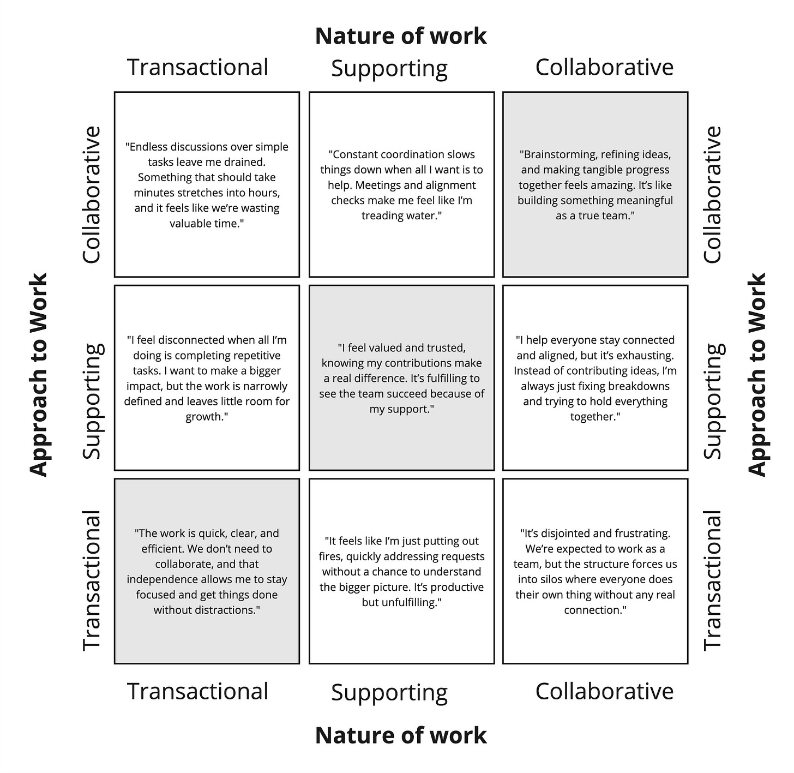
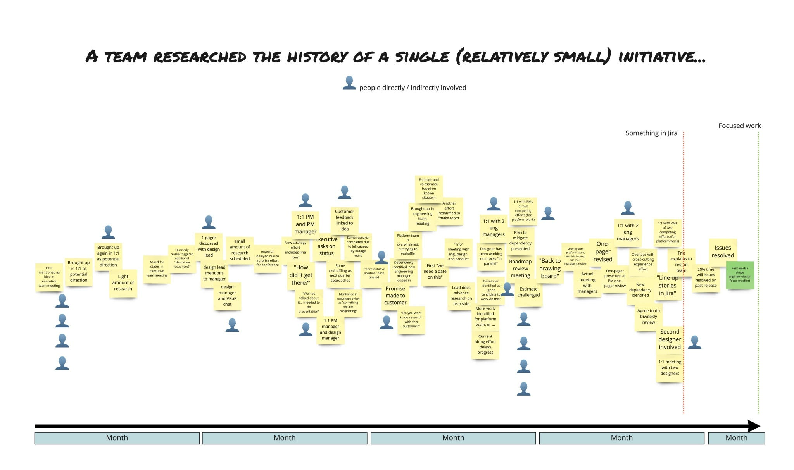

Lately, I've been spending more time talking with product leaders about *exactly* how they operate. For lack of a better term, I'm calling it their company’s product operating system (to contrast it with the broader and less specific idea of a Model). No two product operating systems are alike, because no two companies are alike.

It might sound like a boring process discussion, but it's far from that. It's a dynamic mix of leadership, service design, organizational design, systems thinking, human factors, behavior design, cultural anthropology, communication design, organizational development, and (even some) game design. In some companies, the product operating system is implicit. In others, leaders make painstaking efforts to clarify how things work.

Either way, it's a designed system.

I was asked recently by a Dotwork design partner for some tips, principles, and patterns. I started writing and got a bit carried away. Hence this post.

1. An Internal Product/Platform

----------

Think of your product operating system as a product. You are developing a platform to provide context, encourage alignment, build shared understanding, manage risk, etc. It is a multi-sided marketplace involving customers, leaders, managers, and front-line teams. Cater only to one group, and the whole thing will fall apart. Success breeds new challenges, so never stop adapting, experimenting, and soliciting feedback.

2. Senior Leader as PM of the OS

----------

Senior leaders should own the operating system and stand behind it. It can be tempting to offload this to operations, managers, chiefs of staff, or program managers. Don't! Tap into their experience, but the team will notice if you're only half-bought-in and consistently skirting guidelines and principles.

3. Start With Rituals

----------

Start with rituals. Who should interact with whom, how often, and toward what end? What insights, context, and tools will they need to do great work when they interact? What shared artifacts can help focus the group? Can you automate the boring, transactional stuff to leave more time for quality collaboration and better decision-making? Well-designed rituals—combined with trust and psychological safety—are the best antidote for bureaucracy and smothering processes.

4. Exception Handling

----------

If you design processes to cover every single exception, they will, almost by definition, become too stringent and burdensome. It's OK not to have the answer for every situation and to work it out on the fly. Sure, if those exceptions become the norm, you might want to consider adding more clarity and structure—but you can cross that bridge when you come to it.

5. The IKEA Effect Is Real

----------

The IKEA effect is real. Take advantage of it, but don't take it too far. Teams take pride in approaches they have a hand in designing. It helps to throw some unique rituals and words into your OS, even if your actions are almost identical to an industry "best practice." Watch out for making it too weird, though. While effective, it might make it harder for people to get up to speed when they join. A mix of well-trodden approaches and unique twists is ideal.

* [The IKEA effect is real (LinkedIn post)](https://www.linkedin.com/posts/johnpcutler_the-ikea-effect-is-real-when-it-comes-to-activity-7268126705238589440-3kwV/)

6. Consistent Interfaces

----------

Think in terms of consistent interfaces, not consistent processes. It's OK for teams to work differently in your company as long as other groups (teams, leadership, etc.) have a reasonably consistent way of interacting with those teams. For example, a consistent "flat and flexible" approach to goal setting is much better than mandating two-week sprints, forcing people to fill out the same document, or requiring every team to approach discovery the same way.

7. Stubbornness Quota

----------

You have a stubbornness quota. Use it, but don't exceed it. Great teams are often stubborn about certain things. Maybe they are VERY into writing, running rigorous experiments, or encouraging people to move regularly between teams. However, as a company, you can only be stubborn about so many things before those areas of stubbornness start cannibalizing each other.

* [TBM 44/53: What Is Your Team Stubborn About?](https://cutlefish.substack.com/p/tbm-4453-what-is-your-team-stubborn)

8. Anchor Documents

----------

Make sure to curate a small set of "anchor documents" your team consistently revisits and updates. Anchor documents (e.g., a 12-month operating plan) help your team build positive habits. Returning to your prior work instead of starting over repeatedly makes you more likely to reflect on previous assumptions and commitments. Agree on a review-and-refresh schedule that makes sense for the artifact and close the loop. Anchor artifacts differ from "instance artifacts" like PRDs, which are scoped to a particular initiative, or "logs," which are additive over time.

9. Examples Over Templates

----------

The templates you use almost don't matter. Before you know it, someone will do a kick-ass job filling one out, which will become the new standard. Templates are cheap. Thinking is the real deal. This isn't to say that templates are worthless—they are a good way to at least outline expectations—but more to say that you shouldn't stress about creating the perfect templates. Use examples! Curate a repository of examples involving real-world efforts, and let everyone know it exists. Importantly, in your examples repo, highlight how different teams in different contexts achieved the same desired result.

10. Habits Are Hard

----------

Team habits are like personal habits—you must get your reps in before things stick, and there will be a frustrating time when nothing makes sense. To make matters worse, people are naturally (and rightfully) skeptical of new approaches. Too often, they come and go without any real change. Your job, then, as a leader, is to foster conditions where people can do the thing enough times to see the value while at the same time encouraging people to offer feedback and help you tweak things moving forward. They need to know you are serious while not dogmatic. Give the experiment an expiration date, but ask teams to commit fully.

* [TBM 320: From Fluffy Concepts to Concrete Outcomes & Behaviors](https://cutlefish.substack.com/p/tbm-320-from-fluffy-concepts-to-concrete)

11. Fight Premature Convergence

----------

Fight premature convergence, false precision, and "Tetris playing" (trying to load everyone up and chase high utilization) like the plague. Too often, product operating systems encourage people to prematurely converge on solutions and rush decision-making. They also rely on precise estimates of work and forecasted value. Annual planning is a great example. In a rush to appear diligent and offer a persuasive plan for the next year, teams make commitments they can't keep and agree to build things they shouldn't.

* [TBM 48/52: Premature Convergence](https://cutlefish.substack.com/p/tbm-4852-premature-convergence)

* [TBM 20/52: A Product Super-Skill (Balancing Divergence and Convergence)](https://cutlefish.substack.com/p/tbm-2052-a-product-super-skill-balancing)

12. Limiting vs. Enabling Constraints

----------

Understand limiting vs. enabling constraints. At a high level, operating systems are a set of constraints intended to produce some desired outcomes. The constraints you choose are critical. Enabling constraints help your team learn faster, surface risks sooner, and catch problems before they get out of control. Limiting constraints are like giving teams more hoops to jump through. They may be necessary (e.g., compliance) but aren't free. Choose your enabling constraints wisely, and keep limiting constraints to a minimum.

* [Making Things Better (With Enabling Constraints and POPCORN)](https://cutlefish.substack.com/p/making-things-better-with-enabling)

* [TBM 314: Using Enabling Constraints for Situational Awareness](https://cutlefish.substack.com/p/tbm-314-using-enabling-constraints)

* [TBM 43/52: The Secret to Initiative Success (D, LC, F, EC)](https://cutlefish.substack.com/p/tbm-4352-the-secret-to-initiative)

13. Dependency Inflection Point

----------

Beware of the dependency inflection point. There's a critical inflection point involving dependencies. A company can handle a certain percentage of high-dependency initiatives. Exceed the tipping point, and you'll need to figure out how to support new collaboration patterns or remove the dependencies. Stay aware as you approach this point because it can also masquerade as "poor performance" or "dysfunction."

* [TBM 322: Work Shape Mix](https://cutlefish.substack.com/p/tbm-322-work-shape-mix)

* [TBM 248: Project-ish](https://cutlefish.substack.com/p/tbm-248-project-ish)

14. Carry Forward Logs

----------

Use "carry forward" update logs/journals. Instead of starting with a new document, carry forward your last entry and write the latest update. This is a great habit. Too often, teams lose any sense of what happened in the past. The simplest habit is to copy your last update into a new column and write your next update immediately adjacent to the last one.

* [TBM 292: Friction, Documentation, and Product Tools](https://cutlefish.substack.com/p/tbm-292-friction-documentation-and)

15. Work Within Current Norms

----------

Work with the culture of your company. Some companies encourage writing. Some companies are all about "decks" and presentations. As much as you might want to shift the culture, there's a good chance you won't. So, start working within the company norms.

* [Look Before Leaping](https://medium.com/@johnpcutler/look-before-leaping-9e4049a7c0f4)

16. Intentionality

----------

Intentionality is key. It almost matters more than what you do. Too often, people copy/paste frameworks to avoid having to really think about ways of working. It's unsexy. It's "just process work, and we all hate process!" But your product operating system is a designed thing, whether you like it or not. This includes being intentional about what NOT to worry about or what not to formalize or standardize. Some of the "loosest" systems are the most intentional. But it is intentionality around what *not* to do.

17. Fractal Structures

----------

Use fractal structures whenever possible. For example, if your design lead, engineering lead, and PM meet weekly, it really helps when their managers conduct a similar meeting. Bonus points if you all meet together. The same goes for documents and artifacts. If your company has a strategy, your teams should also have one, and it really helps to use similar terms, cycle lengths, etc. But beware! You see companies so beholden to the fractal structures that they fail to see when things are slipping. The people in the meeting can't resolve anything and must have a whole slew of 1:1s with people in other groups and teams. Sense when things are slipping and when you need a new approach.

* [TBM 36/53: Self-similarity and Manager/Leader Accountability (for Cross-functional Teams)](https://cutlefish.substack.com/p/tbm-3653-self-similarity-and-managerleader)

18. Safe Practice

----------

It takes time to get good at goal setting and being data-informed. A team can go a whole year before settling on good, actionable metrics and building a sixth sense of what's possible in any given quarter. Too often, people try to pick the perfect metrics and goals right from the start. They're afraid of getting it wrong—especially when comp and performance are at stake. A better approach is to focus on the rituals and inspect/adapt. Over time, you'll set better goals and vote up better metrics to pay attention to.

* [TBM 2/52: Start by Counting Things](https://cutlefish.substack.com/p/tbm-252-start-by-counting-things)

* [TBM 324: Goal-O-Rama](https://cutlefish.substack.com/p/tbm-324-goal-o-rama)

* [TBM 309: Zombie Practices and Processes](https://cutlefish.substack.com/p/tbm-309-zombie-practices-and-processes)

19. Beyond The Obvious

----------

Contact passionate problem solvers on the front lines and ask about frequent trade-off decisions. Where do you constantly need to choose between X and Y? It doesn't feel like a "judgment call"; rather, there's missing strategic context. That's a good place to focus your strategy work. The team doesn't need you to restate the obvious. Too often, leadership teams simply restate what everyone knows and punt on the decisions that would really unlock a lot of productivity and impact.

20. Less Mono Process

----------

Product work takes on many shapes. Products go through many stages. Mono Process makes no sense. Sure, you might have some overarching consistency, but you need to leave room for teams to work how they need to and ask for funding and support in ways that make sense. A team working on an early-stage capability in rapid growth mode is not the same as a team managing a "core product" growing more slowly but is the company's cash cow. They will not use the same metrics, carry the same "debt," do the same types of research, or approach budgeting the same way.

* [TBM 14/52: Less Mono-Process (VIDEO)](https://cutlefish.substack.com/p/tbm-1452-less-mono-process-video)

* [TBM 8/52: Avoid Mono-Process (But Embrace Shared Language)](https://cutlefish.substack.com/p/tbm-852-avoid-mono-process-but-embrace)

21. Pendulum Surfing

----------

Know where your company is regarding the common pendulum swings: centralization vs. decentralization, profit extraction vs. innovation, growth vs. stabilization, etc. If you don't, you're liable to pour a lot of heart and soul into something that will implode as soon as the pendulum swings back. Or you might miss an opportunity to surf the right wave. If you start early, you can avoid a pendulum swinging too far, but you almost certainly aren't going to prevent the swing from happening.

* [TBM 319: Surfing Inertia and Pendulum Swings](https://cutlefish.substack.com/p/tbm-319-surfing-inertia-and-pendulum)

22 Dependency Shapes

----------

Not all dependencies are created equal. Some dependencies involve deep, full-time collaboration. Others are mostly transactional with some light coordination. Design processes that adapt to the "shape" of your dependencies. For example, you can afford to lean more into automation and efficiency for two teams interacting transactionally on mostly repetitive requests. However, two teams collaborating on a big, messy project will need dedicated time to work face-to-face. Because of this, you can't treat dependencies with a single mono-process.

* [TBM 264: Dependencies In Fast(er) Growing Companies (Part 3)](https://cutlefish.substack.com/p/tbm-264-dependencies-in-faster-growing)

* [TBM 335: "Simple" Dependency Coordination](https://cutlefish.substack.com/p/tbm-335-simple-dependency-coordination)

23. Subtract First

----------

Embrace the power of subtractive change. Some companies have a nasty habit of only adding and never taking away. The first step should always be to review what you're doing right now and vote some things off the island. Every team has "zombie processes" that people just sleepwalk through because someone said they were important two years ago.

* [TBM 10/52: Subtractive and Additive Change](https://cutlefish.substack.com/p/tbm-1052-subtractive-and-additive)

24. Scaffolding

----------

When things go off the rails and need work, erecting a scaffold helps you safely fix what needs to be fixed. The most important thing about scaffolds is that they are meant to provide structural support but should also be temporary. For example, if dependencies get out of control on your team, you might need to "scaffold" a new review meeting. No one wants this meeting to exist long-term, but it helps to have it until you can move things to a better place. Be explicit that you intend to pull the scaffold down once things improve.

* [TBM 11/52: Scaffolding & Skepticism](https://cutlefish.substack.com/p/tbm-1152-scaffolding-and-skepticism)

25. Official, Real, and Ideal

----------

There's always a balance between the "official" way of working, the "real" way of working (what is happening), and the "ideal." These three things are never fully in sync, but you can watch out for when they drift too far apart. People hate working in a company where they must follow all the "official" rules while running a separate shadow process just to get anything done.

* [TBM 303: Official, Real, and the Ideal](https://cutlefish.substack.com/p/tbm-303-official-real-and-the-ideal)

26. Simple Not Simplistic

----------

Shoot for simple, not simplistic. A "simple" principle can enable a lot of nuance and creativity. A "simplistic" process makes everyone feel like they're back in grade school. A well-formed strategy is often deceptively simple—peeling away the layers reveals many interesting nuances. A simplistic strategy may look good on a slide during a kickoff but fails to create a "spark" for coherent action.

* [TBM 242: The Simplicity Fetish](https://cutlefish.substack.com/p/tbm-242-the-simplicity-fetish)

* [TBM 321: "Reducing Complexity"](https://cutlefish.substack.com/p/tbm-321-reducing-complexity)

* [45A/52: Simplicity Is a Tactic, Not a Goal](https://cutlefish.substack.com/p/45a52-simplicity-is-a-tactic-not)

* [TBM 42/52: Fluffy & Ambiguous](https://cutlefish.substack.com/p/tbm-4252-fluffy-and-ambiguous)

27. Insiders and Newcomers

----------

Don't over-index on how insiders navigate the company. You can learn a lot from people skilled in all the unofficial ways to get stuff done, but you risk alienating newcomers. Similarly, don't over-index on newcomers. Yes, it's nice for everyone to get up to speed quickly, but some things are better learned through osmosis and observation, not reading. Strike a good balance.

* [TBM 21/52: Old Guard, New Guard](https://cutlefish.substack.com/p/tbm-2152-old-guard-new-guard)

28. Allocation Guidelines

----------

Beware of rules like "teams should spend 15% on KTLO and debt." While they help carve out time for that work, the team should often spend much more time on that work to avoid getting fully stuck in the future. Providing guidelines and general heuristics while normalizing people calling out anomalies is much better. Otherwise, they'll publicly say they're at 15% but actually be doing much more.

* [TBM 234: Maintenance, KTLO, and BAU](https://cutlefish.substack.com/p/tbm-234-maintenance-ktlo-and-bau)

* [TBM 334: The Capacity Allocation Illusion](https://cutlefish.substack.com/p/tbm-334-the-capacity-allocation-illusion)

* [TBM 249: Return on Investment (and Allocation)](https://cutlefish.substack.com/p/tbm-249-return-on-investment-and)

29. Match Cycle Length to Rate of Change

----------

When market conditions change rapidly, you'll need to tighten your cycles. An annual cycle is far too long for certain decisions when the market is shifting quickly. If every quarter you find things have drifted too far and too much work is required to converge and get back to shared understanding, you'll need to shift to something more frequent.

30. Less Form-Filling

----------

Watch out for situations where front-line teams are essentially filling out forms to generate reports that have no real bearing on reality. What actual decisions are being made based on the information collected? How is the data being represented? A great example is a team dutifully filling out timesheets to add up to 100% when they're burning 50% of their time context-switching and 10% on administrative work.

31. Initiative Journey Exercise

----------

Periodically do retrospectives on the full history of an effort, from the initial idea (or request or strategy) all the way through to customer and business outcomes. Who was involved? What was collaboration like? Many leaders lose sight of what it actually takes to get work done in a company. It's important to surface this without judgment.

32. Cascade Traps

----------

Watch out for "cascades" (like cascading strategy or cascading goals) that follow the org chart. Sure, some companies are organized such that an org-chart cascade makes sense, but most aren't. Real work doesn't fit neatly into the org chart. Additionally, cascades have a way of making the work more and more prescriptive as you go down "levels." Teams should have relatively stable inputs and set goals based on those inputs. This approach doesn't require a cascade.

* [TBM 305: Stop the (Goal) Cascade Madness](https://cutlefish.substack.com/p/tbm-305-stop-the-goal-cascade-madness)

* [TBM 213: Goal Cascades vs. High-Conviction Models](https://cutlefish.substack.com/p/tbm-213-goal-cascades-vs-high-conviction)

Related…

----------