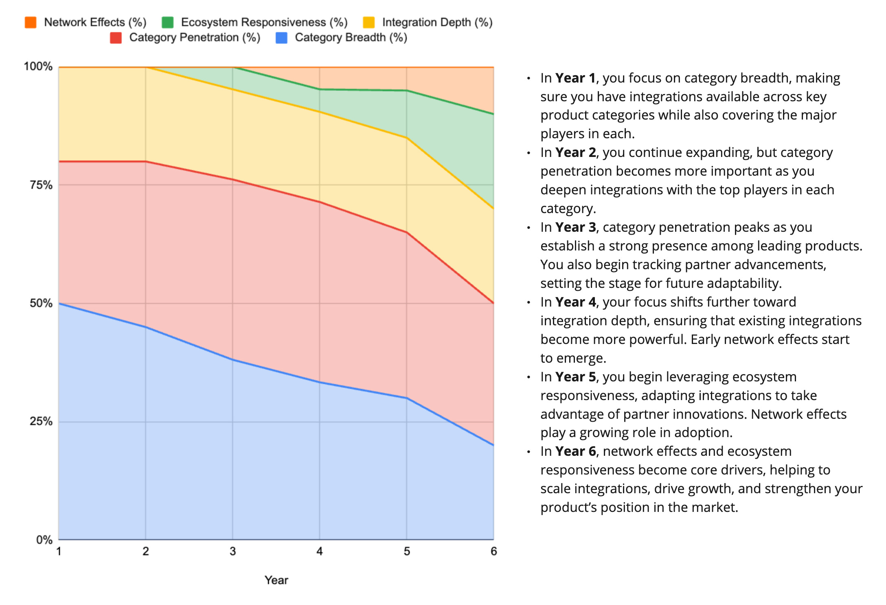

As a product manager, it is your responsibility to guide the conversation with your partners in ways that are more product-centric, and less reactive and flavor-of-the-month. Here’s one way to do that.

There are aspects of your product that change very slowly. The more you can socialize these ideas with key partners—train them to think the "right" way about your product—the more continuity you can build into your various interactions. If you teach them the game, then they’ll be able to provide better feedback.

I'm a huge believer in [Thinking Big and Working Small](https://jchyip.medium.com/guiding-principle-think-big-work-small-8fb1fce6dd97). But to think big, you can't keep shifting your models around. It confuses people. So, the earlier you can train people to think about your product in a way conducive to outcome-oriented, long-term thinking, the better.

An Example

----------

Let's look at an example. Imagine you have a team focusing on partner integrations. At a high level, you can think of this team as focusing on influencing five key drivers:

1. **Category Breadth** – The breadth of whole categories of products that you integrate with.

2. **Category Penetration** – The percentage of top players in each category you integrate with.

3. **Integration Depth** – How deeply you integrate with partners. Ensure unique partner functionality is paired with your product to maximize customer value.

4. **Ecosystem Responsiveness** – Staying current with advances in partner products and identifying opportunities to turn these shifts/improvements into valuable advantages for your customers.

5. **Network Effects** – Leveraging your and your partners' ecosystems to drive growth, expand customer usage, and unlock new market opportunities.

Over the months, quarters, and years, the team will allocate more/less of its energy to each of these five drivers. Strategies and tactics will shift and change, and opportunities will come and go. You'll have your normal mix of fires, hitting local maximums, smooth sailing, wins, and doldrums.

**But the drivers will likely remain stable. This is the key point. Pick models that stand the test of time!**

Here's an example of the "mix" changing over the years:

This is one of many strategies. For example, we might first focus on deeply integrating with a few key strategic partners across categories. Or perhaps we could focus on network effects first, which might be more appropriate if our product's success depends on interoperability across a large ecosystem (and we can incentivize partners or customers to expand adoption organically). But that is the model's beauty—in a sense, it is strategy agnostic.

**The vocabulary is there. How we use the vocabulary to form a strategy is up to us.** This Breadth / Depth / Quality/ Monetization model is one of many we could have picked from. It isn't terribly creative, but it does the trick. We could have used all sorts of "stable" models to underpin our integration product. Here's another one:

* **Product Onboarding** – Reducing friction for new customers by making it easy to connect, migrate, and start using our product.

* **Product Adoption** – Ensuring our product becomes essential to daily workflows through seamless integrations.

* **Product Expansion** – Unlocking more customer value over time by enabling advanced use cases and deeper integrations.

* **Network Effects** – Creating integrations that drive ecosystem growth, making our product more valuable as adoption increases.

**Again, the model isn't the point. Models are a dime-a-dozen. The trick is picking one that will work with your partners and starting to use these terms repeatedly to guide the conversation.**

And if "model" sounds too "frameworky" to you, just think "shared language."

Questions to Consider

----------

Here are some questions to get you started:

What will be just as true about your product area in five years as it is today?

Put on your "bet portfolio" hat—what's a reasonable way to think about allocating your time and energy? Which buckets make sense?

Complete the sentence: The long-term success of our product depends on our ability to [list key drivers and levers].

What will remain stable regardless of shifting strategies?

Features will come and go. Eventually, you'll hit a local maximum and need to innovate. Through all of that, what will you continue working to influence?

What strategic factors matter most when considering your product area? How can a stable model help facilitate those discussions?

What do your stakeholders need to understand about how your product area works? Complete the sentence: "My product area is largely a game of balancing \_\_\_\_\_\_\_\_\_\_\_\_, or shifting investments between \_\_\_\_\_\_\_\_\_ and \_\_\_\_\_\_\_\_\_ over time."

What do people often overlook when they get caught up in today's features and strategies?

Do you find yourself making drastic shifts in approach every quarter? Why? What remains consistent quarter after quarter?

Related Posts

----------

* [TBM 25/53: Persistent Models vs. Point-In-Time Goals](https://cutlefish.substack.com/p/tbm-2553-persistent-models-vs-point)

* [TBM 55/52: Making a Model (Step-by-Step)](https://cutlefish.substack.com/p/tbm-5552-making-a-model-step-by-step)

* [TBM 8/52: The Data-Informed Product Cycle](https://cutlefish.substack.com/p/tbm-852-the-data-informed-product?utm_source=url&s=w)

Aside

----------

Here are two YouTube videos I added to my channel recently. You might enjoy them.

### **Kanban vs. Network Visualization**

 ###

Short view on how “boards” often don’t capture interactions.

### **From Narrative to Graph**

 ###

Using AI to quickly develop network graphs from transcripts.

