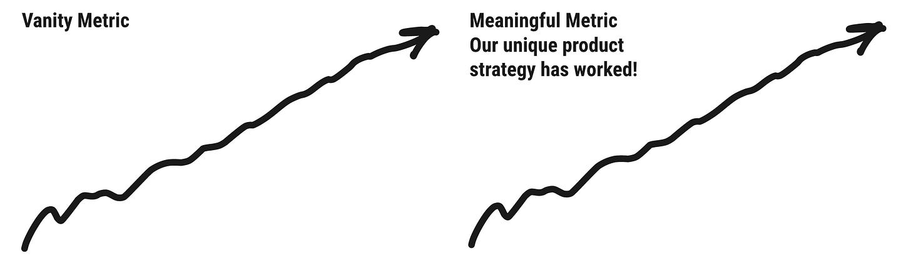

Short post this week. [Doing a webinar tomorrow morning on OKRs and the North Star Framework.](https://info.amplitude.com/growth-series-north-star-202108) It’ll be recorded.

Here's a shortcut I use to help teams zero in on a North Star Metric.

I show an image of two hand-drawn charts. One labeled Vanity Metric. And one labeled Meaningful Metric.

I set the stage: a weekly all-hands meeting. I ask them to imagine a regular presentation involving the chart.

>
>
> OK. You see this chart on the left each week, and your heart sinks. You're not buying it. You have no idea whether this actually means the product strategy is worth it. It looks impressive, but you lose a little of your soul every time you see it. What is the metric?
>
>

The team brainstorms example vanity metrics for their domain (e.g. DAUs, app installs, etc.)

Then I give the following prompts.

>
>
> OK. I don't want you to constrained by HOW we might measure this. Don't worry about that. Rather I want you to image that this next chart is a count of real, living, breathing humans.
>
>
>
> It is increasing steadily up-and-to-the-right, but not with big swings. It has an inspiring name. Something that makes you excited to show up at work. Something that demonstrates the product strategy is working. What is the metric called? The name of the metric...
>
>

At this point I give some examples like:

* Practicing Guitarists

* Learning Users

* Empowered Course Creators

* Storytellers

* Book Club Stalwarts

* Networking Job Seeker

* Fan-Artist Connections

I reiterate that they shouldn't stress about measurement.

Here's what teams often realize. They know their North Star Metric in their heart. They can picture that successful customer. They might even be able to picture some of their behaviors in the product. The activity helps them get over the analysis paralysis on how exactly to measure their North Star, and helps them focus on the Why.

Maybe it is the confidence I’ve gained working at an analytics company, but I find that there’s typically a way to get close enough to get started with measurement.

What would your compelling, human-centric North Star Metric name look like? What do you WISH it could be? Start there…