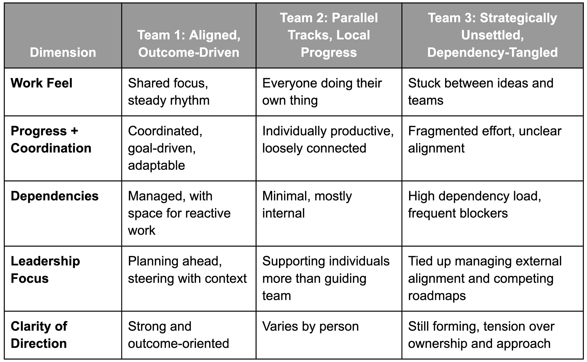

*Some day-job news. We’re finally out of stealth and have a way to set up demos. We’ve (re) launched [the website](https://www.dotwork.com/). I’m really proud of the team, and all the hustle and dedication required to get to this point. I write [things](https://www.dotwork.com/post/thriving-during-the-great-flattening) for work as well, but it is a bit different from TBM.*

---

I was reflecting recently on how stark the differences between teams can be and how often you can pick up on those differences within seconds just by asking someone how things are going. You can feel it. The words they use are different. The way they describe their work tells you almost everything.

Imagine we ask three teams a basic question about how things are going and what's happening. They answer as follows:

*Note: These fictional examples are based on asking this question many times across a range of contexts and companies. Any resemblance to your team or organization is purely coincidental.*

### **Team 1: Aligned, Outcome-Driven**

 ###

>
>
> Right now, we're focused on three main things: improving onboarding conversion, increasing adoption of usage-based pricing, and keeping some space for reactive issues. We're seeing steady progress, and we expect this pattern to carry into Q3, provided there's still headroom in acquisition growth. Based on some early research, we're considering pivoting a bit into activation quality later in the year. And we're assuming there'll be some accumulated UX and technical debt we'll need to tackle then as well. We may bring on one team member in the next few quarters, but only if our team mission expands. Right now, we're feeling the good kind of stretched.
>
>

### **Team 2: Parallel Tracks, Local Progress**

 ###

>
>
> Sam's been working on the new billing portal and refactoring some of the older code. Priya's focused on analytics, which is her big project for the quarter, and she's been updating some internal dashboards as part of that. Jordan is looking into admin performance issues and jumping in on support bugs when they pop up. Some weeks, there are more than others. Maya's been experimenting with ideas for the notification system and is still the only one who understands how our templating service works. Chris has been mostly tied up helping close a major customer and building out a custom reporting view they asked for.   
>   
> We're making progress, but it feels like everyone is pushing their own ball uphill. We check in, but the work doesn't always line up cleanly. If we end up getting assigned the billing systems migration project, we may bring someone on to help tackle that directly.
>
>

### **Team 3: Strategically Unsettled, Dependency-Tangled**

 ###

>
>
> We've got a few things in flight, but a lot depends on other teams right now. Our PM and eng lead have been spending a lot of time chasing down decisions and support, and there are a couple competing ideas about how to proceed—whether we work around the other teams or try to work more closely with them.
>
>
>
> Some team members have started spinning up their own work just to stay productive, while others are still trying to align on what the next big push should be. We've had to present our charter and mission a couple of times over the last few weeks, which has helped clarify some things but also shows we're still trying to get on the same page. There are open questions about ownership of the integration layer.
>
>
>
> And layered on top of that is some tension around the engineering roadmap. Supposedly, it comes directly from the CTO, but it's not always clear how it connects to the product direction—or even whether there's one roadmap or two. With a new Director just joining the group, some promising ideas are starting to emerge, but they're still getting ramped up. It's been hard to get the team moving in one direction. There's a big proposal floating around to launch an orchestration team—so we'll see where that goes.
>
>

How It Feels

----------

Do any of these describe your team at the moment?

If you've been in product development for a while, these "modes" are likely familiar to you. You can almost feel the "flow" of the first team, the "pushing multiple rocks" vibe in the second team, and the murkiness and ambiguity in the third team. I've been on all three of these teams over the years and have even been on teams that felt like all three at different times!

* **Team 1** mode feels exhilarating while it lasts. Yes, you're making hard decisions, but it doesn't feel like you are juggling chainsaws. You're working small but also thinking big. The roadmap is proactive, and people know how things will evolve over the next couple of quarters. It truly feels like a team.

* **Team 2** mode can feel frenetic or oddly boring. It depends. As a PM, you might feel like you have to manage a backlog for every engineer. Maybe you're in startup mode and going broad. Perhaps the team has been around forever, and pockets of specialization have sprung up. It can feel highly productive, but you wonder if it is effective.

* **Team 3** mode feels highly disconcerting, like navigating a fog. Many things feel like they are out of your control despite efforts to do whatever you can. You worry about layoffs and reorgs. You vacillate between marching out to help other teams and then feeling like, "Screw it, let's just take care of our own business for now." There's tons of decision drift. You think you have direction, and it falls apart.

Why This Matters

----------

1. Company culture can very much dictate the mode. Some companies actively incentivize the "each engineer has a project" model based on deep-rooted ideas about productivity, how engineers like to operate, and how performance reviews should happen.

2. If you step back, you might imagine this as a "cycle" of team modes. There are times when we're in a groove, times when we are lost, and times when we've become either too specialized and comfortable, or our teams are more like teams of one-person teams with managers playing traffic cop or coordinator.

3. Consider how Team 1 might figure out overall capacity allocation across its work-streams, which could be healthy. Meanwhile, Team 2 or Team 3 could do something similar and cause actual harm. In other words, team context determines whether or not to try certain things.

4. If you can, avoid getting into Team 3's situation. It happens, but the psychic drag and lack of impact can be a huge demoralizer.

5. I mentioned this several times in the post, but sometimes, you must operate in Team 2 mode. For example, a mid-stage startup might have a lot of breadth to cover and hire experienced people to drive diverse workstreams forward. They are literally optimized for pushing a couple of balls uphill while they get established. At the same time, Team 2 mode could be a symptom of lack of cross-training, a project-focused culture, optimizing for saying yes (vs. actually getting things done), etc. It's the same mode and the same "feel" on the surface, but very different.

Above all, imagine if we could talk about these things without stigma, or immediately jumping to blame individual team members.

---