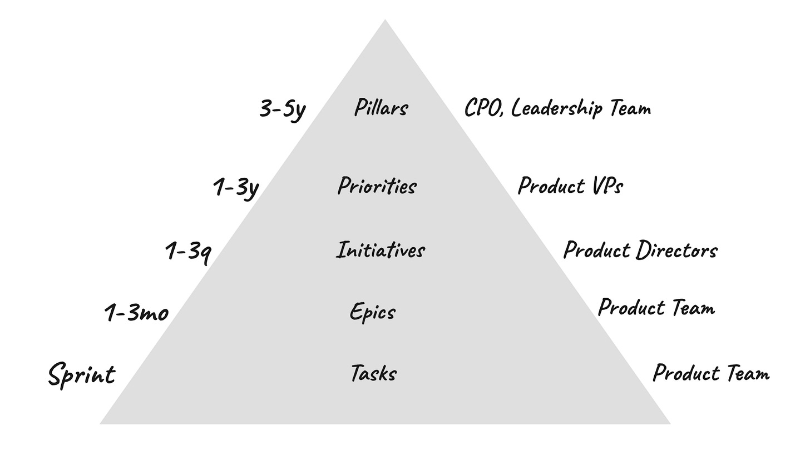
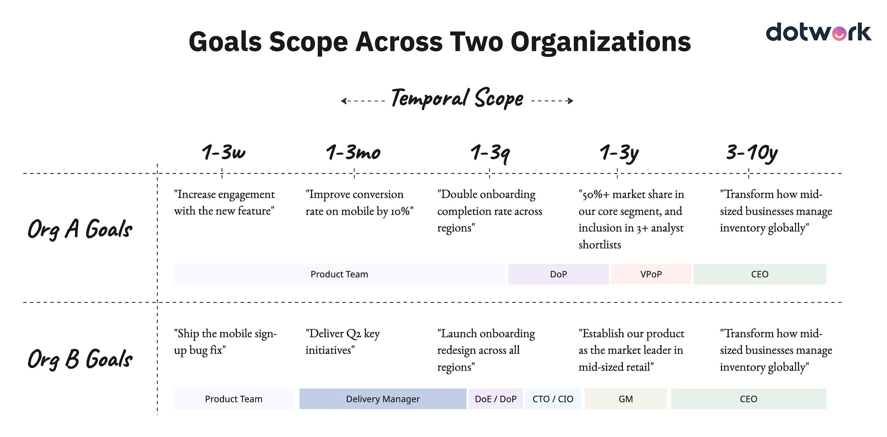
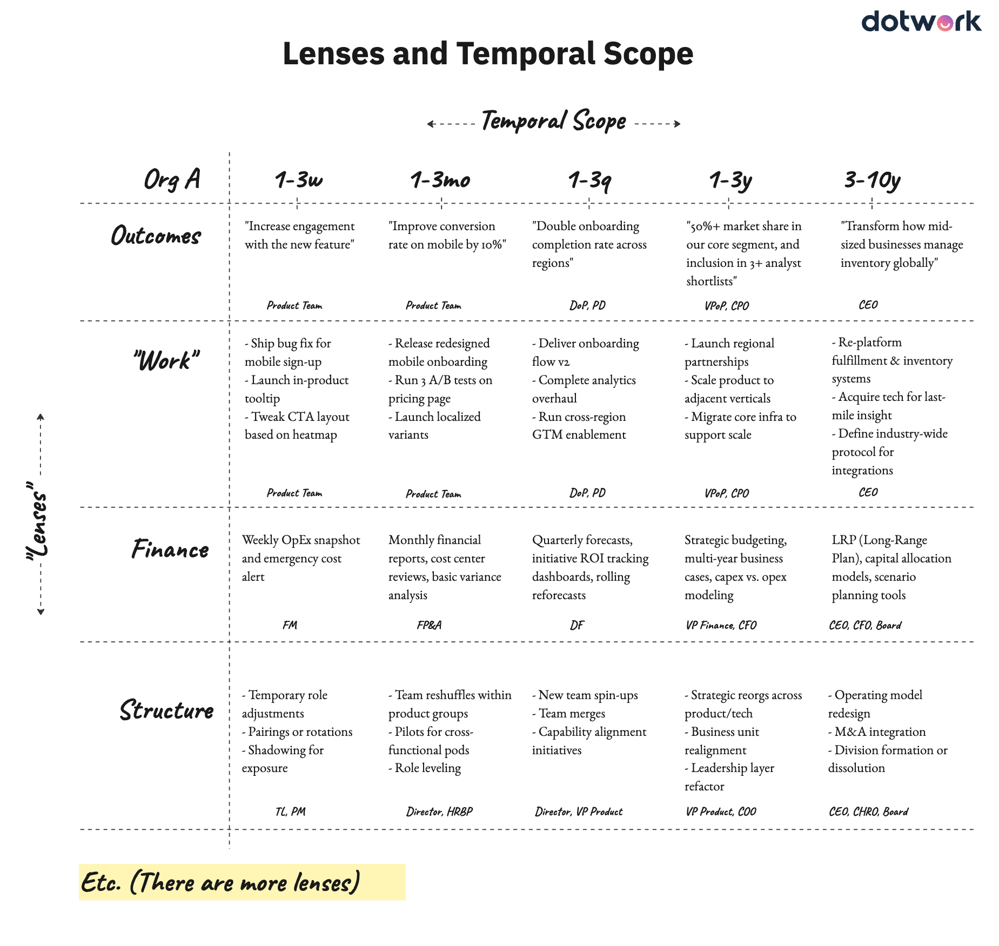
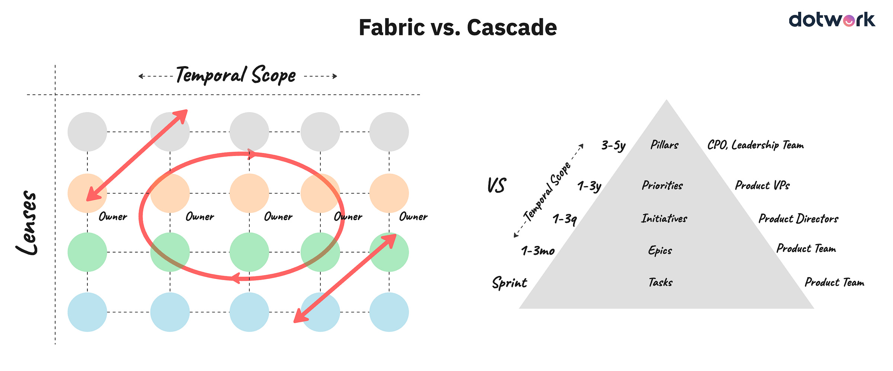
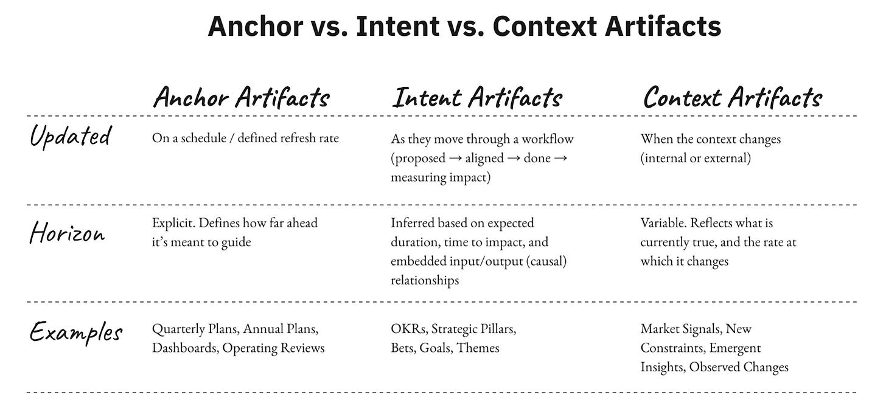
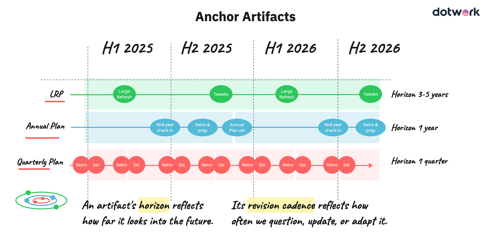
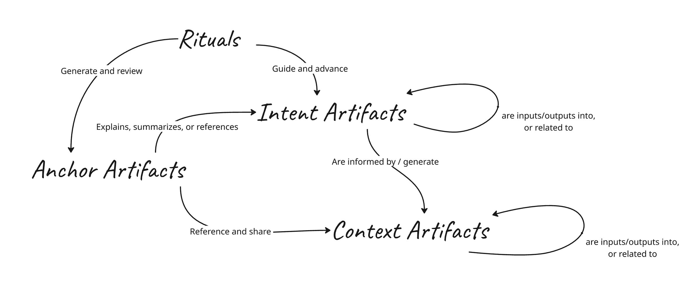

I’m experimenting with Substack’s Video feature. I’m not sure how this will look, appear, or even sound, but giving it a go. Below I include an outline of the video:

Outline

----------

**1. The Familiar Cascade**

----------

* Many organizations use a hierarchical model: Pillars → Priorities → Initiatives → Epics → Tasks

* Timeframes are often assigned at each level (e.g., 3–5 years at the top, sprints at the bottom)

* Roles and ownership are mapped accordingly, from executive leadership down to product teams

* These models persist because they’re intuitive, visual, and create a sense of order

---

**2. Core Limitations of the Pyramid**

----------

* **Assumes one-way flow of information**  
  The model suggests strategy flows down, but in reality, critical insights flow *up* from teams engaging with customers and the market

* **Outcomes are often missing or implied**  
  There’s no explicit representation of impact or results, even though that’s what ultimately matters

* **Ignores time-to-impact variability**  
  Some tasks can generate impact in a week; some initiatives take years. The model fails to show these lags and feedback loops

* **Pushes teams into execution roles**  
  As you move down the pyramid, the framing becomes increasingly prescriptive. Teams are expected to deliver “work” without clear problem framing or strategic ownership

* **Misrepresents the scope and nature of work**  
  High-impact short-term efforts may not “fit” in the hierarchy, creating friction. It also disincentivizes small, iterative wins

---

**3. Temporal Scope and Organizational Culture**

----------

* Comparing two fictional organizations reveals differences:

  * Org A’s goals are outcome-driven across time horizons (e.g., 1–3 month engagement goals, 3–5 year market positioning)

  * Org B’s goals are more output-focused and vague at longer horizons

* Ownership of goals varies by company—some give product teams ownership up to the one-to-three quarter range, others do not

* The same pyramid diagram can reflect entirely different behaviors depending on definitions, ownership, and cultural orientation toward outcomes vs. activity

---

**4. The Need for Multiple Lenses**

----------

* The pyramid presents a single, strategy-to-task lens, but organizations operate with multiple overlapping views:

  * **Outcome lens** – focused on impact and customer results

  * **Work lens** – focused on deliverables and execution

  * **Finance lens** – focused on costs, forecasting, and ROI

  * **Structure lens** – focused on organizational shifts, team structure, and ownership

* Each lens has its own rhythm, scope, and patterns of change

* These lenses intersect in complex ways that a static pyramid cannot represent

---

**5. Real Work Behaves More Like a Fabric Than a Cascade**

----------

* Work, strategy, and feedback move in all directions—not just top-down

* Many artifacts and processes exist at mid-levels of abstraction, not neatly tiered

* A more accurate model is a fabric or network of interconnected items with varying temporal scopes and ownership

* Strategic influence can originate anywhere, and changes at any level can ripple across the system

---

**6. Introducing Artifact Types and Their Cadence**

----------

To support this networked reality, artifacts should be understood in terms of their nature and rhythm:

* **Anchor Artifacts**

  * Have a defined time horizon (e.g., a 12-month roadmap)

  * Refreshed on a set cadence (e.g., quarterly planning cycles)

  * Useful for stability and coordination

* **Intent Artifacts**

  * Represent bets, goals, OKRs, and strategic initiatives

  * Tend to evolve as work progresses and understanding deepens

  * Often nested or linked to other artifacts dynamically

* **Context Artifacts**

  * Reflect shifting knowledge and environmental signals

  * Can be volatile (e.g., customer feedback) or stable (e.g., competitive analysis)

  * Drive updates to other artifact types when significant changes occur

---

#### **7. The Role of Rituals**

 ####

* Artifacts don’t stand alone—they are reinforced and refreshed through team and organizational rituals

* Effective operating systems clarify:

  * Which artifacts exist

  * Who owns them

  * When and how they are updated

  * How they relate to each other across different lenses and timeframes

* Rituals also provide the opportunity to resolve contradictions and adapt to change

---

#### **8. Final Synthesis**

 ####

* The strategy pyramid is a helpful storytelling tool, especially for presentations or executive alignment

* But it is insufficient for designing actual operating models

* Effective models recognize:

  * Multiple lenses (not just one)

  * Temporal and definitional complexity

  * The need for dynamic linkages, not static nesting

  * The interplay of strategy, execution, finance, structure, and learning

* Building an effective system means embracing this complexity and supporting it with the right artifacts and rhythms—not oversimplifying it into a cascade