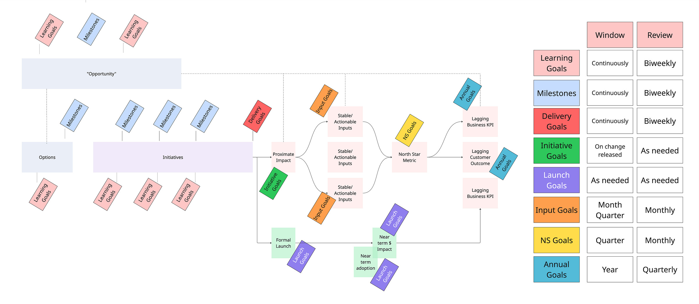

*Before jumping in to this weeks short post, you might enjoy this short 2m video on why companies all seem to operate in unique (but somewhat similar) ways. The image used in the video is [here](https://miro.com/app/board/uXjVJcTmD8I=/?share_link_id=366926344244).*

---

*A very basic post this week.*

Once or twice a week, I run into teams struggling with OKRs. To me, OKRs are goals. And you know what? Goals are hard. Setting good goals and reflecting/pivoting based on your progress is a mix of skill and environment. What seems odd to me is that companies somehow believe that OKRs, alone, will magically *solve* the problem of goal setting.

They help. They make goals legible with a shared format, common language, and rhythm for revisiting what matters. That’s the benefit. But still, goals are hard.

Acronyms abound: SMART, BHAGs, FAST, CLEAR, WOOP, HARD, GROW, PACT. Each stresses a unique goal-setting challenge.

* SMART: specificity and a theoretically “good” goal (Specific, Relevant)

* BHAG: motivation and boldness (Big, Audacious)

* FAST: frequent introspection and transparency (Frequent, Transparent)

* WOOP: balancing aspiration and plans (Wish, Plan)

* HARD: stresses emotion (Heartfelt)

* CLEAR: emotional collaboration and adaptability (Collaborative, Emotional)

* GROW: reality‑grounded options and will (Options, Will)

* PACT: purposeful action and continuous tracking (Purposeful, Trackable)

[

#### TBM 216: Good Goals/Bad Goals ####

](https://cutlefish.substack.com/p/tbm-216-good-goalsbad-goals)

[John Cutler](https://substack.com/profile/5656342-john-cutler)

·

April 24, 2023

[

Read full story

](https://cutlefish.substack.com/p/tbm-216-good-goalsbad-goals)

Given all this abundant help/advice, it is safe to say that good goal-setting is a forever problem. OKRs provide a basic interface to tackle this hard problem. Which leads me to a simple message in this post:

Hard things take practice. Do we expect to get good at something by practicing it once a quarter? In the image below, I explore a bunch of different types of goals. The x-axis here *could* be viewed as time, but linear progression isn’t the message here.

Goal are everywhere! Goals are linked! There really isn’t a hard boundary between one type of goal and another type of goal: they’re all connected.

1. Learning goals help us focus on what we need to learn

2. Milestones are generally useful constructs (e.g., milestones for decisions, milestones for defining an opportunity, etc.)

3. Delivery goals. Hey, without inputs, you have no outputs :)

4. Initiative goals: the proximate impact of an experiment, initiative, etc.

5. Launch-related goals, where we begin tackling commercialization, adoption, and other related objectives.

6. Input goals, which represent increases/decreases in key, stable, actionable inputs

7. North Star goals—where we want the North Star Metric to be by a certain point in time

8. Annual goals around key (but lagging) business KPIs, customer outcomes, etc.

What pains me is that you see teams adopt OKRs and assume these are the only goals you need to set?!

Goals are everywhere. Goals are pure intent. Product work is filled with intent—from the tasks we hope to complete today, all the way through to how we might want to change a vertical or solve extremely complex customer problems. There’s no way you can be good at defining and achieving quarterly OKRs if you have trouble setting goals for the things that happen far more often.

So. Goals take practice.

If quarterly goals are “hard”, work on setting goals more frequently and continuously.