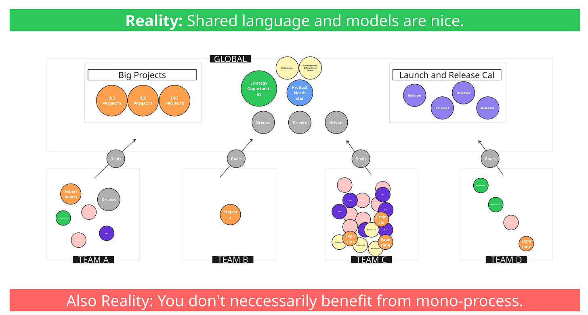

A term I’ve been using a lot with teams lately is “minimally viable consistency,” or MVC.

The general idea, in the context of how I’m using this, is that when you’re designing your company’s operating system, you should strive to have the fewest number of consistent concepts, terms, and phrases possible that still allow you to operate the way you need to.

The important part here is the viability. That’s the “V” in MVC. In some companies, people can’t even agree on a small number of consistent concepts or approaches. In that case, it’s not viable at all. On the other hand, you might have a huge company with lots of dependencies and collaboration needs. In that scenario, the list of viable, consistent things might be quite long. It might even feel uncomfortably long. But that is what viability looks like in that context.

Let’s look at an example.

Imagine you’re a company with diverse teams and groups. You want everyone to have a consistent interface that connects them to the high-level goals of the company. You might decide that OKRs—Objectives and Key Results—become that consistent interface. But you might also feel that OKRs alone don’t capture the strategy of the company. So you introduce another layer, maybe 10 to 15 core strategic pillars.

A brief interlude with a ten second request for help...

*(Help needed. I’m looking to do research/discovery specifically with chiefs of staff and/or product operations leaders, director or above, in companies with \>150 people in design, engineering, and product. I’m happy to split up the session into 50% research, and 50% sharing industry trends and themes, or digging into whatever puzzle you’re facing. [Drop your email here, and I’ll reach out](https://docs.google.com/forms/d/e/1FAIpQLSfkxB7LBKRurOfE3BF0YK5IXMsDqjjuGvq_bZG0ZTx8gUKowg/viewform))*

OK. Back to the post...

Another good example is a launch and release calendar.

Imagine you have teams that operate fairly independently, and you don’t have fully autonomous business units. The marketing team still needs to support everyone. Because this work is customer-facing, you want to communicate with customers in a consistent way. So the company might agree on a common set of terms for launches and releases. You might standardize the way you tier releases, or the language you use around commercialization. That shared structure helps create consistent behavior and language, which makes it easier to keep everyone aligned.

Launch and release is especially interesting because it shows the tension in MVC. Let’s say you come up with a general tiering scheme and describe a handful of release motions. That gives everyone a shared vocabulary. But on the ground, reality might be much more nuanced. Teams may need to work closely together and communicate in more detailed ways. The simple system doesn’t always match reality. In that case, the system might not be viable.

I experienced this myself once. The tiering system represented a market view of complexity. Tiers indicated the size and complexity of the launch. But it didn’t reflect the internal complexity for other teams. They had to invent their own side system to coordinate. That made it harder for them to communicate about their work.

This balancing act shows up everywhere. Take the word “initiatives.” It’s a useful word. But once it gets used for everything—from massive multi-year projects to one-month efforts, from things with complex dependencies to things that are independent, from outcome-oriented work to output-oriented work—it starts to lose meaning. The phrase becomes too overloaded. It stops being useful.

The big point here is that people often look at operating systems from the outside. They see something that appears simple and assume the path is to also make their own operating system simple. That can work if you deliberately force a level of simplicity and push teams to adjust around it. But more often, people overlook the underlying forces at play in a company that make that simplicity possible in the first place.

That brings us back to minimally viable consistency. You need to assess your own context. In some cases you need more consistency. For example, if your company is riddled with dependencies, you may need consistent terms for global priorities or projects. In other cases, you need less. For example, if you’re shifting to a more product-oriented model, you may loosen consistency around concepts like “epics” or other output-oriented terms so teams have more flexibility.

What really matters here is language. It’s easy to have a knee-jerk reaction in either direction. Some people are allergic to complexity and try to oversimplify. Others are allergic to oversimplification and try to keep everything complex. The real task is to ask yourself how your context benefits right now, and how language can support those goals.

As a final step, ask yourself these questions. Where is it critically important for us to have shared language, shared norms, and shared expectations? And where might common language actually be holding us back? Are we pushing people into a kind of double life at work—doing things one way in reality, while also following some official language that doesn’t really help?

And if you identify areas where consistency is truly needed, what is the least risky and highest leverage way to get it? Maybe it’s not about the exact words but about shared norms. Maybe it’s not a process but habit-building. Maybe it’s not writing things up in a wiki but learning through apprenticeship and direct interactions. The point is to choose the right approach for your context. That’s how you create minimally viable consistency in the most effective way.