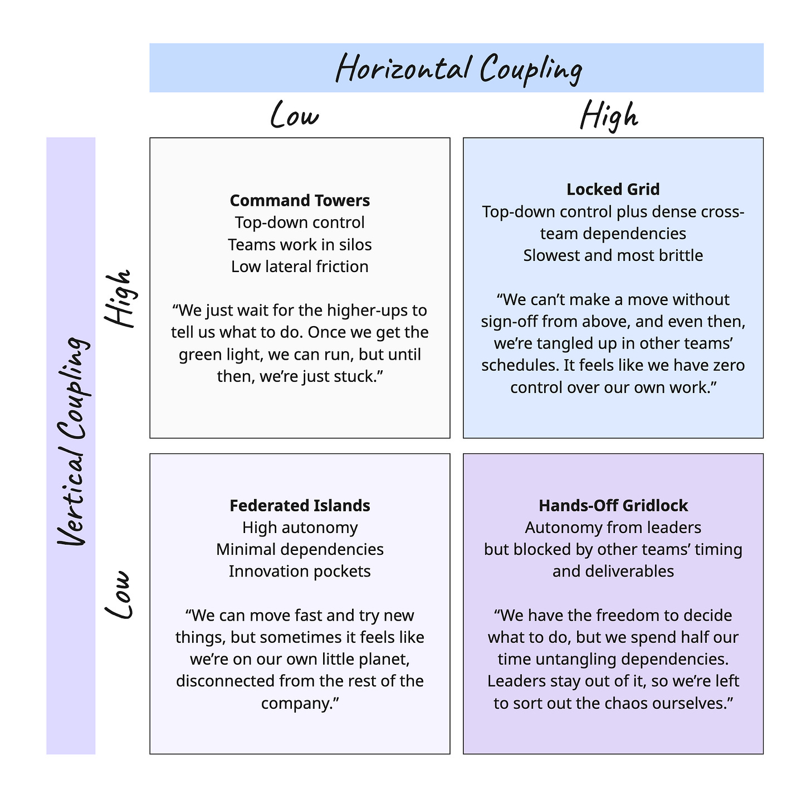

Sharing a 2x2 I’ve found useful lately (and wrong, of course).

A couple of things stand out.

### Perspectives

 ###

Perspectives differ! It can be tempting to fall into the trap of believing that everyone in the company sees the company in the same way. For example, leaders are often insulated from high horizontal coupling. They see their role primarily as finding the sweet spot between low and high vertical coupling (connected enough with the big picture, but able to move fast and innovate). Meanwhile, on the front lines, people are swimming in dependencies. When things get bad, they might even crave some top-down control (“at this point, some command and control would be welcome!”).

### Control vs. Coupling?

 ###

“Control” and “Top-down” are heavy words. But by “coupling,” I am trying to explore how tight the connections are vertically and horizontally. You could have a Command Towers model that was very empowering, in fact. Maybe I’ll revise the diagram to address coupling more directly (and avoid the confusion of the direction of control, e.g., top-down, and the degree of coupling). It might be worth another diagram.

### At What Cost?

 ###

In many ways the real issue isn’t simply low or high coupling, but low or high at what expense. A company might achieve vertical cohesion in a way that feels effortless and cheap, or it might achieve it through heavy-handed control. Similarly, teams might manage dense dependencies through ruthless prioritization and focus, or find themselves constantly gridlocked.

### Movement

 ###

During ZIRP, it was possible to absorb the inefficiencies of low horizontal/low vertical coupling. It was far easier to hire up a new team and give them unspoken permission to work around other teams and go rogue than it was to address horizontal dependencies. As long as things kept going up and to the right (for whatever reason), you were good. Over the last couple of years, we’ve observed the following cycle:

1. Start with Federated Islands

2. The org starts drifting into Hands-Off Gridlock as dependencies increase. Leaders are mostly distanced from the gridlock (they believe they’re still operating as Federated Islands)

3. Repeat efforts to solve the issue in the Locked Grid as tension/pressures rise.

4. Eventually, there are efforts to remove dependencies, and we see a shift to the upper left (Command Towers)

5. Gradually, during the next up and to the right macro cycle, there’s a drift down to Federated Islands.

### Not Monolithic

 ###

An organization is not monolithic, and rarely static. You might observe some parts of the organization operating one way (e.g., strong top-down control to manage dense cross-team dependencies). At the same time, they insist on launching speedboat efforts through Federated Islands and an innovation or “New Ventures” program. Two very different motions.

This goes on for some time until the chaos of the innovation program starts bubbling over and drifting into Hands-Off Gridlock. Similarly, you might see Sales work in a Command Towers model with very distinct regions and segments, while product development oscillates between Federated Islands and Hands-Off Gridlock. This works until there is a swing back from multi-product to something more coherent (with less overhead due to redundant functions).

### Cohesion?

 ###

Cohesion is sitting in the background here too. Think of the classic trade-offs:

1. High cohesion + low coupling → focused teams with clean boundaries.

2. High cohesion + high coupling → strong units, but tightly interdependent.

3. Low cohesion + low coupling → loose, fragmented efforts that may lack direction.

4. Low cohesion + high coupling → brittle systems where messy teams are locked together.

### No Box Is Universally Bad

 ###

I tried to make it so that no box seemed universally bad. You could argue that Locked Grid is universally bad. Still, if you imagine a company adding high vertical coupling to get itself OUT of the upper right, then you could picture a scenario where a team is just “passing through” any of these boxes. It is about inertia and direction. You might need high vertical coupling to withstand high horizontal coupling.

### Enterprise vs. Startup

 ###

A lot of enterprises are stuck with their high-level horizontal coupling. But it should be noted that startups often struggle with too little horizontal coupling. It hurts the customer experience. It is costly and inefficient. It makes it hard to do ambitious things. So while it might seem that the high horizontal coupling boxes are universally bad, it is probably best to imagine it as a spectrum and range. Similarly, too little vertical coupling, and you’re liable to have challenges with org-wide focus.

That’s it for this week!

PS: Want to see [a neat Miro board](https://miro.com/app/board/uXjVJHQgC2E=/?share_link_id=36961224157)?