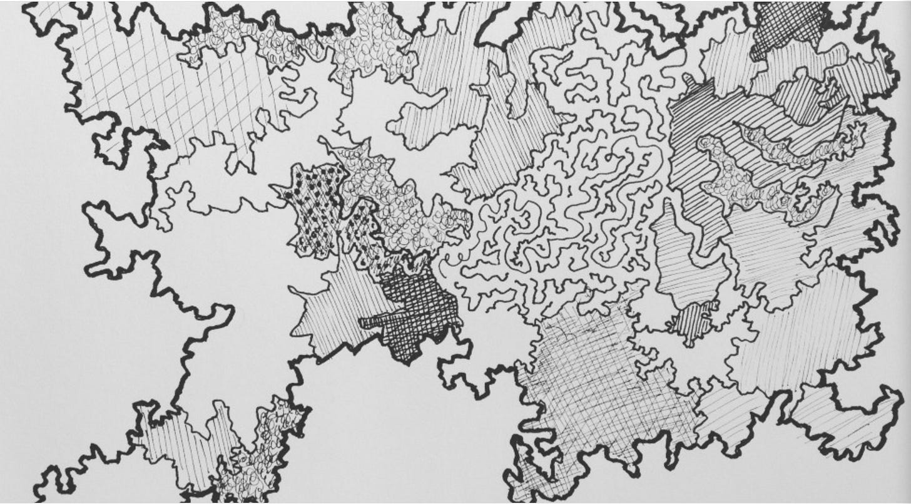

#### Background

 ####

*I met recently with a product leader friend. For heavy conversations I prepare notes. His team (\~400 in product/engineering/design) is experiencing a lot of growth, but as with many companies in 2022 there are a lot of moving parts. I present this with a specific set of “to dos”, but nothing here is easy. Sharing here in case people find this helpful.*

#### Onwards…

 ####

What do I think is going on?

The **strategic thinkers** in your company (VPs and below) are wondering if there is a corporate strategy. They see plans and priorities and know that isn’t a strategy.

1. Some are trying to fill what they see as the void

2. Some are checking out (going through the motions)

3. Some are in blame mode…blaming leaders, each other

4. Some are leaving

The **get-it-done thinkers** (at all levels) are thinking “leadership just keeps changing priorities”. They sense something is off. They see plans and priorities and think “great, now we have alignment!” But anyone who has been there for a while is skeptical.

1. Some of them are trying to fill a void in terms of planning

2. Some are checking out (going through the motions)

3. Some are in blame mode…blaming leaders, each other

4. Some are leaving

Meanwhile **you** are feeling the pressure for the perfect strategy, and the perfect plan. You feel the pressure from the get-it-done thinkers for a plan. You feel the pressure from the strategic thinkers for a strategy. You’re also fighting fires while the X.4s leave, and the X.3s blame, and people are wondering why the X.2s have no sense of urgency. This is NOT EASY.

1. You don’t have time to think strategically

2. You don’t want to just “cook up” a strategy, or plans

3. You’re spending time on fires

So what should **you** do?

First is acknowledge that the **strategic thinkers** and **get-it-done thinkers** have similar/different needs

1. Both want coherence, but different types of coherence

2. The **strategic thinkers** want a sense of (and contribute to) the current thinking

3. The **get-it-done thinkers** want a sense of the stable problems they can solve

Then **acknowledge that the big problem** is…

1. Degrading trust levels

2. Degrading psychological safety levels

3. Good people leaving

These problems are **far more dangerous** than you think. The “fog” means you can’t tell what is happening exactly. You can’t trust your gut.

You have three priorities

1. **Address the trust issues right away**

   1. Less blame game

   2. Relieve people of filling the void

   3. Check in with people

   4. Show not tell: be vulnerable, be transparent

2. **Set aside / prioritize time for a “good enough”...**

   1. Strategy (even if there’s a lot to learn)

   2. Some fairly stable problems to solve

3. **Deploying those things and creating cadence and predictability**

Good luck. Also…

I’m very excited to be [chatting strategy](https://info.amplitude.com/strategy-deep-dive?utm_source=cutlestack) with Ibrahim Bashir (VP of Product at Amplitude) who writes one of my favorite Substacks [Run the Business](https://runthebusiness.substack.com/). We’ll touch on some of the topics above. Thursday, September 8. Will be recorded.

[Chat Strategy with Ibrahim and John](https://info.amplitude.com/strategy-deep-dive?utm_source=cutlestack)

---