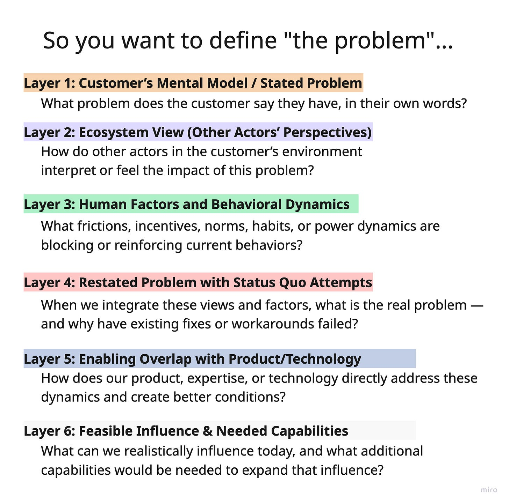

I created this graphic a couple weeks ago. It took me a couple minutes, and I didn’t think much of it. I’m not even really sure the ideas hold up. But it seemed to resonate.

A paid subscriber reached out for a deeper dive, I started replying, and ended up with this post.

In product, we’re told to “define the problem.” I’ve always felt that this is hubris, at least with anything beyond fairly contained situations. “Go talk to customers, and figure out what the problem is!” Their problem? My problem with their problem? A problem we can help with? What they say their goal is?

Ultimately, as product builders or interveners, we may choose to take a shot at “solving the problem” with the tools at our disposal. So I guess my intent with this graphic is to get people thinking at multiple levels.

This is not a root cause model. The layers are not steps toward a single, correct explanation. They are ways of seeing the situation from different angles, adding context and constraints. The goal here is not to fully explain the situation, but to act more thoughtfully within it. There is no privileged “problem definition” moment.

What problem does the customer say they have, in their own words?

----------

**Layer 1** is all about the customer describing their problem in their own words. It is their mental model of the problem. This is their story, not ours, no matter how strange it might sound, or how strongly we might feel they are wrong or missing the point. Even if the framing is misguided, it is still the belief system and narrative currently organizing their understanding of the situation. If anything is going to change, it is this story and its explanatory power that will ultimately need to be replaced by something more compelling.

Humans are notoriously poor arbiters of what is actually going on. Even describing how we “actually feel” can be difficult, because we are also very good at shutting things out and shaping self-affirming or self-protecting narratives.   

But at this stage, we have to take off the judgment hat, the problem-solver hat, and especially the synthesis hat. We are listening for problems, unmet needs, aspirations, and forecasts of future states as they are experienced, not as we wish they were articulated.

*See also: Appreciative Inquiry, Narrative Inquiry, Ethnographic Interviewing, Contextual Inquiry, Non-directive Interviewing*

How do other actors in the customer’s environment interpret or feel the impact of this problem?

----------

Layer 2 is about gathering Layer 1, but from different perspectives. Here we explicitly acknowledge that how one person sees or feels the problem is just one take on the situation. People often inflict their framing of the problem onto others, intentionally or not.

With the ecosystem view, we cast a wide net to other actors involved in the situation. The Heisenberg effect is real, so we also look inward at our own perceptions, how they shape what we notice, how we interpret it, and how our presence influences the situation itself. Consultants know this all too well. There is no such thing as an unbiased consultant, no matter how neutral they aim to appear.

The on-location maintenance worker will experience “poor requirements” very differently from the dispatcher. The dispatcher will experience it differently from the tenant with a clogged toilet. We also need to watch for false consensus. What sounds like alignment or a pattern may actually be inertia or social gravity, a byproduct of the questions we are asking, rather than a cluster that existed before we started poking around.

*See also: Stakeholder Mapping, Service Blueprinting, Actor-Network Theory, Multi-perspective Analysis, False Consensus Bias, Second-order Effects*

What frictions, incentives, norms, habits, or power dynamics are blocking or reinforcing current behaviors?

----------

Layer 3 shifts focus to the environment and the forces acting on people within it. We intentionally look at the system through multiple lenses, including human factors, behavioral psychology, learning design, social practice theory, anthropology, power, and politics. The aim is not to find a single cause, but to understand how the system shapes what feels normal, risky, effortful, possible, etc.  

What structural, social, cognitive, or political pressures are shaping behavior?

Through a human factors lens, we examine how tools, processes, and expectations interact with human limits, including cognitive load, attentional scarcity, memory constraints, error tolerance, fatigue, time pressure, and task switching costs.

Through learning design, we consider whether people are being set up to acquire the skills and mental models the work actually requires, or whether learning is assumed rather than supported.

Through behavioral lenses, we look at capability, opportunity, and motivation, and how incentives or fear influence action.

Through social practice theory and anthropology, we examine routines, norms, shared meanings, artifacts, language, and informal power structures that signal what really matters.

Each lens reveals something different about how the system operates. None of them are sufficient on their own. But together they deepen our understanding.

*See also: Human Factors Engineering, Behavioral Economics, COM-B Model, Social Practice Theory, Cognitive Load Theory, Organizational Anthropology*

When we integrate these views and factors, what is the “real problem” — and why have existing fixes or workarounds failed?

----------

(Note, in the original I wrote *real problem* without the air-quotes.)

Layer 4 is where we start integrating. We take the actors from Layers 1 and 2 and the forces identified in Layer 3, and we add history. What has already been tried? What workarounds exist? What has failed, partially worked, or succeeded to much fanfare?!

We begin restating the problem through this richer lens, knowing full well that we are now converging and imposing a perspective, whether it turns out to be right or wrong. To counterbalance this, it helps to treat the actors not just as problem-holders, but as problem-solvers with a track record.

In Garbage Can Theory terms, some people are solution-holders searching for a problem to attach to. That history matters. We need to respect the people in the room as capable and treat their prior attempts as data, not obstacles.

Questions like the following ground our reframing in lived effort, not abstract critique.

* What have you tried?

* What moved things forward?

* What made things better or worse?

* Who actually cares enough to try to fix this?

How does our product, expertise, or technology directly address these dynamics and create better conditions?

----------

Layer 5 is where, finally, we consider our product, expertise, or technology, and how it might influence the situation. Not how it will. Not how it should. But how it could, in theory, intersect with the dynamics we now understand.

If, in COM-B terms, the issue is one of opportunity, can we reduce friction or create new pathways? If it is capability, can we scaffold learning or decision-making? If it is motivation, can we alter incentives, visibility, or feedback loops? This is hypothesis-building, not pitching.

*See also: Sociotechnical Systems Design, Opportunity Mapping, Intervention Design, Choice Architecture, Enabling Constraints, Hypothesis-driven Development, Affordances*

What can we realistically influence today, and what additional capabilities would be needed to expand that influence?

----------

Layer 6 brings us back to reality, informed by everything we have learned so far. Our understanding of what is possible is shaped by the stories we heard in Layer 1, the perspectives surfaced in Layer 2, the system forces examined in Layer 3, and the history uncovered in Layer 4. This is where we move from understanding to action. What can we realistically influence today? What levers are actually within reach?

Here we form concrete, feasible actions for how we might intervene in the situation. We ask what we can try, not in theory, but in practice. What capabilities would we need to borrow, buy, or build to support those interventions? These choices cannot be made in isolation. They must cohere with prior efforts, align with the incentives and constraints already at play, fit the needs and beliefs of the actors involved, and still connect back to the problem as it was originally described in Layer 1, even if that description now feels distant from where we believe the strongest leverage exists.

*See also: Theory of Change, Capability Mapping, Minimum Viable Intervention, Leverage Points, Portfolio Thinking, Option Framing, Incremental Change*