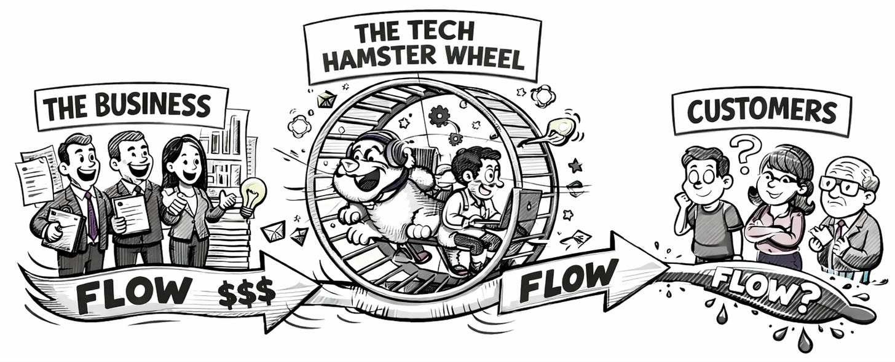

*Before I jump in, I wanted to say thank you for encouraging me to keep writing. I published my first post on Medium just over a decade ago. TBM has been going since January 2020. Because of the writing, I’ve had the opportunity to interact with so many interesting people around the world. Hopefully, the writing continues to be helpful in some way.*

---

I was in a discussion recently about Strategic Portfolio Management (SPM), and I asked what turned out to be a surprisingly uncomfortable question: if the people responsible for strategic portfolio management cannot design the organization, shape the strategy itself, or make actual prioritization decisions, what are they actually managing?

Why aren’t leaders managing the portfolio?

Does this just reinforce the business/tech divide?

The response made sense:

“So I don’t see SPM as ‘managing the portfolio’ in the financial sense. It’s more like maintaining the map: clarifying where resources are going, where bets are accumulating, and where the system is overcommitted, and then creating the conditions for leadership to intervene if they choose to.”

But the question stuck with me.

It sent me down a path of reexamining how we talk about portfolio management in software product organizations, and whether the metaphors and assumptions we rely on still hold. Portfolio management language carries a set of hidden assumptions. It assumes assets can be compared, traded, rebalanced, and adjusted without fundamentally changing the system that holds them. In finance, this is often true. In software and technology, it rarely is.

To understand why Strategic Portfolio Management so often feels awkward or incomplete in technology organizations, we need to start with two basic concepts from finance: liquidity and fungibility.

### **Liquidity and Fungibility**

 ###

For portfolios of assets, we use the terms *liquidity* and fungibility to describe how easily assets can be converted into cash without materially affecting their price, and how easily investments can be exchanged for one another or rebalanced across the portfolio.

* Liquidity = ease of converting to cash

* Fungibility = ease of substituting or reallocating value across assets

Liquidity and fungibility exist on a spectrum, not as binary properties. Consider the range between large-cap equities and vineyards.

* Publicly traded large-cap equities (e.g., S&P 500 stocks) are highly liquid and highly fungible, unless your employer, your lawyer, or the SEC has other ideas this quarter.

* Real estate is less liquid and fungible, but you can still sell a unit, change tenants, refinance, or hand the keys to a property manager without redesigning the asset.

* A consumer goods brand portfolio sits somewhere in the middle of the liquidity–fungibility spectrum. After launch, brands and SKUs can be scaled up or down, divested, licensed, reformulated, or sunset. Capital and attention can be reallocated with meaningful (but not instantaneous) effects. Brands aren’t fungible, but they are modular enough to rebalance over time.

* With a vineyard, any rebalancing of the vineyard portfolio involves multi-year, largely irreversible changes to the land, vines, labor model, and production cycle.

These concepts—liquidity and fungibility—will come in handy as we try to wrap our heads around strategic portfolio management in software and technology.

### **Two Strands**

 ###

There are really two historical strands feeding into what we now call Strategic Portfolio Management, and each makes specific assumptions about liquidity and fungibility.

**First, there is the strand that emerged from centralized IT**.

In this model, a single IT organization served demand from across the enterprise, built systems on behalf of the business, and then ran those systems over long horizons. Portfolio management here focused on intake, prioritization, funding, sequencing, and load management within *a shared, constrained delivery function*.

*Assumptions: Systems are bought, configured, run for long periods, and replaceable. Improvements are capitalizable, while “running” the system is treated as an operating expense. IT labor is largely fungible and can be reassigned across initiatives.*

**Second, there is the strand that emerged from manufacturing and consumer goods**.

Here, portfolio thinking was applied to brands, products, and SKUs: deciding what to launch, scale, sustain, reformulate, or retire. These portfolios assumed *partially* modular assets, recognizable lifecycle stages, and the ability to reallocate capital and attention over time without fundamentally redesigning the organization.

*Assumptions: Products and brands are modular assets with lifecycles. Investment can be reallocated over time through capital, capacity, and marketing decisions*.

The trouble starts when these assumptions are applied wholesale to software-centric, team-centric, and platform-based organizations, where rebalancing is far more path-dependent than either lineage anticipated.

### **Lean Portfolio Management**

 ###

Imagine you are a self-respecting lean aficionado who observes the mess caused by the centralized IT model. “This is madness!” The system is overloaded. Things take years to reach customers. You have dependencies everywhere. There’s no rhyme or reason for how people are organized. The business is frustrated as hell and considering outsourcing everything. There’s no FLOW. The company just lobs projects over the wall, and the poor teams are swamped.

What do you do?

* You make the work visible.

* You limit WIP so things can actually finish.

* You stabilize teams instead of constantly reshuffling people.

* You organize around value rather than around functions.

* You try to shorten feedback loops.

**You restore flow.** But flow alone is not a strategy.

OK! So what do you do next? Time to get *strategic*.

Instead of thinking about projects, initiatives, or programs, you start linking them to company strategy. You frame decisions on where that flow goes, to strategic decisions and investments.

If project managers manage the delivery of discrete pieces of work, program managers manage the coordination of related work and dependencies, and project/program portfolio managers manage the selection and sequencing of initiatives, then, by extension, strategic portfolio management involves deciding which strategic investments are allowed to consume the organization’s limited *flow*.

But note that this is still based on some underlying assumptions:

1. Flow can be deliberately redirected without fundamentally reshaping teams, systems, or architecture.

2. Strategic investments are substitutable, so increasing one and decreasing another is a meaningful move.

3. Capacity is universally reclaimable, and stopping work reliably frees it for reuse elsewhere.

4. Rebalancing is reversible, rather than locking in long-lived consequences.

5. Strategy can be expressed primarily through allocation, not through organizational and product design.

Lean Portfolio Management clearly starts down the path of acknowledging low fungibility and limited liquidity. By stabilizing teams, funding long-lived value streams, limiting WIP, and bringing work to teams instead of moving people to work, it implicitly rejects the idea that labor and teams are easily interchangeable.

In that sense, it makes a real break from the centralized IT model.

Where it stops short is in what it still treats as liquid. Rather than assuming people can be reshuffled, it assumes that flow can be redirected. Strategic change is framed as reallocating capacity, funding, or initiative mix within stable structures. LPM moves fungibility out of people and into flow, but flow itself is far less liquid than the portfolio metaphor suggests.

### **“Product” Portfolios**

 ###

In technology product-centric organizations, you don’t hear about “portfolios” as much, even when there are lots of products or lots of product areas, product groups, and product teams. Why?

In technology product-centric organizations, products quickly become entangled with teams, architecture, data, operations, and customer workflows. The product is a long-lived socio-technical system. Shifting investment is slow and risky, and stopping a product rarely frees capacity in a clean, reversible way.

This doesn’t mean, of course, that finance and executives in software and technology companies aren’t making portfolio-level decisions. They absolutely are. They invest more in some product areas, put others on ice, stop funding certain bets, start new ones, and sometimes reorganize to align teams with strategy better.

The difference is where that work lives.

In product-centric software companies, these decisions are not handled by a separate “tech” PMO or portfolio function acting as a buffer between the business and “delivery.” They are part and parcel of product leadership itself, and they sit directly with the executive team. The people deciding strategy are also accountable for how teams, products, and systems evolve. In other words, there is no clean separation between “the business” and “technology.” The portfolio is not something managed between the two. It is the business.

Strategic investment decisions exist, but they are embedded in product leadership and organizational design rather than abstracted into a standalone portfolio layer. Portfolio metaphors imply a level of liquidity and fungibility that simply isn’t there. What looks like portfolio management is, in reality, continuous product stewardship and executive judgment about where to place and sustain long-term bets.

The job of leaders IS implicitly portfolio management.

*Note: This isn’t to suggest that so-called “mature” technology product-centric organizations are somehow immune to dysfunction. They aren’t. Underinvestment in platforms is common, everything gets labeled a “product” even when it clearly isn’t, critical work gets starved while flashier bets are overfunded, and the result can be a real mess. The point isn’t that these organizations have figured it all out, but that where the decisions are made is different. In “mature” product-centric software companies, portfolio-level decisions sit with product leadership and the executive team, alongside responsibility for organizational design, hiring, and long-term technical stewardship. Strategy, structure, and execution evolve together, for better or worse.*

### **Strategic Portfolio Management**

 ###

This brings us to the central idea.

Classic technology PMO and Strategic Portfolio Management functions are primarily concerned with understanding the corporate strategy, and deciding and reporting on how focus and capacity are allocated against it. Their job is to interpret strategic intent, translate it into investment themes or initiatives, and manage the distribution of the limited flow.

But when Strategic Portfolio Management stops being a buffer function within technology and instead becomes an explicit responsibility of leadership, its shape fundamentally changes. The primary levers are no longer just prioritization and allocation. They become organizational design, budgeting horizons, hiring and succession, team topology, and, when necessary, re-orgs. Portfolio decisions shift from routing work through a system to reshaping the system itself.

At that point, strategy, organization, and execution are inseparable, and portfolio management is no longer about aligning to strategy, but about actively co-creating it through structural choices.

**Questions To Consider**

----------

* What is the true unit of allocation in our organization: projects, flow, teams, or long-lived systems?

* When we “stop” an initiative, what actually gets freed up, and what remains permanently entangled?

* How reversible are our strategic decisions in practice, not in theory?

* Where do we still assume fungibility that does not actually exist, whether in people, teams, platforms, or domains?

* Are our portfolio decisions primarily about reallocating work, or about reshaping the organization that does the work?

* Who truly owns portfolio decisions today: a PMO, a technology function, or the executive team, and what levers do they actually control?

* How often does changing strategic direction require organizational redesign rather than reprioritization?

* What parts of our “portfolio” are effectively vineyards, even if we talk about them like stocks?

* Where does portfolio management end and leadership responsibility begin, and are we clear about that boundary?

* If portfolio management disappeared tomorrow, would strategy execution collapse, or would it simply move back to where it arguably belongs?