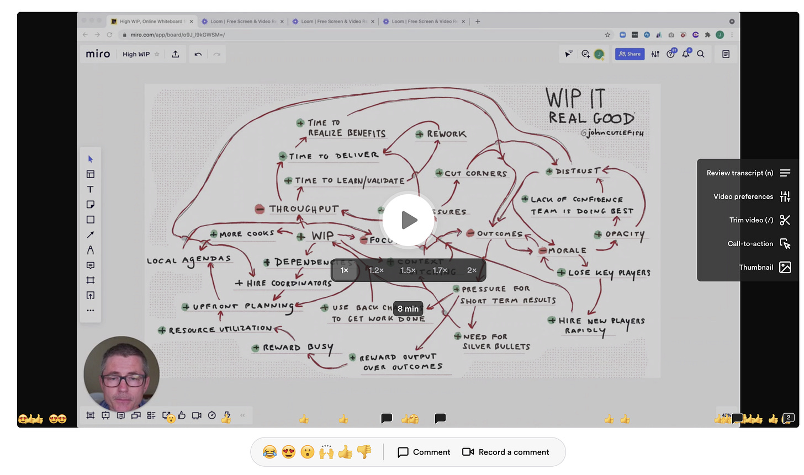

*(Twitter is great. This week I had some great back and forths with Jacob Singh about normalizing being idle. He cranked out a wonderful post that you should check out called [The Case for Slacking Off at Work](https://jacobsingh.name/the-case-for-slacking-off-at-work/). I took a different approach.)*

Ask an executive “do you think we should optimize for keeping people *busy*?”

There’s a good chance that you’ll hear something like:

>
>
> We shouldn't try to keep people busy. We should optimize for doing the highest leverage work possible!
>
>

OK. Do high leverage work. Sounds reasonable.

Now propose that to do the highest leverage work possible, it’ll be necessary for team members to work on small tasks for a bit. You want to start a solid mission and engage everyone in discovery and prioritizing bets. Small tasks will let that happen.

Exec:

>
>
> I’m confused! Why would we do that? Shouldn’t the designers and product managers be making sure that doesn’t happen? Why would we have people just hang out? Our engineers are highly paid!
>
>

For some reason, it is not computing with the exec. They leave the Zoom call in a hurry.

A couple days later, they Slack you:

>
>
> I chatted with the engineering manager for that team, and this will NOT work. No one wants to hang out. People want to do important work. I have to respect their decision.
>
>

You’re curious. First, you talk to a engineer who trusts you:

>
>
> To be honest, performance reviews are coming up. I need a win here. Last quarter was a wash for me because Infra blocked us. They got slammed. I get what you are trying to do, and I see why it will be better for outcomes, but I’m under a lot of pressure. And so is my boss! She needs to prove she can get the team delivering. I want to support her.
>
>

You talk to another engineer:

>
>
> It makes sense, but we’ve each kind of got our own specialties, right? It is easier to do our own projects. And because of that, does it make sense to ask people to hang out? Who would decide what to work on? Finally, last quarter I got stuck juggling all of those P0s. And trying to help with annual planning. And also being on the hiring committee for Harriet’s new data ops hire. So...
>
>

You talk to the engineering manager. You have a good relationship, and feel guilty about asking engineers behind her back. She explains:

>
>
> It would be a lot easier if you and I crafted a couple projects that Abe, Sharon, Tania, and Xin could work on individually. I know what you’re trying to do. I like working like you're suggesting. But, the team isn’t there yet. Plus, it would feel weird just working on *anything*...
>
>

You’re discouraged. It is all making sense. You ask your trusty design partner:

>
>
> I’m swamped. I get what you are trying to do but I’m juggling three teams at the moment, plus working on the global redesign. This would be a lot easier if I crank out the mocks for a couple projects and get Abe, Sharon, Tania, and Xin going. When we hire our dedicated UX researcher, and you have more time -- lord knows you have so many meetings -- then maybe we can try starting together. Which reminds me, I have resume to review.
>
>

Your head is spinning in circles now. Is everyone conspiring against you? But you’re busy. And have to head off to get your 2022 roadmap “blessed”, so you can secure the help of an understaffed shared platform team (there’s a rush on their bandwidth).

This dynamic is very common. No one is conspiring against you, but there are a lot of factors conspiring against you. Before reading on, try to identify some of the issues.

I wrote the story with the following factors in mind:

1. Most people want to stay busy! And they want to stay busy on “important work” (or, at a minimum, challenging and interesting work)

2. Most companies want engineers to stay busy. And they want them to stay busy on “important work”. They also want to keep their prized engineers (who want interesting work, new technologies, new problems, etc.)

3. Incentives: promotions hinge on finishing high profile projects. Granting promotions hinges on individuals working in isolation. The manager's promotion (at the moment) hinges on “proving she can get the people on the team delivering.”

4. Working together is hard. Collaboration is harder

5. A desire to “catch up” after being blocked in the past. High WIP breeds high WIP

6. Specialization. It is easier to work in familiar parts of the codebase. We often feel more confident and valued when we specialize

7. Understaffed designer. It is legitimately “easier” to crank out mocks

8. Tetris playing because there’s a “rush on the platform team’s bandwidth”. The need to load up these teams triggers premature convergence

9. A desire for efficiency, certainty, and clear spheres of control

10. A desire on the part of the manager to tailor projects to team member strengths

It can be extremely difficult to advocate for lowering utilization rates, lowering WIP, normalizing being idle, and starting together. Even if the idea conceptually/intuitively makes sense (which is a stretch in unto itself).

Why?

The system isn’t optimized for any of it. In fact, if you tried to implement work in progress limits or starting together (for example), the system would reject the change immediately. Each of the factors contributing to lower efficacy is small. Seemingly intuitive. Empathetic and caring even. And probably feels pragmatic and “working within your current constraints”. But multiplied, it leads to something which is LESS effective.

So what can you do about it?

**The first step is acceptance.** This is what you are dealing with. You aren’t dealing with a math problem. This isn’t about teaching queuing theory. You are dealing with a complex problem. I’ve learned this the hard way. People will nod like crazy when they hear about the ills of high WIP or running individual projects...and go right back to it.

**You need to figure out how to nudge the fundamental forces in the system.** Somehow. Which is hard. Because with complex problems you can’t tweak some knobs or do “normal” change management. Formal leader proclamations are no better.

A good experiment to try would be to take Jacob’s suggestion about trying a slack/idle queue. And then try to get strong executive support for normalizing that. Make it OK. Incentivize it. Find influential developers who are bought in. And get their help. Show don’t tell. More on this further down in the post.

A promising experiment to get buy-in for reducing WIP is to visualize (all) work in progress -- and I mean work in the broadest sense. Visualize everything people are thinking about. From that original pitch or one-pager, through repeated experiments, to it providing value in the customer’s hands. Development is typically a very small part of the journey. SEEING that can cause things to click.

These may or may not work. There’s a lot of inertia in these systems.

For these types of shifts, I always refer to Donella Meadows [Places to Intervene in a System. ](https://donellameadows.org/archives/leverage-points-places-to-intervene-in-a-system/) Meadows lists 9 places to intervene in a system, in ascending order of leverage/efficacy.

9. Numbers (subsidies, taxes, standards).

8. Material stocks and flows.

7. Regulating negative feedback loops.

6. Driving positive feedback loops.

5. Information flows.

4. The rules of the system (incentives, punishment, constraints).

3. The power of self-organization.

2. The goals of the system.

1. The mindset or paradigm out of which the goals, rules, feedback structure arise.

Meadows is very quick to point that that this isn’t a recipe or silver bullet.

>
>
> First I want to place the list in a context of humility. What bubbled up in me that day was distilled from decades of rigorous analysis of many different kinds of systems done by many smart people. But complex systems are, well, complex. It's dangerous to generalize about them. What you are about to read is not a recipe for finding leverage points. Rather it's an invitation to think more broadly about system change. That's why leverage points are not intuitive.
>
>

For this type of change, we *might* be able to get there with #5-#7. Some companies are able to make progress with WIP limits, improving information flows, and amplifying the good. I have observed people starting with a lot of skepticism about X working (e.g. starting together) but trying it a couple times, seeing the good, and doubling down. But it will likely take something in the 1-4 range for a breakthrough in an entrenched system.

In chatting with Jacob about this piece he made an interesting point:

>
>
> TBH, I don't think a slack queue is a solution at all. It's a trojan horse to get people to start fewer projects, be really explicit about strategy and prioritization and feel okay about it.
>
>

Amazing point! This is an experiment that starts to **strike at the goals of the system and constraints.**

Back to the top of the post. There seems to be agreement about the goal…

“Absolutely not! We should optimize for doing the highest leverage work possible!”

So I’ll leave with a question: What’s your next step? What’s a good trojan horse experiment? How might you nudge this situation forward?

---

This video might be a good companion. I’ve actually seen this “work” in terms of persuading people to try new ways of working.

Alternatively, [this video](https://www.loom.com/share/5efceb288b634a449041918bdba08202?sharedAppSource=personal_library) is helpful for explaining some of the myriad issues with high WIP.

