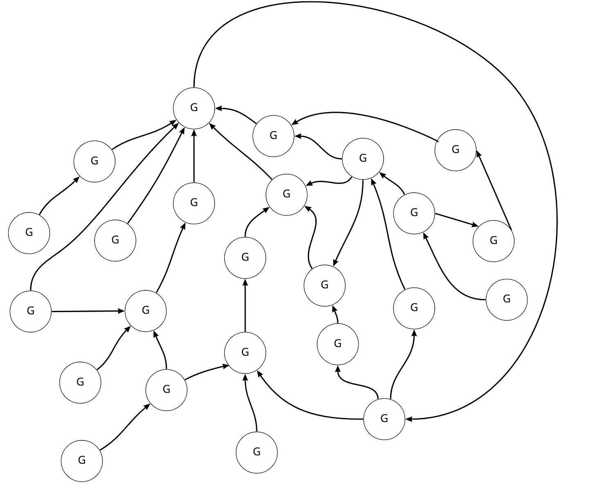
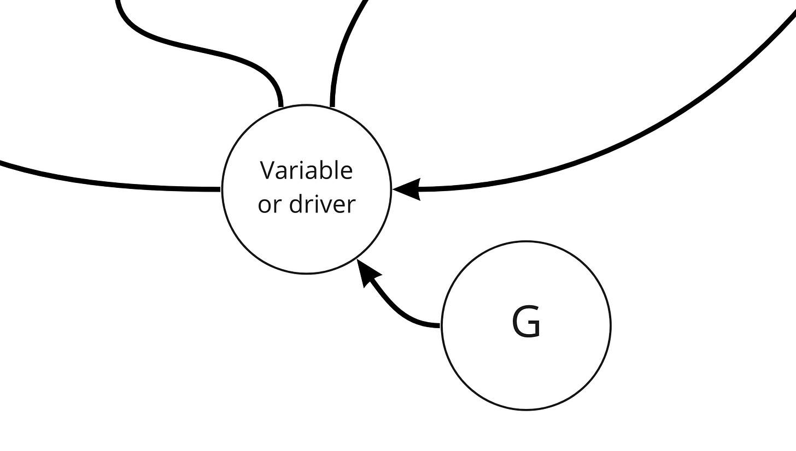
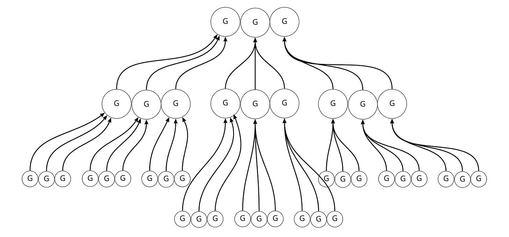
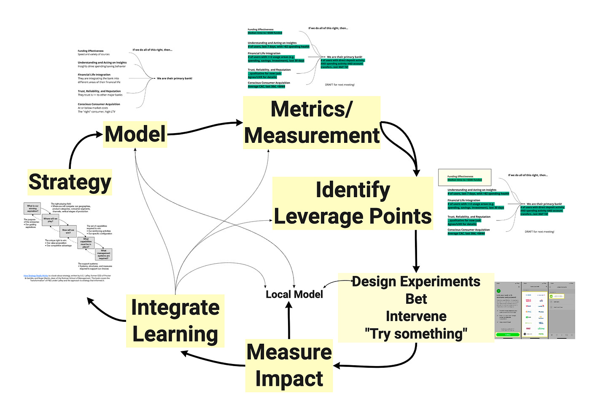

**Thought experiment:**

A company sets 24 ambitious goals for the year. They *do not* consider the org chart *at all* when creating the goals. The goals are completely department/team agnostic. The goals are solution-agnostic (e.g. increase \_\_\_\_\_\_\_). Some goals are related to other goals—leading/lagging, input/output, flywheels, etc. Those relationships are made explicit. Any hierarchy between goals is because of those relationships (not a goal cascade). Here’s a visual:

Don’t worry if that looks like a chaotic mess. There’s a lesson here. Hold on!

Minor detail that will come in handy later. A more accurate version of the above drawing would indicate that we set goals to move variables or drivers. If I had indicated that would have looked VERY chaotic.

Now I want you to contrast this with how a cascade works.

In a cascade, the leadership team sets a small number of *high-level* goals (the magic number three). Department leaders then work to mimic that structure fractally. For example, the marketing team looks at the topmost goals and then comes up with three of its own goals (depending on the framework, some combination of objectives, measures, etc.). It looks like this:

The cascade is not chaotic. It is wonderfully symmetrical. But cascades are problematic:

* In the cascade, we limit the number of top-level goals. You might think this is a good thing—fewer priorities—but that isn’t the case. Why? The goals are high level and don’t provide adequate forcing functions. The 24 “flat” model might be much more effective at providing heuristics for focus.

* The cascade tends to reinforce organizational boundaries. Sometimes this is blatant; the top-level priorities map the org chart perfectly. More often than not, it is subtle. 

* The cascade reinforces a directed graph-like structure with a small number of goals at the *top* and many goals at the *bottom*. It is a tree (like the org chart in most organizations). In reality, variables very rarely have such a simple relationship. Efficiency in one part of the organization could have a widespread impact and kick off virtuous loops. Moving an input “at the frontlines” could be very high leverage.

* The cascade often leaves things out due to the forced simplicity at the top. It can be heavily biased towards *new stuff* and leave out ongoing activities. Some teams openly admit that the top-level goals “don’t replace all the normal stuff we do.” The lack of connection can alienate teams, diminish teams, and generally lead to incongruence.

* With the cascade, you often find teams shoehorning *anything* into the roadmap because they can make a semi-plausible connection to the highest-level goals.

* You lose the nuance of inputs and outputs with goal cascades. The top-level goals should be outputs. But with goal cascades, you conflate inputs/outputs with the hierarchical structure imposed by the cascade. It is unclear.

* Very often, goals = work. Teams are encouraged to “not have too many goals; otherwise, you will get overloaded.” This dynamic springs up in environments that dream up the work *and then tack* on goals. When that is not the case, you realize that a piece of high-leverage work can increase many related goals. More goals can equate to *more context* and not more work. 

Goal cascades combine too many ideas and attempt to do too many jobs. They have shades of driver trees, inputs/outputs, MBO, efforts at empowerment, context sharing, prioritization, tactics, strategy, and strategy deployment. But don’t do any of those well. 

What is the alternative?

What I recommend is not so dissimilar from the 24-goal example. 

1. Create a model that maps the drivers of your business. This model should be agnostic to anything you have on your roadmap. To reiterate, this is entirely agnostic to tactics.

2. Add measurement to that model.

3. Prioritize points of leverage. We might consider these high-level opportunities.

4. Identify goals for those points of leverage. Map goals to the model.

5. It is ok if you have lots of goals. You can group/summarize them later if you need that magic slide.

6. An early version of this becomes the basis upon which teams can start figuring out where they can have an impact, where they need to collaborate, etc.

7. Concurrently refine the model, and refine the leverage thesis.

8. Teams might, at this point, start layering more localized goals on top of more localized models (you can imagine more fine-grained models connected to the high-level model).

9. There’s no requirement to set annual goals. What if you have a goal for the next four months?

In the image below, goals would come after strategy—\>model—\>metrics/measurement when we identify high-level leverage points. This is consistent with the [distinction between persistent models and point-in-time goals](https://cutlefish.substack.com/p/tbm-2553-persistent-models-vs-point).

More on image (what I call the data-informed product loop) [here](https://cutlefish.substack.com/p/tbm-852-the-data-informed-product).

**At a very high level, what we are doing here is decoupling goal setting from the org chart and org hierarchy while grounding it in a universally accepted model.** Goals should form a network because models tend to create a network. It isn’t completely flat because there are relationships. But the dimensionality is much more centered around inputs/outputs vs. departments and teams.

In short, goal cascades mix too many ideas, and try to do too many jobs. With a dollop of enticing simplicity.

But at the end of the day, our goal is congruence, not simplicity.

Goal cascades meet internal needs, not customer needs. They meet the requirement for a planning process at the expense of catalyzing congruence across the organization.

**Ditch the cascade. Create models. Set goals wherever it makes sense to set goals.**