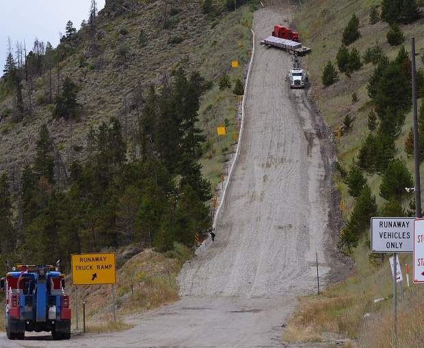

If you don't slow down to speed up, something will force you to slow down. And it will not be on your terms.

This happens with individuals when they dig too deep for too long. They hit the wall and get sick. They burn out. The slowdown may be acute. Or it may be chronic—a very long, prolonged period of numbness.

It happens with companies. Quarterly goals increase. The company scales. Complexity increases. The pressure increases, and cracks begin to form. As with individuals, sometimes there is a sudden collapse. The company has to pump the brakes. It has no other choice (which might be a blessing in disguise).

In other less acute/dire situations, the company is able to keep plodding forward. Some people leave and some people find workarounds. New people join, but they get caught up in the swirl. The team habituates to a haze of reactivity and dampened performance. Any effort to stabilize the situation is no match for the inertia of the status quo.

Forced slowdowns (vs. dampening) have a silver lining. I remember a CTO explaining:

>
>
> *Hitting that string of outages was wake up call for our organization. It forced us to REALLY look at how we were working, and to seek outside guidance.*
>
>

And a friend saying something very similar about their personal experience:

>
>
> *Getting sick was the best thing that could have happened to me. The forced break was essential. I'm certain that if I had kept going, I could have been in a far riskier situation. I could have gotten very sick. Or I would have started sleepwalking through life.*
>
>

In both cases, the "forced slowdown" was fast-acting and unilateral. Which is very different from the slow descent into numbness and sleepwalking.

So what can you do about all this?

One common approach is to push a team, watch them crack, and then "let off the gas a little". I hate this approach, but it is far more common than you would think. I remember an exec explaining their rationale. "How will we know what the team is capable of unless we push the limits?" he said. "Also, why fix things before the break?"

His first statement I disagree with. The second—about not fixing things until they break—is interesting. In theory it sounds reasonable. But there are issues. I have worked in environments that had a healthy approach to continuous improvement. We looked for early signals. We established clear lines of communication. When the signals indicated something was amiss, the team took action. But we didn't wait until things were "broken". By that point they are far more expensive and risky to fix (if fixable at all).

The status quo in many organizations seems to equate "fixing" to basically "patching holes in the slowly sinking boat."

So don't do that.

Your other option is to slow down **on your own terms.** To tap and test the brakes a little. To design and establish *healthy, signal producing* constraints. Here are some examples that I have seen work:

* Team takes every sixth week off and focuses on gardening, weeding, systems, tools, and redesigning how it works.

* Close, full-time pairing with new hires. Watching new hires experience an organization is very informative. You see the cracks!

* A max "batch size" limit of one month. If a team has trouble splitting/slicing work to under a month, it is a good sign something is amiss and worth exploring.

* Work in progress limits! A classic way to send up a warning flare about where work is having trouble flowing through the system.

* Always have one continue improvement experiment in progress at any given time...and elevate it to the status of "real work".

* Random teams form to tackle new challenges for a month.

* New hires do support desk duty. And all employees cycle in periodically.

You can come up with your own experiments, but consider that each of these has an element of temporary slowing and resilience building.

Give one a try. Slow down on our own terms, before you are forced to slow down.