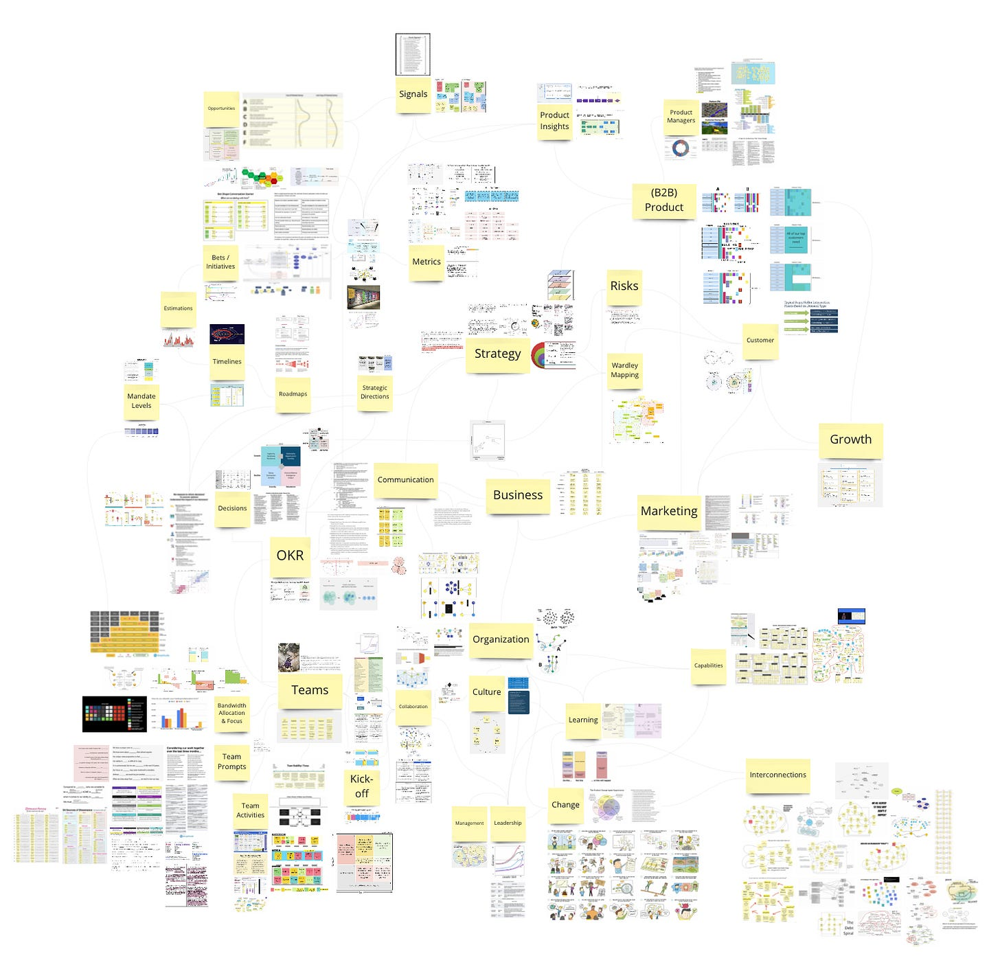

Some news:

First, I wanted to invite everyone to [a talk](https://info.amplitude.com/2022-10-13-Make-Bets-Count-John-Cutler-Registration) I will be giving about Drivers, Constraints, and Floats (see [2021 TBM 43/52](https://cutlefish.substack.com/p/tbm-4352-the-secret-to-initiative)) on October 14. I originally encountered the idea in Johanna Rothman's book [Manage It! (2007)](https://www.amazon.com/dp/B075G2B3KY/ref=dp-kindle-redirect?_encoding=UTF8&btkr=1). I've used it ever since and have made some enhancements and modifications. We send out the recording to anyone who signs up.

Next, Bülent Duagi[ organized many of my tweeted images from 2022 on this Miro board](https://twitter.com/Bulent_Duagi/status/1573975050419671040?s=20&t=QHT5K_rd3G1efDTVW3RTng). Thank you, Bülent!! Cool to see these in one place. Thank him if you can.

Short post this week.

I asked a product leader recently about what made his team so diligent about strategy and challenging assumptions.

His answer was simple:

>
>
> *I think product is forced to have another level of clarity because we don't "own" the execution. We have to inspire engineering.*
>
>

That reply brought up several questions for me. I would be curious to hear your thoughts in the comments.

* Does needing to *inspire* perhaps bias some product managers to certainty theater? What tactics do you use to inspire engineers when there IS a lot of uncertainty, and you need their help?

* How *much* inspiration? Is it fair to expect everyone to be 100% inspired? Can you be *too* inspired?

* Do we *only* seek clarity when forced? What if that forcing function does not exist? Could this explain why many unilateral decisions lack clarity? It could be that ambiguity works in most situations because there isn’t pushback.

* What leeway does engineering have in your company to push back if they find a strategy lacking? What might that indicate if they can push back but don't?

* This assumes a single owner for clarity/strategy and a single owner for execution. Is that the only way to run things? Is this putting too much burden on the PM for clarity? And too much load on the team for execution?

Curious about your thoughts.

Thanks!