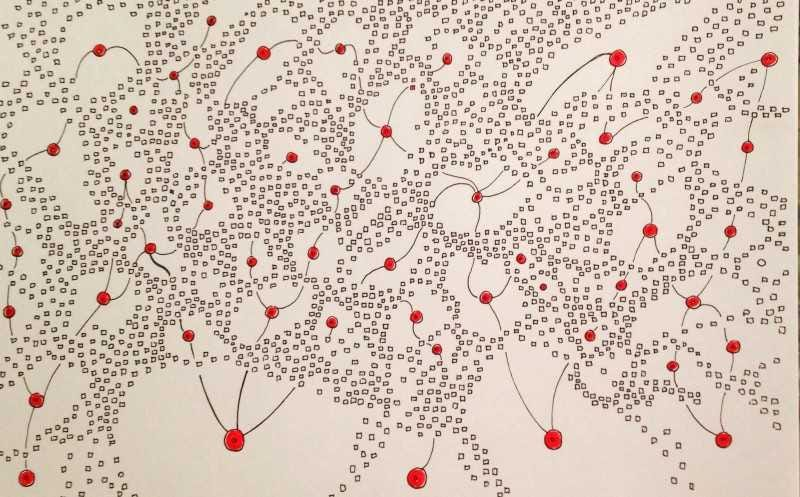

Sharing some advice I wrote to a product leader.

>
>
> John, my company seems to be in a terrible cycle. We are so reactive. Nothing is stable. Nothing lasts. There’s so much churn and pivoting. I want a sense of stability.
>
>

In my experience, this signals a shaky foundation. Without a strong foundation, humans create \*certainty\* by either:

1. Going into exploration mode to discover the foundation

2. Manufacturing big-bang plans (on top of no foundation)

**Exploration mode** is hard and takes space/safety, but it addresses the root issue. It takes time, care, patience, and attention.

**Manufacturing big-bang plans with no foundation** will fail. 99% guaranteed. First, big-bang projects tend to fail under normal circumstances. And second, with no foundation, things get even worse.

Without the right foundation, you will be forced into premature convergence and either 1) nobly execute things that don’t work (which causes failure in the future) or 2) watch in dismay as reality catches up with your crafted plans. You don’t even finish what you started.

The worst part is that you start to experience a wicked loop: 

uncertainty --\> manufacture certainty --\> failure --\> uncertainty

Different people respond in different ways to stress. The organization develops camps: 

1. People who *realize* that there’s no foundation are out in the shadows stressing from the side (while also getting caught up in the big-certain plans).

2. The poor front-liners see a never-ending parade of 1) significant bang failures and 2) constant pivots.

3. Frustrated leaders wonder what the hell is happening (and how they are contributing to the problem).

4. People who get caught up in OWNING the big plans. They are valiantly trying to push them forward amidst the naysayers (1s), the stressed front-liners (2s), and frustrated leaders (3s)

It is a vicious cycle of destructive behavior and burnout. The 1s get further ostracized. The 2s get cooked. The 3s get more frustrated. The 4s burn out as well. Freakout, work big, and fail. And repeat. It is a mess! And the mess gets worse and gets harder to fix.

What is the alternative?

----------

What is needed is to slow down, establish a foundation, and undertake smaller efforts that aren’t as big bang. Think big and work small. Note that this isn’t assuming that “everything needs to be figured out before starting.” Instead, it means doing the *work* needed to lay the foundation and giving up on the fallacy of manufacturing certainty with big plans.

It is both establishing the *foundation* of strategy, etc.—the stuff that will not change as quickly—AND the foundation of ways of working. Early-stage startups must work like this. They may have a core mission but are still in foundation discovery mode. Their survival depends on it.

With bigger companies, inertia becomes a much larger issue. A big company with a strong foundation undertakes all types of work (including more integrated efforts AND “speedboat” innovation efforts). *Without* a strong foundation, the big company has all the dependencies and inertia (challenging) without capitalizing on its assets and strengths.

To summarize:

----------

1. When you lack a strong foundation, you have to focus there

2. When you lack a strong foundation, you should stop believing big projects will save the day.

3. “Foundation” is layered. We have core things that last decades and strategies that last quarters and years.

4. A good foundation enables experimentation, learning about new foundations, and big coordinated efforts.