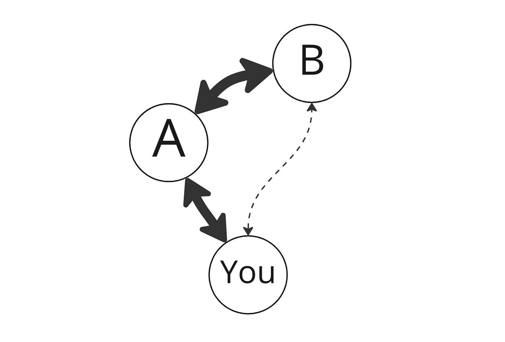
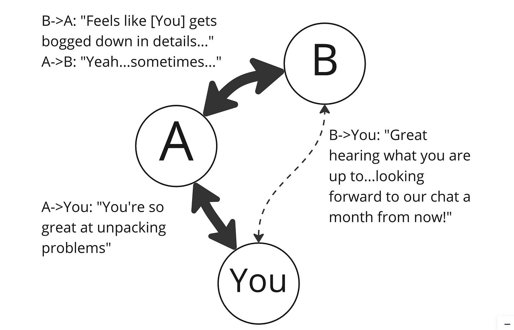
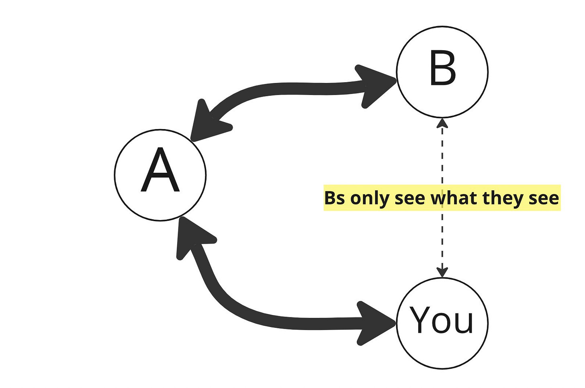
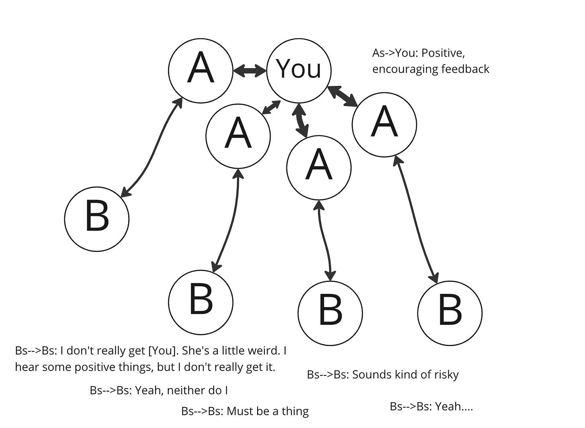
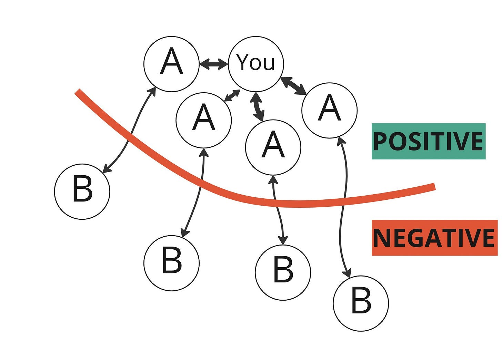
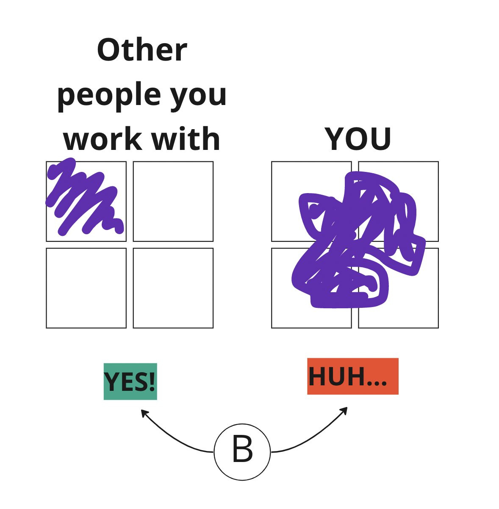

***Maven is sponsoring a free PM career panel with ​Marily Nika, Peter Yang, and Gabrielle Bufrem on December 12th. Looks interesting! [Check it out](https://lu.ma/pm-career-panel).***

Are you having trouble advancing in your career? Do you feel like your skills and experience don't match your opportunities? If so, one of the most important things to discover is "perception asymmetries." In short, what does B in this drawing perceive about you.

It is possible that someone (A) appreciates your ability to do something, but when someone else (B) proposes an alternative take, A – who you perceive as your champion – doesn't represent that. This can happen for many reasons, most of which are not nefarious or self-serving.

Meanwhile, B is only able to see what they can see. They only see your public wins and public fails, or neither.

Now, multiply this across many interactions. Keep in mind that the Bs talk to each other and exchange notes, all out of your eye.

In fact, it becomes a wicked cycle. Perceptions turn into a narrative – positive, affirming, and self-reinforcing in your local circle, but negative in the broader circle, or just confused.

Another thing to keep in mind is that some people can be neatly put into a box, while others cannot. The more diverse and seemingly contradictory the skills you have, the worse this gets. People desperately want to be able to put you in a box, and they’ll experience a lot of incoherence if they can’t figure you out.

The "weirder" your mix of skills and experiences, the harder it is to manage perceptions, the greater the asymmetry, and the thicker the bubble.

So, how do you fix this?

You have to ask. Prepare yourself for very hurtful feedback. Start with the As—your champions—and ask them about external perceptions. They may not share everything they know, but they’ll hint at something if they genuinely want to support you.

Then move on to the Bs. Say something like:

* “I'm open to hearing different perspectives and would really appreciate it if you could share your honest thoughts on my work with me. Can you give me some feedback?"

* "I'm grateful for the positive feedback I've received from my team, but I want to make sure I'm not missing anything. Can I ask for your honest feedback on how I can improve?"

* "I know that I can't always see the whole picture, and I'm looking for ways to grow and develop. Can I ask for your candid feedback on my strengths and weaknesses, and how I can improve?"