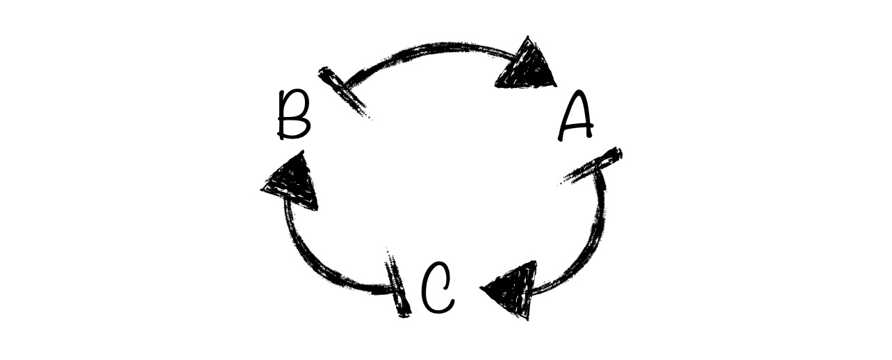
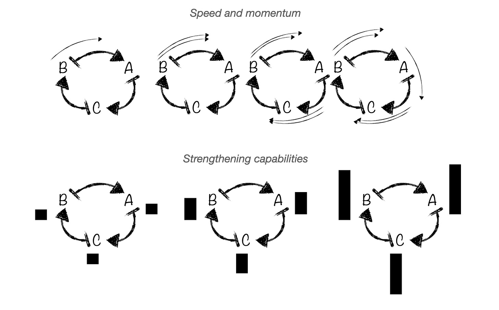
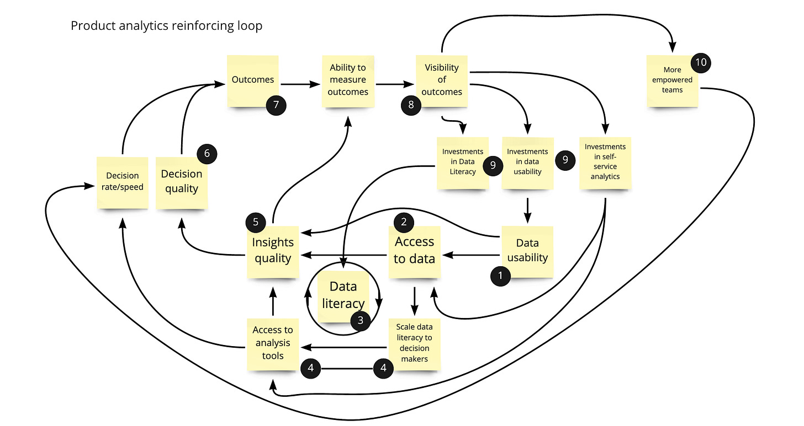

*Post 53 of 53. Thank you for reading. [The experiment](https://cutlefish.substack.com/p/coming-soon) is done. What’s next? I’m not sure.   

I do have a small ask. If anyone cares about music (jazz in particular) and would like to donate to a good cause…please consider donating to the [COVID-19 Musicians’ Emergency Fund](https://jazzfoundation.org/covid19fund/). That would mean a great deal to me.*

I spent most of my writing time today putting this [one-pager checklist together](https://docs.google.com/document/d/1LS_wnRwQLF65ZqqhtFf2m7UUdhtYKNKEgHa7ad3z-Yk/edit?usp=sharing). Hope you find it helpful. And with my remaining time…

---

I see companies do this all the time. They want to know where they *stand*. They want a *grade*. So they—often with the help of vendors/consultants—generate something like this:

But here’s the problem. Getting a grade doesn’t magically help you improve (though in theory you know where you stand). Many of these models encourage forms of change management that simply don’t work. Why? You can’t improve the capabilities in isolation. Sociotechnical systems are not like a bunch of unrelated college courses.

Improvement is more of a virtuous, integrated cycle:

Piggybacking a bit off of [Jim Collins’s Flywheel Effect,](https://www.jimcollins.com/concepts/the-flywheel.html) and Donella Meadows’s concept of a reinforcing loop…you get something like this:

Writes Meadows in [Thinking in Systems](https://www.amazon.com/dp/B005VSRFEA/ref=dp-kindle-redirect?_encoding=UTF8&btkr=1):

>
>
> [The reinforcing loop] is amplifying, reinforcing, self-multiplying, snowballing—a vicious or virtuous circle that can cause healthy growth.
>
>

Writes Collins:

>
>
> We’ve allowed the way transitions look from the *outside* to drive our perception of what they must feel like to those going through them on the *inside.* From the outside, they look like dramatic, almost revolutionary breakthroughs. But from the inside, they *feel* completely different, more like an organic development process. 
>
>

Jim Collins and Donella Meadows are actually describing slightly different things (both applicable). Collins focuses on the idea that at first it is incredibly difficult to get “the wheel” moving. You need to focus and push a great deal at first. But success is not just one big push. Rather it is the “overall accumulation of effort applied in a consistent direction.” Meadows focuses on the reinforcing, complimentary nature of the loop. Her work would argue for representing the inertia making it hard to get the flywheel going (which we aren’t doing here).

Here’s an example from the day job (Amplitude). Note that it is not a perfect causal loop diagram. There are holes. But it gets the conversation going.

The crux of all these stickies is that you:

* need **1)** usable data, **2)** access to data, **3)** data literacy, and….

* **4)** scale that data literacy, and access to usable data, to decision makers, to…

* **5)** improve insight quality, which will …

* **6)** improve decision quality, thereby

* **7)** improving outcomes, which when coupled with the ability to measure outcomes will…

* **8)** improve outcome visibility, which will…

* **9)** increase investments in data literacy, data usability, and self-service AND will…

* **10)** increase confidence in teams and empower them to take more of an outcome focus.

Data Literacy has its own flywheel whereby insights quality, access to data, efforts to scale data literacy, and access to analysis tools will (surprise) increase data literacy.

Why is this important?

You can’t just run DataInformedProduct.exe. If you can’t figure out how to scale data literacy, no amount of analytics chops will help. If you do a bunch of instrumentation but can’t generate meaningful outcomes, you will lose the inertia (and support) for good instrumentation. And if you can’t empower teams to act semi-independently, you’ll miss the window of opportunity.

It is a set of loops. You need to make it safe and possible to move through the loop…and it is perfectly fine to keep things minimal at first.

As an exercise, pick an area of improvement. Brainstorm variables. Connect the variables (messy is OK). And think about how you can apply energy in a “consistent direction” to get the “amplifying, reinforcing, self-multiplying, snowballing” effect.

*See you in 2021. Any ideas for me? Keep this up? Try something new?*