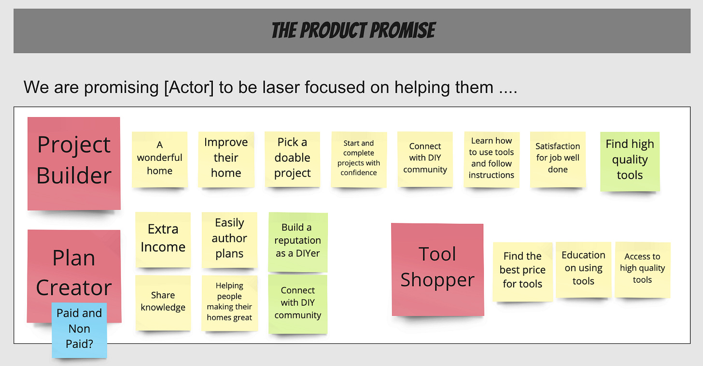
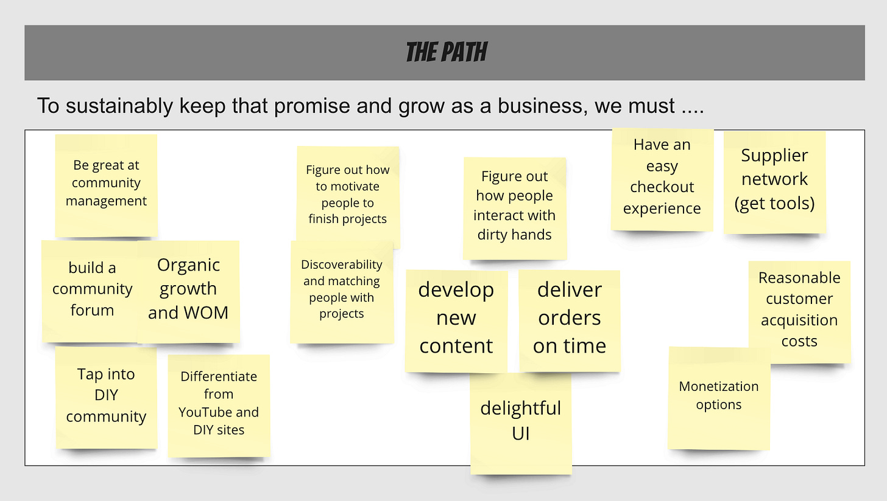
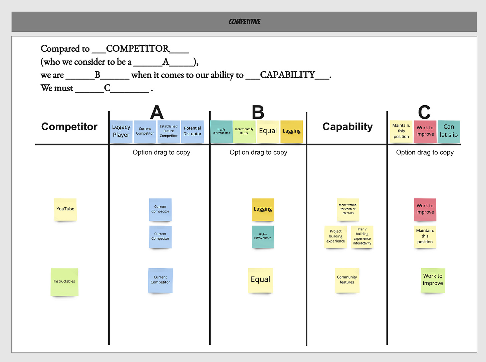

*Update! I am very excited to be hosting Andrew Yu and Andrea Wang for the first in a series of chats titled Product-led In Practice (PLIP). Andrea heads up our growth efforts at Amplitude, and Andrew is fresh off of working as a product manager for the Biden Inauguration and Biden Campaign.[ Join us on Wednesday, February 17, 2021, 9:30am PT](https://info.amplitude.com/product_led_in_practice_feb17).*

Here's a simple exercise I do with teams. I leave out all the fancy product strategy lingo and keep it straightforward. It is broken into three parts:

* The Promise

* The Path

* The Pressure (Competitive Pressure)

For examples, I use an imaginary company called DIY.io.

>
>
> DIY.io’s mission is to help aspiring DIYers to improve their home. We source DIY plans from passionate and experienced plan creators, pair those plans with all the right tools, pack them up, and deliver them right to the DIYers door!
>
>

**The Promise**

----------

First, I ask the team about their product's **promise**. Why promise? A promise carries weight. It is easy to imagine a product as making a promise that it must fulfill and keep.

>
>
> The promise our product makes to our customers is be laser focused on helping them \_\_\_\_\_\_\_\_\_.
>
>

I like to start with the promise framing, because to me it represents a very pure view of product making.

**The Path**

----------

Then, we get into **the path**. A team can have the perfect product, but still go out of business. There are other factors to consider.

>
>
> Our product's path to sustainable growth hinges on our ability to *\_\_\_\_\_\_\_\_\_.*
>
>

I try to leave this very open. We’re looking for things around channels, business model, customer segments, growth loops, partnerships, cost structure, etc. If the team has trouble coming up with ideas, I share the [The Business Model Canvas.](https://sites.google.com/a/talcie.org/resources/topics-and-activities/business-model-canvas)

**The Pressure**

----------

After the promise and the path, we jump to the competition. Keep in mind that our biggest competition is sometimes the status quo. This one is a big tricker, but teams get the hang of it and start to have fun.

>
>
> Compared to [Competitor]....
>
>
>
> ...who we consider to be a *[Legacy Player, Current Competitor, Established Future Competitor, Potential Disruptor]*...
>
>
>
> ...we are *[Highly Differentiated, Incrementally Better, Equal, Lagging]*...
>
>
>
> when it comes to our ability to [Some Capability].
>
>
>
> We must *[Maintain this position, Work to Improve, Can let slip]*.
>
>

What is fascinating about this exercise is when a team lists "work to improve" for everything. Even when they believe they are "ahead". That signals a lack of focus. It is impossible to improve everything.

Combined, these three activities are a great way to quickly understand different perspectives on your product, product strategy, etc. I use them as prep for a [North Star Workshop](https://amplitude.com/north-star).

I hope these activities — while “basic” — were helpful. It is all about the conversation.  

Like these posts? Check out last year’s 53 posts [free](https://johnpcutler.github.io/tbm2020/), or in [a simple ebook for $5](https://gum.co/sErvL).

[Buy TBM 2020 for $5](https://gum.co/sErvL)