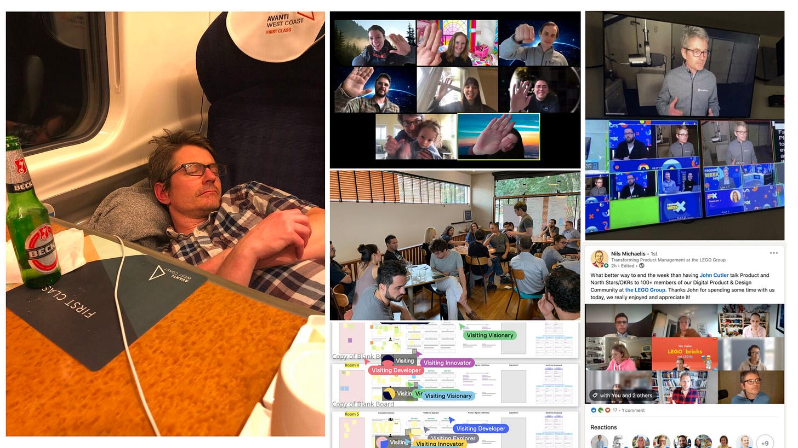
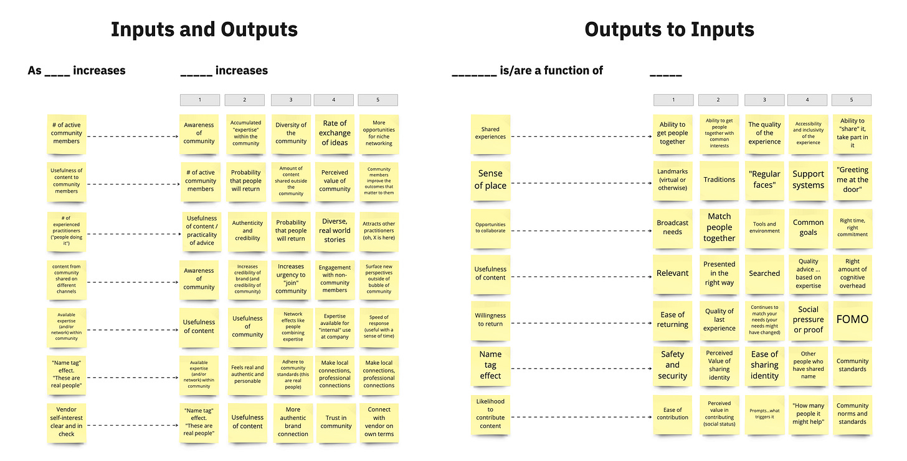
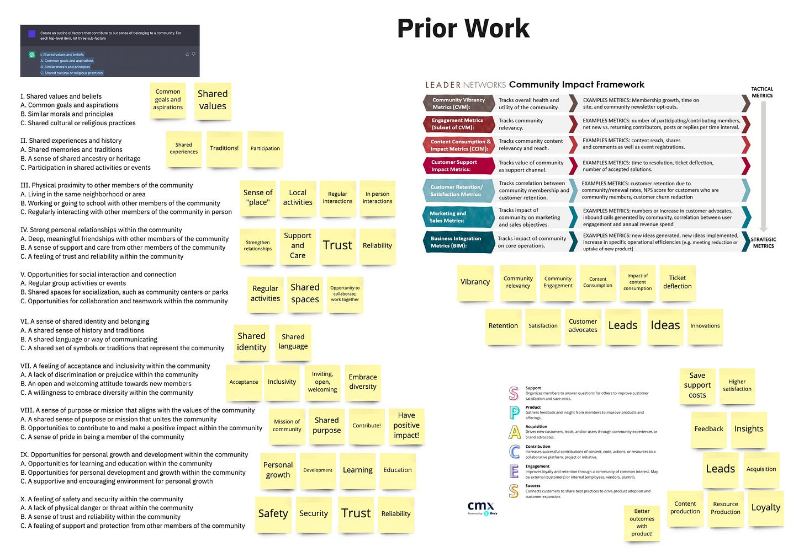
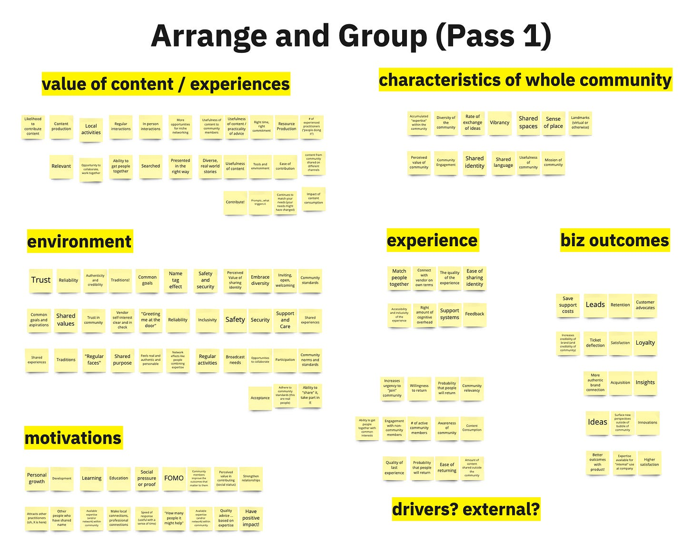
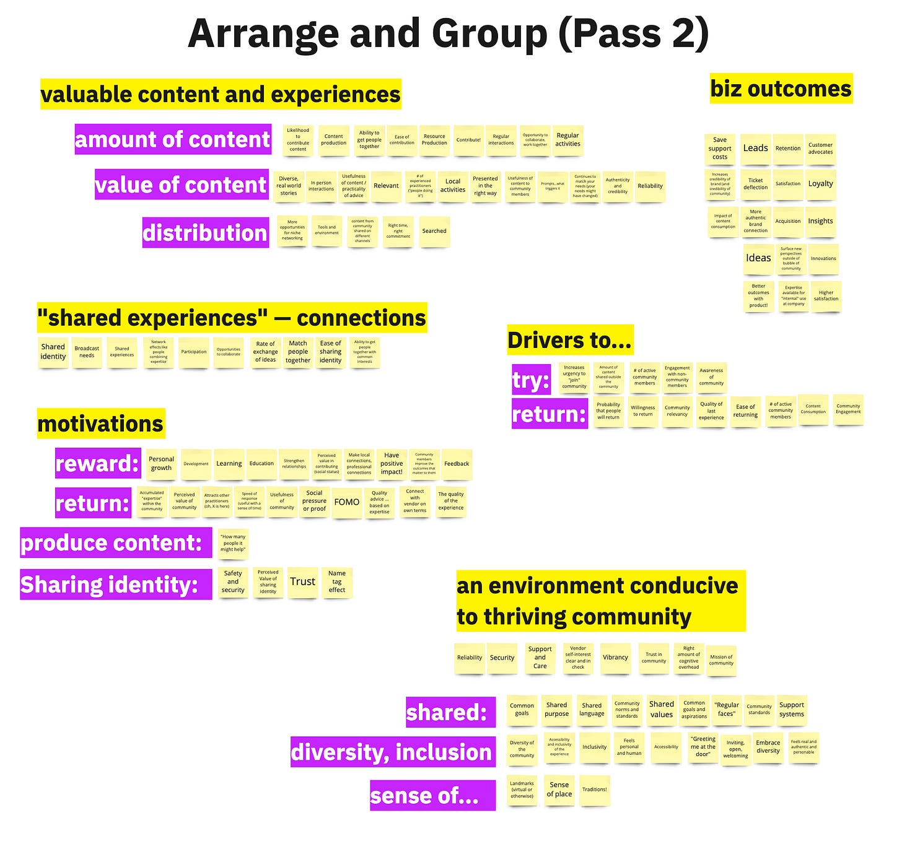
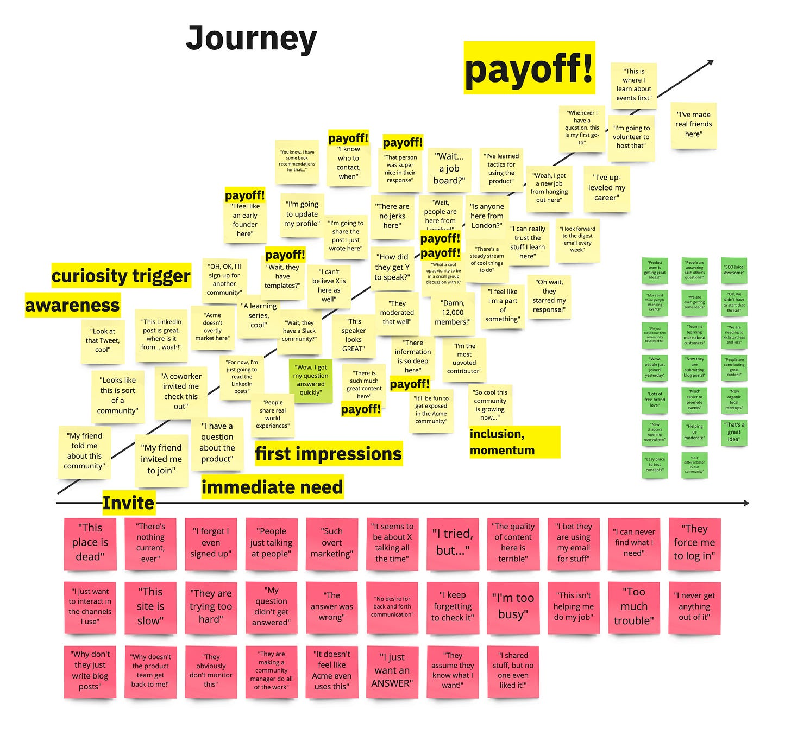
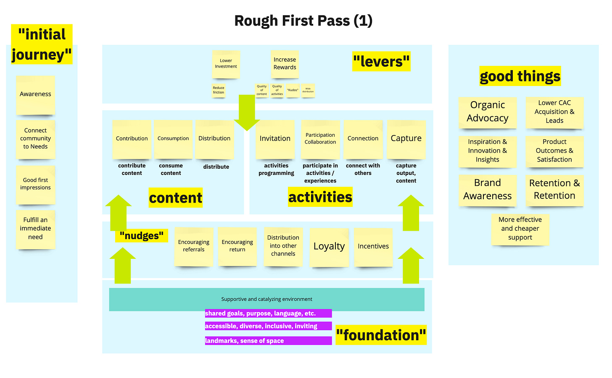
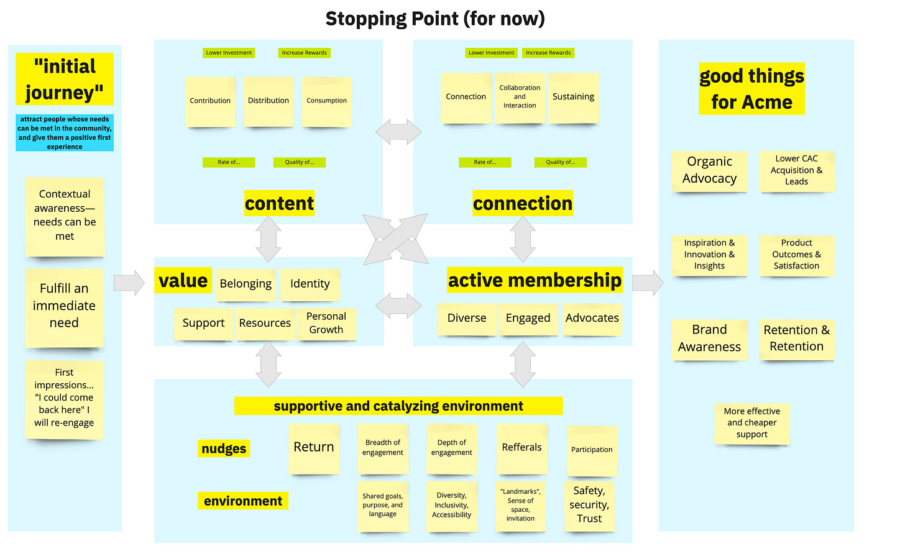
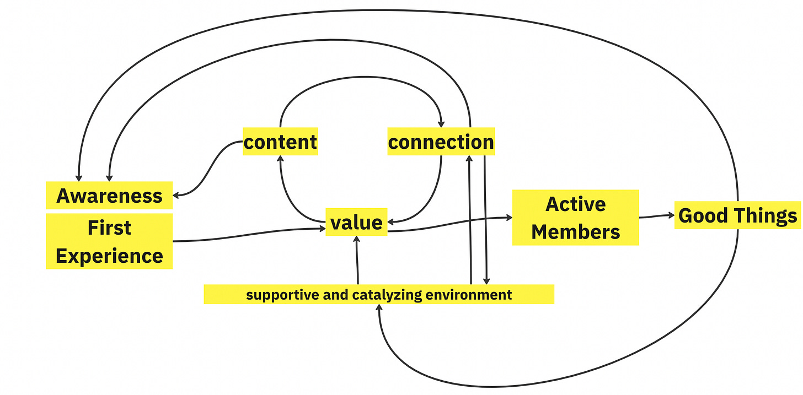

*A quick work update—I'm leaving Amplitude after a fantastic run. What an amazing team and professional (and personal) adventure. [I wrote a brief reflection here (on LinkedIn)](https://www.linkedin.com/posts/johnpcutler_todayafter-1569-days-in-the-amplitude-saddlemy-activity-7010775576965783552--1tV?utm_source=share&utm_medium=member_desktop). As TBM readers, you've been encouraging me along this journey. Thank you!*

*What a crazy ride.*

This post is an experiment. It started with a question emailed by a TBM reader.

>
>
> How do you go about making your models and frameworks?
>
>

So I thought I would "live diagram" my process. I am sharing each step as it happened—no editing. This is how the sausage is made, with all the faults.

*Note: This process took about 60 minutes. To do this right, you would need to 1) invite collaborators, and 2) spend more time.*

**Step 1: Set a goal**

----------

My goal with this model is to explore the drivers of a healthy community. Eventually, I want to be able to prioritize initiatives to influence the key levers for community vitality and success. A community has a couple of flywheels in effect, so I want to surface those.

*Caveat: I have no formal knowledge of community building outside of my writing, etc. I'm sure great frameworks exist, but I wanted to try making my own.*

**Step 2: Explore inputs and outputs.**

----------

To get warmed up, I start brainstorming inputs and outputs—first from the input to output direction and then from the output to input direction. 

For example:

#### **Inputs to Outputs**

 ####

As **# of active community members** increases, we would expect to see increases in the:

* Awareness of community

* Accumulated expertise within the community

* Diversity of the community

* Rate of exchange of ideas

* More opportunities for niche networking

#### **Outputs to Inputs**

 ####

**Sense of place** is a function:

* Landmarks (virtual or otherwise)

* Traditions

* "Regular faces"

* Support systems

* Someone "greeting me at the door."

**Why is this valuable?** It warms up my model-making brain and surfaces a lot of source material.

Here is what that activity looked like (and here is the [Inputs/Outputs Miro Frame](https://miro.com/app/board/uXjVP39bdCA=/?moveToWidget=3458764541870581845&cot=14)).

**Step 3: Check prior work.**

----------

After brainstorming, I take a look at some prior work. In this case, I ask ChatGPT to "create an outline of factors that contribute to our sense of belonging to a community." I also looked at [SPACE (David Spinks)](https://cmxhub.com/the-spaces-model/) and something by [LeaderNetworks](https://www.leadernetworks.com/2017/02/business-impact-online-communities-new-study-framework.html).

Some things that stood out to me:

* The need for shared space, meaning, and mission

* How communities fill many needs (SPACE)

* The importance of tempo: regularity, cadence, opportunities to collaborate

I read these sources and take notes on sticky notes. My notes are not extensive—a couple of words each—but they are just thematic reminders.

Why is this valuable? It is OK to create frameworks from scratch, but also good to check out prior work for inspiration. I am not a community expert. It would be easy for me to attach product ideas to everything, but there are nuances with a community that I need to learn.

Here is what that activity looked like (and here is the [Prior Work — Miro Frame](https://miro.com/app/board/uXjVP39bdCA=/?moveToWidget=3458764541870581846&cot=14)).

**Step 4: Start grouping sticky notes**.

----------

In Miro, I select all of the sticky notes created so far and put them in one place. Next, I start grouping those sticky notes by theme. This exercise is my first pass, so I don't stress about correctness.

My categories are:

* Value of content/experiences

* Environment

* Characteristics of the "whole community."

* Experience

* Biz outcomes

* Motivations

* A random list of drivers

The issues pop out immediately! What the heck is the difference between environment, characteristics of the whole community, and experience? I don't stress because this is just the first pass.

**Why is this valuable?** We have a lot of source material to work with, so grouping it will quickly surface themes.

Here is what that activity looked like (and here is the [Arrange/Group Miro Frame](https://miro.com/app/board/uXjVP39bdCA=/?moveToWidget=3458764541870581847&cot=14)).

**Step 5: Refine the grouping**

----------

I did the previous step quickly. Now, I need to refine my thinking. 

I add sub-categories and combine similar categories. 

You can see that the sub-categories are rough. That's ok!

**Why is this valuable?** The previous step was messy. There were a lot of contradictions. The output is easier to look at and talk about.

Here is what that activity looked like (and here is the [Arrange/Group V2 Miro Frame](https://miro.com/app/board/uXjVP39bdCA=/?moveToWidget=3458764541870581848&cot=14)).

**Step 6: Think about the customer journey**.

----------

At this point, you need to change gears a bit. There's a risk of seeing things from only one angle and making the whole exercise too theoretical. So I brainstorm three categories of customer journey moments.

1. Positive community member moments (e.g., "Someone answered my question!")

2. Negative community member moments (e.g., "This place is dead!") 

3. Positive business moments (e.g., "The product team gets inspiration here")

**Why is this valuable?** It keeps things customer-centric and adds a new perspective to offset these theoretical drivers.

Here is what that activity looked like (and here is the [Journey Miro Frame](https://miro.com/app/board/uXjVP39bdCA=/?moveToWidget=3458764541870616472&cot=14)).

**Step 7: First pass at a model**

----------

I now feel ready to take a pass at making a model. I consider the customer journey, the drivers, and the business outcomes. This activity is primarily an exercise in grouping similar things and thinking about how they connect with other groups of items.

High level, the pattern is that great content and fostering connections creates a virtuous loop. And the environment helps!

A couple of things to note:

* I am playing with the idea of levers to lower the investment and increase the reward of various actions ("levers")

* A layered approach is emerging with a foundational environment that supports various "nudges", which support content and activities.

* I keep the journey idea—from awareness to good first impressions and fulfilling an immediate need.

**Why is this valuable?** We are getting closer to something we can share and discuss.

Here is what that activity looked like (and here is the [Rough First Pass Miro Frame](https://miro.com/app/board/uXjVP39bdCA=/?moveToWidget=3458764541870581849&cot=14)).

**Step 8: Second pass and stopping point**

----------

You can see some of the issues with the prior model. They include:

* That weird investment and risk stuff at the top

* There's no real mention of the value

* There's no real mention of what we are hoping to increase

To fix this: 

* We add some information architecture and make similarly leveled things the same color and treatment. 

* We add arrows to denote the flywheel effect

* We add a "value" box with different sub-factors

* And a box to remind people that we hope to increase active membership

**Why is this valuable?** This version could be better, but now we can start discussing prioritization and focus areas with the team.

Here is what that activity looked like (and here is the [Stopping Point Miro Frame](https://miro.com/app/board/uXjVP39bdCA=/?moveToWidget=3458764541870581851&cot=14)).

Hopefully, this play-by-play was helpful!? Or perhaps…boring as hell. 

But that’s how I do it! The model needs work, and often I will start over again from scratch after I have had time to think about it. In many cases I over-simplify:

Before completely starting over.

Let me know!