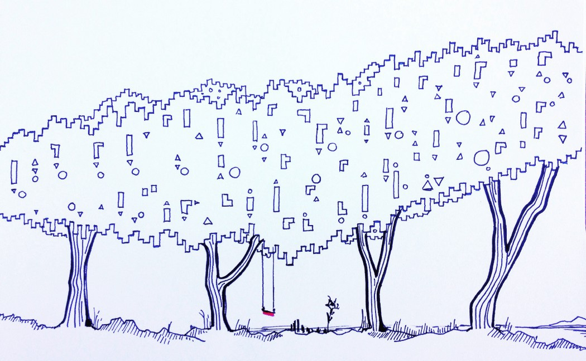

Does your role involve being an "integrator" across teams?

Supporting. Connecting. Cohering. Resolving. Balancing. Listening. Translating. Absorbing.

If so, there is a good chance you have a view of your organization that no one has (not even the CEO). You see and hear things most people don't see. You are taking on an emotional burden that most people don't take on. And you are shouldering an emotional burden that often goes unrecognized and unappreciated...and unpaid.

The lack of appreciation is not intentional in my mind. It is more that the formal structures, incentives, and flows ignore this type of work. It is not mainstream...it happens in the eddies, near the edges, in the side-currents and depths of the channel.

Being a manager is very hard. No doubt. But management is a *different* emotional burden in many ways. Managers have a formal responsibility to care for a support a group of humans. It's in their job description and career ladder. 1:1s. Coaching. Development. Performance reviews. Team meetings. Broadcasting important information. So much of a manager's energy goes into those key tasks. Yes, managers also integrate. But it is alongside these other responsibilities.

"Management" is well-trodden territory. So is "Influence Without Authority". Even "Managing Up" gets its fair share of books. But we don't discuss connecting, caring, and cohering nearly as much. Part of that is that integration often falls on underrepresented and marginalized groups. These individuals know that organizations are not an idealized Venn diagram of "aligned incentives" glued together by meritocracy. They sense the cracks and the edges and want to help and support, and know if they don't, no one will.  

A friend pre-read the post and offered this perspective:

>
>
> As a woman of color who’s felt marginalized in various contexts, I’m hyper-attuned to what’s happening away from the mainstream as a means of self-preservation; I immediately hone in on who or what’s being left out, and that naturally turns me into an integrator. I recently told a coach that I wanted to be the connective tissue between teams — not that that’s served me well in any capacity.
>
>

Don’t get me started on all the double standards for female product managers, testers, analysts, coaches, etc. It’s terrible. I realize that as a white man I have never experienced the full weight of this. I will share some experiences, but I know I'm only scratching the surface.

Me? A school principal once told my parents that "John finds a wolf behind every tree." There's much more to that story, but suffice to say that I think some people are wired to see incoherence, and desperately need to believe in the OK-ness of people despite their actions (hence zeroing in on system level factors). We all have our own wolves behind trees.

I remember a leader once asking/telling me "Why are you even concerned about what that team is doing John? It is outside of your group. It is outside your role. You'll drive yourself batty thinking about that AND your day job!" I received the feedback as a classic "stay in your lane!" and remember spinning an internal narrative that pitted me against *uncaring* leadership. It wasn't that though. She was a very skilled leader, and worried I would burn out. From her perspective, she had hired a formal management team to deal with issues like this. It was their responsibility! I see this now, but I didn't feel that at the time.

My role had put me in touch with people from across the organization. Since I wasn't a formal manager, they trusted me with insights and perspectives. I could sense the macro currents because I worked with everyone. I saw how...

* The toxicity of one manager was bubbling over into other groups

* Tensions between two leaders were spreading distrust among their respective teams

* The push to grow at all costs was crushing the career aspirations of less vocal team members

* Different groups were not communicating, and that this was causing burnout

* How the CEO's words were often misunderstood

* How knowledge silos were overly burdening OTHER integrators

I invested an incredible amount of time in trying to help everyone involved. After work chats. Walks. Helping with retrospectives. Coaching people 1:1. Smoothing things over. And yes, I burned out. On reflection, part of the challenge is that I didn't recognize how atypical my role was! I assumed that everyone must see these things. And that if they did nothing, it was pure negligence. What I realize now is that my perspective was UNIQUE. I was connecting dots others were not connecting. And that came at a steep cost.

In my personal career and day-job I have interacted with many integrators. I don't have any wisdom here and am hitting the time-box of this week's post. Maybe:

* Take care of yourself. I’ve personally tried to do equal amounts self-care and integrator work.

* Connect with yourself. What is the wolf behind your tree? Why are you drawn to put yourself in the messy middle of the org?

* Realize you are not alone. There are many integrators out there ([read this thread](https://twitter.com/johncutlefish/status/1447235221905047554?s=20))

* Be realistic that integrators are not formally rewarded. And ask how might you change that? Are you working with integrators that have not been formally rewarded?

* How can you elevate the profile of underrepresented groups in your org that take on the burden of integration work?